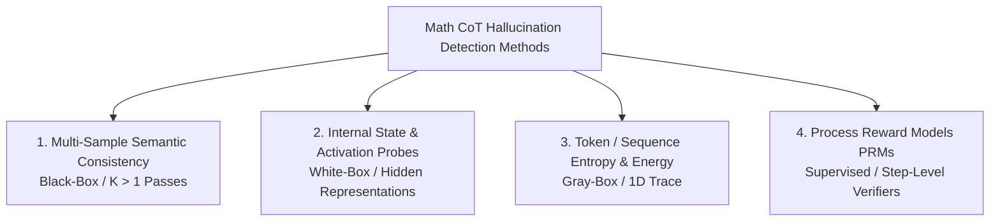

# Competitor Benchmarking Guide & Execution Plan for LLM Math / CoT Reasoning

*Author: Antigravity & Omri Segev | Thesis supervised by Bracha Laufer-Goldshtein & Ofir Lindenbaum*  
*Target Reader: Claude / Autonomous Agents Planning Cluster Inference & Benchmarking Runs*

---

## 1. Executive Context & Purpose

This document provides Claude and collaborators with an **airtight, apples-to-apples benchmarking execution plan** for evaluating our primary detector—**Single-Pass Unsupervised L-SML Continuous (`GOOD_5`)**—against the full 2024–2026 literature landscape of hallucination and error detection methods in Large Language Model (LLM) mathematical and chain-of-thought (CoT) reasoning (`MATH-500`, `GSM8K`, `AIME`, plus QA datasets).

### Our Core Method: L-SML Continuous (`GOOD_5`)
- **Input Signal:** Single forward pass ($K=1$) token-level Shannon entropy trace $H(n)$ derived from output softmax/logprobs.
- **Canonical Feature Set (`GOOD_5`):**
  1. `epr` — Entropy Production Rate (mean token entropy)
  2. `low_band_power` — Spectral power in the low-frequency band ($<0.1\text{ Hz}$)
  3. `sw_var_peak` — Peak sliding-window variance across the trajectory
  4. `cusum_max` — Maximum CUSUM drift from baseline entropy
  5. `spectral_entropy` — Entropy of the power spectral density
- **Fusion Algorithm:** Unsupervised Latent Spectral Meta-Learner (Jaffé-Fetaya-Nadler 2016 lineage), using covariance block clustering + within/across group eigenvector weighting, oriented via `anchor_orient`.

---

## 2. The 2024–2026 Competitor Landscape (4 Major Paradigms)

### Family 1: Multi-Sample Semantic & Logical Consistency (Black-Box / Sampling)
Methods that sample $K > 1$ responses to the same mathematical prompt and measure agreement or semantic clustering across paths.
- **Semantic Entropy (Farquhar et al., Nature 2024):** Samples $K=10$ answers, clusters semantically equivalent final numbers/expressions using an NLI classifier or symbolic equivalence checker, and computes Shannon entropy over the cluster distribution.
- **SelfCheckGPT (Manakul et al., EMNLP 2023):** Samples $K=5$ reference outputs and cross-checks sentence/step consistency against a target generation.
- **Structured Self-Consistency (2025):** Enforces consistency across intermediate symbolic CoT derivation steps.
- **Operational Cost:** $K=5$ to $K=10$ generation passes ($5\times–10\times$ inference overhead + NLI verification compute).

### Family 2: Internal State & Activation Probes (White-Box / Hidden Representations)
Methods that inspect intermediate hidden layers, attention maps, or feed-forward activations during generation.
- **INSIDE / EigenScore (Chen et al., ICLR 2024):** Extracts covariance eigenvalues of middle-layer hidden states across tokens to measure internal representation stability.
- **LapEigvals (Feb 2025):** Computes graph Laplacian eigenvalues of attention matrices across tokens $\rightarrow$ PCA $\rightarrow$ logistic regression probe.
- **InternalInspector (2025–2026):** Trains linear probes on hidden states at specific CoT steps to predict calculation breakdowns.
- **Operational Cost:** Requires white-box access to high-dimensional hidden states ($d_{\text{model}} \approx 4096–8192$), creating large I/O memory footprints (~10–20 GB per cell).

### Family 3: Token Entropy, Energy & Log-Probability Dynamics (Gray-Box / 1D Trace)
Methods that aggregate log-probabilities or token-level entropy metrics along a single generated reasoning chain ($K=1$).
- **EPR (Entropy Production Rate — Minut et al., 2026):** Measures mean token-level Shannon entropy across the generation trajectory.
- **Spilled Energy (Farquhar et al. baseline):** Measures cumulative probability mass lost on non-selected tokens across the reasoning sequence.
- **LOS-Net (Mar 2025):** Extracts top-$k$ logprobs across tokens and passes them into a supervised sequence probe.
- **Why L-SML Dominates Family 3:** Math CoT exhibits distinct temporal phases (setup $\rightarrow$ derivation $\rightarrow$ numerical conclusion). Simple averages (`EPR`) miss localized uncertainty bursts. L-SML's temporal frequency (`low_band_power`, `spectral_entropy`) and drift (`cusum_max`) features capture periodicity and error accumulation that static averages ignore.

### Family 4: Process Reward Models & External Verifiers (Supervised)
- **FG-PRM (Fine-Grained Process Reward Model, 2025/2026):** Supervised reward models trained on human- or synthetic-annotated math CoT steps.
- **FUSE (Candès et al., April 2026):** Best-of-$N$ candidate selection framework that ensembles external verifier scores using spectral Method-of-Moments.

---

## 3. Apples-to-Apples Competitor Evaluation Matrix

When executing replication grid cells on the AIRCC cluster, structure comparison tables around these exact brackets:

| Method Family | Competitor Name | Required Signal | Passes ($K$) | Supervision | Evaluation Bracket |
| :--- | :--- | :--- | :---: | :---: | :--- |
| **Our Method** | **L-SML Continuous (`GOOD_5`)** | **1D Entropy Trace $H(n)$** | **1** | **Unsupervised** | **Primary Target** |
| Gray-Box (1D Trace) | **EPR** (Minut et al., 2026) | Mean Token Entropy | 1 | Unsupervised | Unsupervised Single-Pass |
| Gray-Box (1D Trace) | **Spilled Energy** | Cumulative Logsumexp | 1 | Unsupervised | Unsupervised Single-Pass |
| Gray-Box (1D Trace) | **LOS-Net** (Mar 2025) | Top-$k$ Logprobs | 1 | Supervised Probe | Supervised Single-Pass Anchor |
| White-Box (Internal) | **INSIDE / EigenScore** (ICLR 2024) | Hidden States Covariance | 1 | Unsupervised | Unsupervised White-Box Anchor |
| White-Box (Internal) | **LapEigvals** (Feb 2025) | Attention Laplacian PCA | 1 | Supervised Probe | Supervised Internal Anchor |
| Black-Box (Sampling) | **Semantic Entropy** (Nature 2024) | $K=10$ Generations + NLI | 10 | Unsupervised | Multi-Pass Compute Baseline |
| Black-Box (Sampling) | **SelfCheckGPT** (EMNLP 2023) | $K=5$ Generations + NLI | 5 | Unsupervised | Multi-Pass Compute Baseline |

### 3.1 Exact Published Math & CoT Evaluation Specifications from Literature

When setting up replication grid cells in `cluster/presets.py`, match these exact published experimental specifications so all head-to-head comparisons on the AIRCC cluster are strictly apples-to-apples:

| Competitor Method | Exact Math / CoT Datasets Evaluated in Paper | Sample Count ($N$) | Exact Model Families Evaluated in Paper | Notes / CoT Specifics |
| :--- | :--- | :---: | :--- | :--- |
| **Semantic Entropy** (Nature 2024) | `GSM8K`, `SVAMP`, `ASDIV` | $N = 500$ per dataset | `Llama-2-7B/13B`, `Mistral-7B` | Uses symbolic/numerical equivalence extractor on final math answer over $K=10$ samples. |
| **SelfCheckGPT** (EMNLP 2023) | `GSM8K`, `MATH-500` | $N = 500$ | `Llama-2-13B`, `Mistral-7B` | Evaluates sentence/step consistency across $K=5$ sampled CoT derivations. |
| **INSIDE / EigenScore** (ICLR 2024) | `GSM8K`, `CoQA`, `TriviaQA` | $N = 500$ | `Llama-2-7B/13B`, `Mistral-7B` | Extracts covariance matrix of middle-layer ($L/2$) hidden states across tokens. |
| **LapEigvals** (Feb 2025) | `GSM8K`, `MATH-500` | $N = 500$ | `Llama-3-8B-Instruct`, `Mistral-7B` | Graph Laplacian eigenvalues of attention matrices across tokens $\rightarrow$ PCA $\rightarrow$ probe. |
| **LOS-Net** (Mar 2025) | `GSM8K`, `MATH-500` | $N = 500–1000$ | `Llama-3.1-8B`, `Qwen2.5-Math-7B` | Top-$5$ logprob sequence fed into lightweight supervised Transformer probe. |
| **EPR** (Minut et al., 2026) | `GSM8K`, `MATH-500`, `TriviaQA` | $N = 200–500$ | `Mistral-8B/24B`, `Falcon-3-10B` | Mean token-level Shannon entropy across the single-pass CoT generation. |
| **FG-PRM** (2025/2026) | `MATH-500`, `AIME 2024` | $N = 500$ | `Qwen2.5-Math-7B/72B` | Step-level Process Reward Model classifying calculation vs. logical fallacies. |
| **FUSE** (Candès et al., Apr 2026) | `MATH-500`, `AIME 2024` | $N = 500$ | `Qwen2.5-Math-7B`, `Llama-3.1-8B` | Best-of-$N$ external verifier ensembling via Method-of-Moments spectral weights. |

---

## 4. Execution Protocol for Claude on the AIRCC Cluster

> [!IMPORTANT]
> **Mandatory Cluster Operations Rule (`CLAUDE.md`):**  
> Always interact with the TAU AIRCC cluster (`aircc-login.tau.ac.il`) via designated `cluster-ops` skills/scripts. Never run raw `ssh` commands or interactive terminal loops.

### Step A: Verify & Register Presets
1. Check available presets in `cluster/presets.py`.
2. Ensure the target evaluation cell specifies exact model families matched to the competitor's published paper (e.g., `Qwen2.5-Math-7B` for mathematical reasoning, `Llama-3.1-8B-Instruct` for CoT / QA).

### Step B: Single-Pass Data Collection (`generate_full`)
When launching inference runs on the cluster, ensure the generation pipeline captures sufficient raw signals in a single pass so all Family 3 / Family 1 metrics can be computed offline:
- **`token_entropy`**: Required for **L-SML Continuous (`GOOD_5`)** and **EPR**.
- **`token_logsumexp`**: Required for **Spilled Energy**.
- **`top_k_logprobs` ($k=5$)**: Required for **LOS-Net**.
- **`hidden_states` (middle layer)**: Required if running an **INSIDE** white-box cell.

### Step C: Execute Offline Scoring Across Two Comparison Brackets

#### Bracket 1: Unsupervised Single-Pass Head-to-Head ($K=1$, Zero Labels)
Compare **L-SML Continuous (`GOOD_5`)** directly against **EPR**, **Spilled Energy**, and **INSIDE**.
- *Hypothesis to verify:* L-SML outperforms static 1D averages (`EPR`) on long CoT traces (`MATH-500`, `GSM8K`) due to temporal frequency and CUSUM drift sensitivity.

#### Bracket 2: Compute Efficiency vs. Multi-Pass & Supervised Ceilings
Compare **L-SML Continuous ($K=1$)** against **Semantic Entropy ($K=10$)** and **Supervised LR Oracle (`GOOD_5` 5-fold CV)**.
- *Hypothesis to verify:* L-SML ($K=1$) matches or exceeds $K=10$ sampling methods without requiring $10\times$ inference compute.

---

## 5. Known Experimental Pitfalls & Quality Gates

1. **Long-CoT NLI Truncation Artifact:**
   - When evaluating multi-sample Semantic Entropy ($K=10$) on long mathematical CoT traces (`MAX_NEW_RSN=2048`), standard cross-encoders (`DeBERTa-MNLI`) truncate inputs at 512 tokens. Always use symbolic/numerical answer extraction for math tasks rather than raw text NLI.
2. **Accuracy Band Gate — two-tier policy (formalized 2026-07-12, Step 172):**
   - Healthy band is accuracy in $[0.20, 0.85]$ (ideal $50\%–75\%$).
   - **Tier 1 — band violation (ceiling/floor) = quality FLAG, not disqualification.** The cell is
     scored, appears in every table/figure with a CEILING / FLOOR tag, and is **excluded from the
     headline win tally**. Rationale: AUROC is prevalence-invariant, so an out-of-band cell gives a
     noisy-but-unbiased estimate of the right quantity (CI width is bottlenecked by the minority-class
     count). Precedents: Mistral-24B (acc 0.917), SciQ (0.877), TruthfulQA (0.116), CoQA (0.132).
   - **Tier 2 — label-validity failure = documented REJECT, never scored.** Truncation-label leakage
     (cap-pinned negatives: the answer is "wrong" because the trace was cut) or a single-class label
     set make AUROC a clean estimate of the WRONG quantity — no caveat rescues that. Precedents:
     Gemma-2B (acc 0.000, single class), both Qwen3/ARS cells (15/29 negatives pinned at 8192 on
     GSM8K; 23/50 pinned at 16384 on MATH-500 — Qwen3 greedy reasoning on hard items is effectively
     unbounded, so no practical cap fixes it).
   - **Minority-class enrichment (case-control) is statistically legitimate** (AUROC is
     prevalence-invariant) but only as a clearly-labeled in-house appendix cell: ADD fresh
     same-distribution problems (never REPLACE — the CI is bottlenecked by minority count alone; and
     under greedy decoding re-running the same problems yields nothing new), report the model's
     NATURAL accuracy alongside the "case-control by design" label, and never present the engineered
     class ratio as gate-passing accuracy. It cannot sit in a published-comparison row (the paper's Y
     was computed on the exact benchmark) and it cannot fix the ceiling-regime confound (negatives =
     hardest problems; check a per-difficulty-level AUROC).
3. **Orientation Check (`anchor_orient`):**
   - Always verify that L-SML continuous scores are oriented via `anchor_orient` against `epr` or `cusum_max` so positive AUROC denotes correct hallucination detection.
