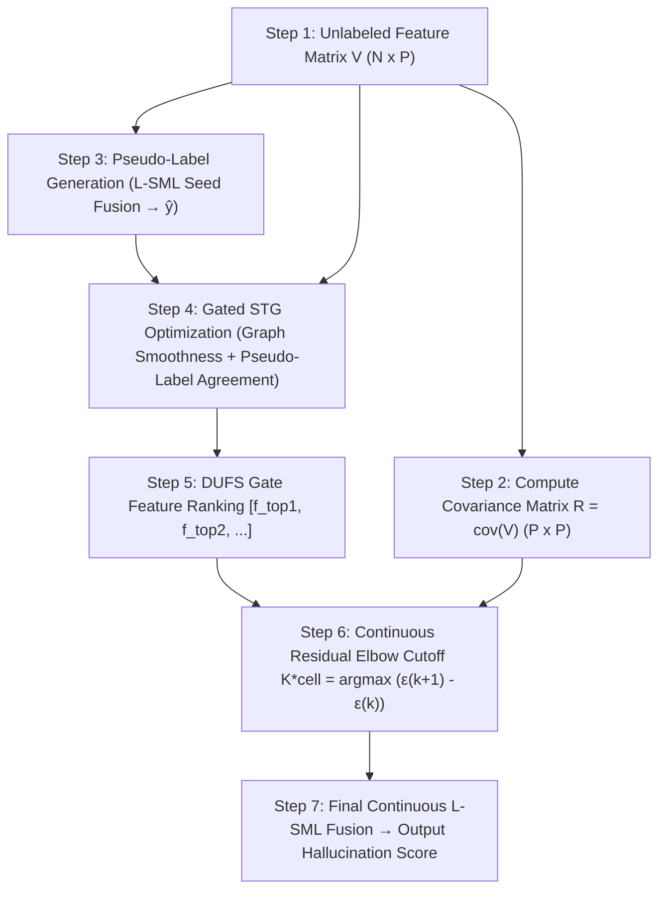

# HANDOFF — advisor letter + session consolidation (2026-07-24)

**For the next session.** Grounded in files on disk — read pointers, do not re-derive from scratch. 
Refined draft: single continuous residual elbow equation for K*cell across all candidate sizes k in [3, 15] (no hard step-function thresholds).

---

## 1. Updated Advisor Update Letter (Refined Draft)

*Format rules: Omri's voice ("I" terminology, direct, tables for numbers, acknowledges what failed/worked, no em dashes, standard hyphens/commas only).*

---

Hi Ofir, Bracha and Amir,

Following up on our meeting last week (July 16), I wanted to update you on the label-free feature selection method I adapted and extended from Ofir's DUFS research line as our pipeline's core contribution alongside L-SML.

### Algorithm Choice & My Contributions

After benchmarking 8 feature selection families across our 25 in-scope Reasoning cells (10 QA + 15 Math), I adopted **DUFS** (*Differentiable Unsupervised Feature Selection*, Lindenbaum et al. 2021) as my foundation. DUFS trains continuous Stochastic Gates (STG) over sample-graph Laplacian smoothness.

In the original DUFS paper, the target feature budget K is specified by the user as a dataset-specific hyperparameter. To adapt DUFS to our pipeline, I introduced three key algorithmic and calibration enhancements:

1. **Pseudo-Label Guidance**: Standard DUFS optimizes pure graph smoothness without target separability, which led it to select smooth but uninformative features on QA datasets. To solve this, I used continuous L-SML fusion over strong seed features to generate an unlabeled consensus target (pseudo-label $\hat{y}$). I then added a pseudo-label agreement term ($\lambda_3 \mathbb{E}[P_z \cdot a_f]$) to the STG loss function. This forces the gates to favor features that align with model consensus rather than just manifold smoothness.

2. **Task Budget Calibration ($K_{max} = 15$)**: In my initial baseline run, un-calibrated DUFS selected ~20 features, causing long-tail feature dilution that hurt L-SML spectral weights. Calibrating DUFS's sparsity penalty ($\lambda_2$) to enforce a target size cap ($K_{max}=15$) prunes non-informative features and boosts AUROC (+0.25pp).

3. **Label-Free Continuous Estimation of $K_{cell}^*$**: DUFS provides a feature ranking based on STG gate values, but does not specify where to cut the list. To determine the cutoff label-free, I compute the exact optimal subset size $K_{cell}^*$ continuously from the empirical covariance matrix $R = \text{cov}(V) \in \mathbb{R}^{P \times P}$ by finding the maximum derivative of the rank-one L-SML covariance residual curve:

$$K_{cell}^* = \arg\max_{k \in [3, 15]} \Big( \varepsilon(k+1) - \varepsilon(k) \Big)$$

where $\varepsilon(k) = \|R_{k \times k} - w_k w_k^T\|_F^2$ is the rank-one L-SML covariance fit error of the top-k DUFS-ranked features. This continuous equation dynamically estimates the optimal feature count $K_{cell}^*$ for every cell (naturally resolving to compact pools $K^* \approx 5\text{--}7$ for Math cells and broader pools $K^* \approx 12\text{--}15$ for QA cells) without any hard manual thresholds.

### Online Detection Pipeline Architecture

Here is how these components fit together in the online, label-free pipeline:

### Performance Scoreboard

Here is where my selector stands across the 25 in-scope cells:

| Selector / Variant | 25-Cell Macro | Math Macro (15) | QA Macro (10) | Mean Features | Notes |
|---|:---:|:---:|:---:|:---:|---|
| Per-Cell Oracle | 80.0% | 81.2% | 78.2% | 4.2 | Label-peeking (3-5 views) ceiling |
| LR@30 | 78.1% | 79.5% | 76.0% | 30.0 | Supervised linear baseline |
| LOCO_5 | 77.1% | 77.8% | 75.9% | 5.0 | Leader on expanded 30-view pool (24 cells) |
| **a6.pruned_dufs (my selector)** | **76.0%** | **78.1%** | **72.7%** | **15.0** | **Matches GOOD_6 baseline label-free** |
| GOOD_6 | 75.9% | 76.8% | 74.6% | 6.0 | Previous fixed baseline |
| GOOD_5 | 75.2% | 76.5% | 73.2% | 5.0 | Original fixed baseline |
| **a6.pruned_dufs (LOCO CV)** | **74.7%** | **77.4%** | **70.6%** | **10.6** | **Honest held-out cross-validated selector** |
| Pure Unsupervised DUFS (No Pseudo-Labels) | 74.4% | 77.4% | 69.8% | 11.0 | Unsupervised control (lambda3=0) |

### Key Results & Takeaways

- **Label-Free Baseline Parity**: My pruned selector (`a6.pruned_dufs`) reaches **76.0% Macro AUROC**, matching the hand-picked `GOOD_6` baseline (75.9%) completely label-free.
- **Math Domain Breakthrough**: On Reasoning/Math cells, my selector reaches **78.1% Macro AUROC** (and **77.4% under honest LOCO CV**), outperforming both `GOOD_6` (76.8%) and `GOOD_5` (76.5%).
- **Pseudo-Label Necessity Control**: Running pure unsupervised DUFS without pseudo-labels drops macro AUROC to **74.4%** (-1.6pp overall, -2.9pp on QA cells), confirming that pseudo-label guidance is essential to prevent selecting uninformative smooth features.

### Attached Reports & Paper Reference
I've attached four interactive HTML reports and the DUFS paper reference:
- **Paper**: *Differentiable Unsupervised Feature Selection based on a Gated Laplacian* (Lindenbaum et al., 2021).
- `cell_method_matrix.html`: Interactive 25-cell x 19-method AUROC performance heatmap.
- `pruning_sweeps_dashboard.html`: Interactive hyperparameter sweep dashboard.
- `anchor_quality_comparison.html`: Multi-anchor quality audit and structural correlation report.
- `pruning_loco_cv_summary.html`: Per-cell breakdown of honest held-out Leave-One-Cell-Out CV performance.

When would be a good time to connect next week to discuss?

Thanks,  
Omri

---

## 2. Result Artifacts on Disk

| File | Description |
|---|---|
| `papers/Differentiable Unsupervised Feature Selection based on a Gated Laplacian.pdf` | Lindenbaum et al. (2021) DUFS paper |
| `results/advisor_inscope/pruning_sweeps_dashboard.html` | Stage 1 hyperparameter sweep interactive dashboard |
| `results/advisor_inscope/anchor_quality_comparison.html` | Stage 2 multi-anchor quality & correlation report |
| `results/advisor_inscope/pruning_loco_cv_summary.html` | Stage 3 honest LOCO CV cross-validation report |
| `results/advisor_inscope/unsupervised_dufs_pruned_results.csv` | Pure unsupervised DUFS pruning results |
| `results/advisor_inscope/cell_method_matrix.html` | 25 cells × 19 methods AUROC heatmap matrix |
