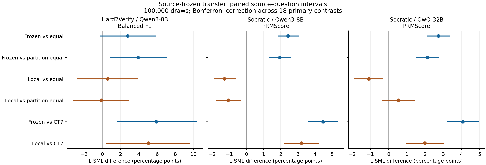

# Frozen L-SML external generalization results

## Interpretation and decision

**Keep frozen step-level bank11 L-SML as the leading learned method.** Its source-fitted weights add measurable value on the external data. On Socratic, the improvements over its ordinary equal and learned-partition equal controls are positive after correction across 18 primary contrasts for both Qwen3-8B and QwQ-32B. The observed-disjoint panel preserves these gains. This is evidence for transferable fusion value, not a claim of benchmark leadership.

Hard2Verify is a qualified positive result: frozen L-SML reaches 43.670 Balanced F1 versus 37.751 CT7 and 39.758 partition equal. The corrected intervals support both gains. Its +2.787pp gain over ordinary equal has interval [-0.222,+5.839]pp; that particular claim remains inconclusive. The global label-shuffle null also includes this gain. The calibrated prediction prevalence contributes to null differences, so a positive raw delta alone is insufficient.

**Do not promote the current answer-local token L-SML implementation.** It loses to its ordinary equal control on both Socratic backbones: -1.285pp [-1.894,-0.665] and -1.087pp [-1.854,-0.313]. Native coverage is 2984/2995 per backbone, and the matched-native panels preserve the ordering; eleven short-answer fallbacks per cell do not explain the losses. This rejects this implementation as the primary method, not all CPU runtime learning. Its higher descriptive within-answer AUC than frozen L-SML on Hard2Verify (.6664 vs. .6343) and Socratic/QwQ (.7094 vs. .7011) does not establish superiority on the registered decision metric.

A cross-family qualification matters: local equal reaches 63.247 on Socratic/Qwen3, effectively tying the frozen-L-SML point estimate 63.221. Frozen L-SML is therefore the leading registered *learned* variant; it is not universally better than every averaging recipe. Its evidence for learned weights comes from its own matched step-level controls. Averaging remains a diagnostic control, not the proposed final method.

### What limits absolute performance

Frozen L-SML identifies 29.23% of error steps on Hard2Verify and 37.60%/39.39% on the two Socratic backbones. Correct-step recall remains 86.30%/87.83%/87.84%. The policy calls 20.22%/20.88%/21.49% of steps incorrect, while the gold error fractions are 41.94%/34.27%/34.27%. Both ranking and decision calibration deserve investigation; the current experiment does not identify a single cause.

The most concrete Hard2 diagnostic is **41/42 entirely correct answers receiving at least one error flag**. If every answer must keep its observed number of error predictions, even an oracle that reassigns those predictions using gold cannot exceed 52.673 Balanced F1. The weaker global-prevalence-only ceiling is 65.052. These are independently verified optimistic bounds on the observed decision budgets, not bounds on other thresholds or all L-SML methods. They motivate testing source-only alternatives that retain information about whether an entire answer is correct, including the effect of final answer standardization. They do not justify target-tuned thresholds or claim that calibration alone fixes the method. See `CALIBRATION_DIAGNOSTICS.json`, `BOUND_MATH_TEST.json`, and `independent_null/DECISION_BUDGET_CHECK.json`.

### Diversity already available in the collected traces

Frozen L-SML decisions disagree between Qwen3 and QwQ on 1751/26055 Socratic steps (6.72%); mean within-answer Spearman is .9003 over 2991 eligible answers. There is some complementary information, with substantial shared behavior. Answer-local decisions differ on 12.96% of steps, but that extra variation does not make the local method stronger on the primary metric. No cross-backbone fusion was fitted or evaluated here. `BACKBONE_COMPLEMENTARITY.json` records the descriptive analysis; its gold-assisted accuracy bounds are not PRMScore or deployable selectors.

### Next research boundary

Preserve this frozen bundle as the external-transfer baseline. Investigate calibration/answer-level information and any residual or cross-backbone extension on source development data first, using the retained telemetry and CPU computation. External labels have now been examined: subsequent optimization on these results is exploratory and needs a fresh held-out evaluation for a new generalization claim. MedPRMBench remains deferred; published critic/PRM reproduction remains outstanding. The literature context below still exceeds our Socratic scores and includes substantially higher Hard2 results, so no SOTA claim is supported.

All seven registered internal methods were evaluated on all three dataset/backbone cells: 6,190 records and 53,970 steps. No new model inference or GPU training was performed in this evaluation stage. Published comparator inference remains a separate, unfinished item of the broader pipeline.

## Official full-set results

Percentages below use the metric defined by each benchmark. Hard2Verify: harmonic mean of correct-step and incorrect-step recalls. Socratic: pooled binary macro-F1 (PRMScore). The columns must not be averaged.

| Method | Hard2Verify / Qwen3-8B | Socratic / Qwen3-8B | Socratic / QwQ-32B |
|---|---:|---:|---:|
| Frozen step L-SML | 43.670 | 63.221 | 64.238 |
| Step equal (control) | 40.882 | 60.791 | 61.503 |
| Step partition equal (control) | 39.758 | 61.270 | 62.110 |
| Answer-local token L-SML | 42.805 | 61.961 | 62.153 |
| Token equal (control) | 42.212 | 63.247 | 63.240 |
| Token partition equal (control) | 42.931 | 63.020 | 61.612 |
| CT7 reference | 37.751 | 58.753 | 60.166 |

## Incremental fusion value

Each primary contrast uses identical answer/step masks and source-only calibration access. Intervals are paired source-question bootstrap intervals: 100,000 draws, seed 20260924, Bonferroni correction across 18 contrasts. Positive intervals support improvement over that particular reference. Native fitting and readout differ between the frozen-step and local-token families; compare their matched controls first.

| Cell | Candidate | Reference | Difference (pp) | Corrected interval (pp) |
|---|---|---|---:|---|
| Hard2Verify / Qwen3-8B | Frozen step L-SML | Step equal (control) | +2.787 | [-0.222, +5.839] |
| Hard2Verify / Qwen3-8B | Frozen step L-SML | Step partition equal (control) | +3.912 | [+0.837, +7.058] |
| Hard2Verify / Qwen3-8B | Answer-local token L-SML | Token equal (control) | +0.594 | [-2.744, +3.877] |
| Hard2Verify / Qwen3-8B | Answer-local token L-SML | Token partition equal (control) | -0.126 | [-3.202, +2.887] |
| Hard2Verify / Qwen3-8B | Frozen step L-SML | CT7 reference | +5.919 | [+1.626, +10.350] |
| Hard2Verify / Qwen3-8B | Answer-local token L-SML | CT7 reference | +5.054 | [+0.472, +9.542] |
| Socratic / Qwen3-8B | Frozen step L-SML | Step equal (control) | +2.430 | [+1.848, +3.027] |
| Socratic / Qwen3-8B | Frozen step L-SML | Step partition equal (control) | +1.952 | [+1.337, +2.578] |
| Socratic / Qwen3-8B | Answer-local token L-SML | Token equal (control) | -1.285 | [-1.894, -0.665] |
| Socratic / Qwen3-8B | Answer-local token L-SML | Token partition equal (control) | -1.058 | [-1.774, -0.342] |
| Socratic / Qwen3-8B | Frozen step L-SML | CT7 reference | +4.468 | [+3.628, +5.319] |
| Socratic / Qwen3-8B | Answer-local token L-SML | CT7 reference | +3.208 | [+2.214, +4.188] |
| Socratic / QwQ-32B | Frozen step L-SML | Step equal (control) | +2.735 | [+2.115, +3.356] |
| Socratic / QwQ-32B | Frozen step L-SML | Step partition equal (control) | +2.128 | [+1.514, +2.755] |
| Socratic / QwQ-32B | Answer-local token L-SML | Token equal (control) | -1.087 | [-1.854, -0.313] |
| Socratic / QwQ-32B | Answer-local token L-SML | Token partition equal (control) | +0.541 | [-0.337, +1.428] |
| Socratic / QwQ-32B | Frozen step L-SML | CT7 reference | +4.073 | [+3.233, +4.926] |
| Socratic / QwQ-32B | Answer-local token L-SML | CT7 reference | +1.987 | [+0.969, +3.024] |

The averaging arms are controls, not proposed final methods. A higher absolute score alone does not establish that learned fusion adds value. Published comparator values below do not have paired predictions in this experiment.

## Ranking and observed-disjoint transfer

| Cell | Method | Within-answer AUC | Eligible answers | Observed-disjoint official metric (%) |
|---|---|---:|---:|---:|
| Hard2Verify / Qwen3-8B | Frozen step L-SML | 0.6343 | 148 | 43.670 |
| Hard2Verify / Qwen3-8B | Step equal (control) | 0.6051 | 148 | 40.882 |
| Hard2Verify / Qwen3-8B | Step partition equal (control) | 0.5688 | 148 | 39.758 |
| Hard2Verify / Qwen3-8B | Answer-local token L-SML | 0.6664 | 148 | 42.805 |
| Hard2Verify / Qwen3-8B | Token equal (control) | 0.6250 | 148 | 42.212 |
| Hard2Verify / Qwen3-8B | Token partition equal (control) | 0.6263 | 148 | 42.931 |
| Hard2Verify / Qwen3-8B | CT7 reference | 0.6079 | 148 | 37.751 |
| Socratic / Qwen3-8B | Frozen step L-SML | 0.6836 | 2987 | 63.070 |
| Socratic / Qwen3-8B | Step equal (control) | 0.6512 | 2987 | 60.454 |
| Socratic / Qwen3-8B | Step partition equal (control) | 0.6583 | 2987 | 61.132 |
| Socratic / Qwen3-8B | Answer-local token L-SML | 0.6871 | 2987 | 61.812 |
| Socratic / Qwen3-8B | Token equal (control) | 0.6967 | 2987 | 63.126 |
| Socratic / Qwen3-8B | Token partition equal (control) | 0.7004 | 2987 | 62.719 |
| Socratic / Qwen3-8B | CT7 reference | 0.6452 | 2987 | 58.661 |
| Socratic / QwQ-32B | Frozen step L-SML | 0.7011 | 2987 | 64.173 |
| Socratic / QwQ-32B | Step equal (control) | 0.6650 | 2987 | 61.141 |
| Socratic / QwQ-32B | Step partition equal (control) | 0.6688 | 2987 | 61.912 |
| Socratic / QwQ-32B | Answer-local token L-SML | 0.7093 | 2987 | 62.309 |
| Socratic / QwQ-32B | Token equal (control) | 0.7085 | 2987 | 63.235 |
| Socratic / QwQ-32B | Token partition equal (control) | 0.6984 | 2987 | 61.643 |
| Socratic / QwQ-32B | CT7 reference | 0.6727 | 2987 | 59.967 |

Observed-disjoint paired uncertainty is a sensitivity analysis, using the same group-bootstrap procedure and eighteen-comparison correction. It does not establish absence of semantic overlap.

| Cell | Candidate | Reference | Disjoint difference (pp) | Corrected interval (pp) |
|---|---|---|---:|---|
| Hard2Verify / Qwen3-8B | Frozen step L-SML | Step equal (control) | +2.787 | [-0.222, +5.839] |
| Hard2Verify / Qwen3-8B | Frozen step L-SML | Step partition equal (control) | +3.912 | [+0.837, +7.058] |
| Hard2Verify / Qwen3-8B | Answer-local token L-SML | Token equal (control) | +0.594 | [-2.744, +3.877] |
| Hard2Verify / Qwen3-8B | Answer-local token L-SML | Token partition equal (control) | -0.126 | [-3.202, +2.887] |
| Hard2Verify / Qwen3-8B | Frozen step L-SML | CT7 reference | +5.919 | [+1.626, +10.350] |
| Hard2Verify / Qwen3-8B | Answer-local token L-SML | CT7 reference | +5.054 | [+0.472, +9.542] |
| Socratic / Qwen3-8B | Frozen step L-SML | Step equal (control) | +2.616 | [+1.978, +3.261] |
| Socratic / Qwen3-8B | Frozen step L-SML | Step partition equal (control) | +1.938 | [+1.261, +2.610] |
| Socratic / Qwen3-8B | Answer-local token L-SML | Token equal (control) | -1.314 | [-1.976, -0.643] |
| Socratic / Qwen3-8B | Answer-local token L-SML | Token partition equal (control) | -0.907 | [-1.663, -0.149] |
| Socratic / Qwen3-8B | Frozen step L-SML | CT7 reference | +4.409 | [+3.488, +5.347] |
| Socratic / Qwen3-8B | Answer-local token L-SML | CT7 reference | +3.151 | [+2.079, +4.223] |
| Socratic / QwQ-32B | Frozen step L-SML | Step equal (control) | +3.031 | [+2.361, +3.723] |
| Socratic / QwQ-32B | Frozen step L-SML | Step partition equal (control) | +2.261 | [+1.593, +2.945] |
| Socratic / QwQ-32B | Answer-local token L-SML | Token equal (control) | -0.926 | [-1.761, -0.094] |
| Socratic / QwQ-32B | Answer-local token L-SML | Token partition equal (control) | +0.667 | [-0.275, +1.592] |
| Socratic / QwQ-32B | Frozen step L-SML | CT7 reference | +4.206 | [+3.312, +5.138] |
| Socratic / QwQ-32B | Answer-local token L-SML | CT7 reference | +2.342 | [+1.256, +3.435] |

Socratic contains 442 answers connected to development questions, leaving 2,553 answers/1,514 groups in the observed-disjoint panel. Its full set has 2,995 answers/1,765 groups. Hard2Verify has 200 answers/79 text groups and no observed exact development overlap. These exclusions propagate through source identity and original/evaluated-text components. Development metadata does not enumerate every original/modified PRMB question variant and has no verified cross-dataset ID crosswalk. Therefore observed-disjoint does not establish absence of paraphrases, equivalent problems or pretraining contamination. The two Socratic backbones reuse the same dataset.

## Coverage, decisions and runtime

Cell-level label sanity and full-population coverage flags are retained in METRICS.json and METRICS.csv. Flagged cells must not be used for unqualified headline win counts.

| Cell | Answers | Steps | Local native fits | Empty steps | Scoring CPU seconds | Per-answer elapsed p95 (seconds) |
|---|---:|---:|---:|---:|---:|---:|
| Hard2Verify / Qwen3-8B | 200 | 1860 | 200 | 0 | 1321.2 | 20.076 |
| Socratic / Qwen3-8B | 2995 | 26055 | 2984 | 3 | 6400.1 | 4.596 |
| Socratic / QwQ-32B | 2995 | 26055 | 2984 | 3 | 5887.1 | 4.007 |

Three empty Socratic steps per backbone remain included, with a fixed incorrect decision independent of labels and a null risk score. Native-score ranking excludes those empty steps. Local estimator failures use chosen-token surprisal for all three local arms; complete-policy and matched-native metrics are both saved. Each arm has its own source q80 threshold, so identical fallback scores can still produce different binary decisions. METRICS.json records those fallback decision differences, small-group guards and degeneracy flags.

Runtime above includes feature extraction and all seven comparison arms, including CT7. It is not the deployment cost of one L-SML method. CPU time is measured with process_time; elapsed percentiles include contention on the local workstation. The three full AIRCC collection jobs used 1,376 allocated GPU seconds (0.38222 GPU-hours); earlier timing, pilot and failed-job costs are recorded separately in the collection ledger. This evaluation stage added zero GPU hours. The local fallback followed repeated SSH timeouts and verified SHA256s of all three private Drive archives.

| Cell | Method | Correct-step recall (%) | Error-step recall (%) | Predicted error fraction (%) | Gold error fraction (%) |
|---|---|---:|---:|---:|---:|
| Hard2Verify / Qwen3-8B | Frozen step L-SML | 86.30 | 29.23 | 20.22 | 41.94 |
| Hard2Verify / Qwen3-8B | Answer-local token L-SML | 86.30 | 28.46 | 19.89 | 41.94 |
| Hard2Verify / Qwen3-8B | CT7 reference | 87.04 | 24.10 | 17.63 | 41.94 |
| Socratic / Qwen3-8B | Frozen step L-SML | 87.83 | 37.60 | 20.88 | 34.27 |
| Socratic / Qwen3-8B | Answer-local token L-SML | 87.18 | 36.02 | 20.77 | 34.27 |
| Socratic / Qwen3-8B | CT7 reference | 88.12 | 29.82 | 18.03 | 34.27 |
| Socratic / QwQ-32B | Frozen step L-SML | 87.84 | 39.39 | 21.49 | 34.27 |
| Socratic / QwQ-32B | Answer-local token L-SML | 87.01 | 36.51 | 21.05 | 34.27 |
| Socratic / QwQ-32B | CT7 reference | 89.74 | 30.73 | 17.28 | 34.27 |

## Source validation and method lock

Existing source folds were preserved. Each source evaluation fold used three other folds for fitting and one separate calibration fold. The deployment model fits folds 0-3 and uses fold 4 for q80 calibration. Calibration pools unlabeled PB+PRMB steps; it is not target calibration or PRMB-only calibration. Source scores cover 13,769 answers; the official PRMB panel below uses 6,211 non-control answers/83,371 steps. These remain development results.

| Method | Separated source PRMScore (%) | Within-answer AUC (6,030 answers) |
|---|---:|---:|
| Frozen step L-SML | 64.172 | 0.7645 |
| Step equal (control) | 63.329 | 0.7496 |
| Step partition equal (control) | 63.748 | 0.7531 |
| Answer-local token L-SML | 60.016 | 0.7091 |
| Token equal (control) | 60.302 | 0.7087 |
| Token partition equal (control) | 60.057 | 0.7045 |
| CT7 reference | 64.618 | 0.7724 |

The guarded bank11 recipes, feature signs, entropy orientation, Top10 readouts and final answer-z were fixed before external quality inspection. Local token fitting uses stride 8 and at least 3 active channels and 3 observations per active channel. All source local scores and six frozen fits passed strict numerical-failure replay unchanged; the deployment weights exactly match the historical fold 4 fit. Twelve deterministic source examples replayed CT7 and bank11 raw extraction. This is a bounded implementation-fidelity check, not a full raw-cache replay.

## Published context, not reproduced baselines

Hard2Verify reports step-level Balanced F1 of 53.51 for the Qwen3-8B critic, 42.37 for Qwen2.5-Math-PRM-7B and 60.27 for UniversalPRM-7B. Its PRM thresholds were tuned on 100 target responses; our thresholds were frozen on development data. These are different access conditions. [Hard2Verify, Table 2 and Appendix E.1](https://arxiv.org/html/2510.13744v1).

Socratic reports PRMScore 68.0 for Qwen2.5-Math-PRM-7B and 73.8 for the QwQ-32B critic. These are literature context, not same-run measurements or evidence of statistically established superiority. [Socratic-PRMBench, Table 3](https://arxiv.org/html/2505.23474v1).

## Evidence and reproduction

- Input and result restore locations/checksums: `evaluation/SOURCE_DEPENDENCY_ARCHIVE.json` and `evaluation/EVALUATION_ARCHIVE.json`; restore into a separate checkout and verify hashes before running.

- Frozen contract: [execution lock](LSML_EXTERNAL_EVALUATION_LOCK_20260924.md).
- Machine-readable results: `results/lsml_external_generalization_v1/evaluation/{METRICS,CONTRASTS,EVALUATION_PROVENANCE}.json`.
- Per-cell predictions, seals, confusion arrays, bootstrap draws, category and native panels are in the corresponding cell directory.
- Independent audits: `evaluation/independent_population`, `independent_ct7`, `independent_source`, and `RED_TEAM.md`.
- Private telemetry restore locations and SHA256s: `FULL_ARCHIVES.json`; local fallback verification: `evaluation/LOCAL_FALLBACK_PROVENANCE.json`.
- Run `scripts/fit_external_source_bundle.py`, verify with `scripts/verify_external_source_strict.py`, then run `scripts/run_external_local_cpu.py`. The AIRCC CPU driver uses the identical scorer when connectivity is available.
- Seal/evaluate with `scripts/evaluate_external_locked_scores.py --root results/lsml_external_generalization_v1/evaluation --inputs scratch/external_generalization_private/inputs`; the evaluator rejects mixed run identities and changed code/bundles.
- No raw Hard2Verify text is included in Git. Frozen result files are retained; this evaluation does not rewrite historical scores.

## פירוש קצר בעברית

**הגרסה המובילה להמשך היא L-SML קפוא ברמת step עם בנק 11 הפיצ׳רים.** ב־Socratic היא משפרת באופן מובהק את שתי הבקרות התואמות ואת CT7, גם עם Qwen3 וגם עם QwQ. היתרון נשמר לאחר הסרת החפיפות המזוהות עם נתוני הפיתוח. זו עדות לערך של fusion נלמד שמועבר לנתונים חדשים.

ב־Hard2Verify השיפור מובהק מול CT7 ומול הבקרה בעלת חלוקת הקבוצות הנלמדת ומשקלים אחידים. ההפרש מול מיצוע רגיל אינו מובהק לאחר התיקון לריבוי השוואות. הגרסה המקומית, שלומדת מחדש בכל תשובה, נחותה מהמיצוע התואם בשתי הרצות Socratic ולכן לא נבחרת כמובילה.

**אין כאן טענה ל־SOTA.** ב־Socratic הציונים שלנו הם 63.22 ו־64.24, לעומת 68.0 ו־73.8 בהשוואות שפורסמו בתנאים אחרים ולא שוחזרו כאן. ב־Hard2Verify הציון הוא 43.67, ויש תוצאות מדווחות גבוהות משמעותית.

ממצא חשוב להמשך: ב־Hard2Verify סומנה שגיאה ב־41 מתוך 42 תשובות נכונות לחלוטין. נדרש לבדוק על נתוני הפיתוח כיצד לשמר מידע ברמת התשובה ולכייל את ההחלטות, בלי להסתפק בדירוג היחסי בין השלבים. שינויי שיטה עתידיים בעקבות התוצאות הללו ידרשו בדיקה חיצונית חדשה.

כל ההשוואה נעשתה על CPU מהטלמטריה שכבר נאספה, ללא אימון GPU או inference נוסף. מיצוע משמש בקרה בלבד.
