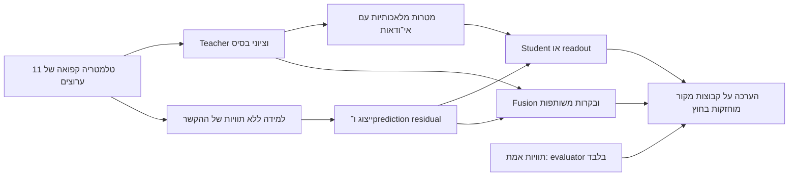

# תוכנית ניסויים: Self-Supervision, Pseudo-Labels ו־Residuals ללוקליזציה

**גרסה:** 1.2 — 2026-09-23. **עדכון מחייב:** [תוכנית PRMBench runtime fusion](PRMBENCH_RUNTIME_FUSION_PLAN_HE.md) גוברת על הפרוטוקולים בהמשך בכל סתירה. S4 ו־S5 התלוי ב־encoder הוצאו מההיקף הפעיל. אין אימון GPU או מעבר LLM נוסף; SSL רלוונטי רק כעיבוד CPU של מידע קיים בזמן ריצה. המוקד הוא L-SML בעל תרומה מדידה, גם בבנק פיצ'רים אחר מ־CT7; RBM הוא חלופה. מיצוע הוא בקרה בלבד. PRMBench וה־PRMScore הם יעד הפיתוח הראשי; PB משני. הפרוטוקולים הישנים נשמרים לתיעוד המתכונים שנבדקו.

**מצב מימוש:** הופקו תיקוני metadata ל־228 contrasts בגרסה חדשה, ותוקנו רכיבי מסכות native ונרמול residual לערוץ. שש בדיקות עברו. טרם בוצעה ריצת איכות מלאה של מועמד חדש. ראו [ביקורת הטענות והספרות](../reviews/PRMBENCH_LITERATURE_AND_CLAIM_AUDIT_20260923_HE.md).

**מטרה:** לבדוק האם אפשר ללמוד ראיות שימושיות למיקום שגיאה מתוך הטלמטריה שכבר נאספה, ולשלב אותן ב־fusion באופן שמשפר לוקליזציה. התוכנית מפרידה בין איכות התוויות המלאכותיות, איכות הייצוג, איכות ה־readout ואיכות ה־fusion, כדי ששיפור או כישלון יהיו ניתנים להסבר.

**הנחיית Omri:** אין מחויבות לאופן שבו Claude השתמש ב־pseudo-labels. הניסוי שלו הוא מקור לראיות ולבקרות. כאן מוגדרים גם שימושים אחרים: מטרות רכות, תוויות לכל צעד, הסכמה בין מבטים, הימנעות מתיוג, ולמידת pooling בעזרת teacher קפוא. אין הנחה שה־teacher הוא אמת.

**היקף הביצוע:** זהו רצף של שלבים תחומים, ולא פקודה להריץ את כולם. מתחילים ב־S0 ומדווחים בסיום כל שלב. שלבים שלא הופעלו נשארים בתכנון. אין לשנות את ריצת Claude, לדרוס תוצאות קפואות או להתחיל inference חדש כדי לממש את שלבי הליבה.

## 1. ההמלצה המחקרית

הכיוון המומלץ הוא שילוב של שלוש פעולות בעלות תפקידים שונים:

1. **Self-supervision לומד את המבנה של הטלמטריה:** מה ניתן לחזות מההקשר ומה נשאר בלתי צפוי. הוא אינו לומד ישירות מהי שגיאת reasoning.
2. **Pseudo-labels מגדירים משימת דירוג או סיווג חלשה:** למשל, באיזה צעד כדאי להתמקד, או אילו צעדים חשודים. הם מאפשרים ללמוד readout, אך עלולים להעביר ל־student את ההטיות של ה־teacher.
3. **Residuals מוסיפים תיקון לראיות הקיימות:** אי־צפיות בזמן, או מרכיב של מבטי ה־fusion שהציון הנוכחי אינו מבטא. הם אינם מחליפים אוטומטית את ציון הבסיס.

לכן בודקים תחילה כל רכיב בנפרד. החיבור ביניהם מגיע רק לאחר שאפשר למדוד את תרומתו של כל רכיב. שחזור מדויק יותר, residual גדול יותר או יותר הסכמה בין מבטים אינם כשלעצמם הצלחה בלוקליזציה.



## 2. מה כבר ידוע, ומה עדיין אינו מסקנה

### 2.1 ראיות קודמות שעליהן נשענת התוכנית

| ממצא | המשמעות לתכנון | מה אינו נובע ממנו |
|---|---|---|
| בביקורת Steps 428–429 שוחזרו המדדים; לא נמצא מועמד שמנצח את CT7 | לשמר CT7, token L-SML וה־equal כעוגנים | לא מוצו כל הייצוגים או כל דרכי ה־pooling |
| הרחבת איגום הטוקנים עזרה בחלק מתוצאות PB ופגעה ב־PRMB | למדוד שגיאה קצרה לעומת ראיות מפוזרות; להשאיר readout קבוע בזמן בדיקת features | אין readout יחיד שהוכח כטוב לשני היעדים |
| בדיקת מספר המתחרים תומכת בכך שריבוי צעדים מקשה על בחירת השיא | לנתח rank, margin וטעויות לפי עומק | זה אינו מוכיח שהטלמטריה עצמה נעשית גרועה יותר עם העומק |
| בניסוי ההקשר ההיסטורי TCN שיפר PB F1 מול innovation5, אך יתרונו על Ridge לא הוכח | Ridge הוא בקרת חובה לכל SSL חדש | MSE נמוך יותר אינו הוכחה ללוקליזציה טובה יותר |
| residual-only היה חלש משמעותית מה־levels בניסוי ההיסטורי | לשמר בסיס ולבדוק תיקון, לצד residual-only אבחוני | אין הצדקה למחוק את ה־levels |
| NRM שיפר AUROC ברמת תשובה ב־PRMBench ב־0.460 נקודות אחוז | יש מוטיבציה לבדוק מרכיב משלים לציון הראשי | זו אינה תוצאה של step localization |

מספרי עוגן קפואים מ־Steps 428–429, לצורכי replay בלבד:

| שיטה | PB SLA macro8 | PB F1 עם CT7 gate | PRMB within-answer AUROC |
|---|---:|---:|---:|
| CT7 | 0.398862 | 0.411887 | 0.772397 |
| token L-SML | 0.359237 | 0.373244 | 0.753164 |
| top5 equal, המתכון הקפוא | 0.324895 | 0.352436 | 0.753153 |

אין להשתמש בשורה האחרונה כמספר צפוי של כל teacher חדש: שינוי נרמול או מעבר מ־mean(z) ל־mean(sigmoid(z)) עשויים לשנות דירוגים.

בניסוי ההיסטורי על innovation5, PB **F1** היה 0.398314 לבסיס, 0.408472 ל־Ridge ו־0.409718 ל־TCN. אלה אינם מספרי SLA ואינם השוואה מותאמת לבנק 11 הערוצים. השיפור של TCN מול הבסיס היה מבוסס יותר מההפרש שלו מול Ridge. יש לשחזר את ההשוואה באותו בנק לפני ייחוס יתרון לארכיטקטורה.

מקורות מקומיים:

- [ביקורת Claude וההסתייגויות הסטטיסטיות](../reviews/CLAUDE_READOUT_REVIEW_20260922_HE.md).
- [פרוטוקול predictors היסטורי](../../.worktrees/readout-quickest-detection-v1/docs/experiments/ALIGNED_CONTEXT_PREDICTORS_20260915.md).
- [פרוטוקול residual-moment ההיסטורי](../../.worktrees/readout-quickest-detection-v1/docs/experiments/RESIDUAL_MOMENT_FUSION_20260915.md).
- [NRM: תוצאה ברמת תשובה, לא ברמת צעד](../../.worktrees/readout-quickest-detection-v1/results/neutral_residual_mode_prmbench_v1/REPORT.md).

### 2.2 הניסוי של Claude הושלם: מה בדיוק נבדק

מקור: [STEP_EVIDENCE_V1_PROTOCOL.md](../../.worktrees/readout-quickest-detection-v1/docs/experiments/STEP_EVIDENCE_V1_PROTOCOL.md), Amendment A1, וקובצי `results/step_evidence_v1` באותו worktree.

המתכון המקורי בנה היסטוגרמות pseudo-positive / pseudo-negative מתוך שיא של teacher, והתנה את אוכלוסיית החיוביים ב־CT7 gate. ב־PRMBench ה־gate לא נפתח באף אחת מ־6,969 התשובות. A1 שינה זאת ל־pseudo-positive אחד בכל תשובת PRMBench. **הריצה המתוקנת הסתיימה:** הלוג מסתיים ב־exit 0, קיימים 30 outer ו־40 inner jobs, ו־SUMMARY/REPORT_MANIFEST נוצרו אחרי jobs המתוקנים, ב־2026-09-23 סביב 07:36 לפי זמני הקבצים המקומיים. 25 עוגנים משותפים דווחו כמשוחזרים בדיוק.

בטיוטה המוקדמת נצפתה הריצה באמצע העדכון. הנתונים בהמשך הסעיף הם מן התוצאה הסופית של A1, ולא מתוצאת ה־zero-positive המקורית. אין לייחס את ה־AUROC הנמוך של הריצה המקורית לכישלון המתכון המתוקן.

נמצאו גם שני דברים המחייבים בדיקה ב־S0:

1. `seed_mass_equal_softmax` מפעיל softmax על הקלט בלי לבצע בעצמו z-score בין צעדים. ה־driver מעביר את ה־profiles הקפואים ישירות, בעוד `cvf_v2.encode(..., 'pmf', 'pb')` מבצע z-score בין צעדים. הבדיקה המספרית שיחזרה את ה־seed בפועל בדיוק. הוספת step-z בלבד משנה **1,508 מתוך 6,800** חיזויי PB ומעלה את ה־SLA מ־29.644% ל־32.489%, בדיוק ערך ה־equal הקפוא של Step429. זו אינה תוצאה של student חדש; היא מראה מדוע אסור להשוות את שני ה־seeds כאילו היו אותו baseline.
2. `code_freeze` משתמש ב־`p.name` כמפתח. גם ה־driver וגם המודול נקראים `step_evidence_v1.py`; בדיקת hashes אישרה שב־RUN_FREEZE וב־source_snapshot נשמר המודול תחת השם הזה, ולא ה־driver. בפרוטוקול החדש המפתחות חייבים להיות נתיבים יחסיים מלאים.

אלו מגבלות שיש להפריד מתוקף המדדים: hash חסר של driver הוא פער provenance, ושני normalizations הם שני מתכונים. אף אחד מהם אינו סיבה למחוק תוצאה שניתנת לשחזור. ראיות הבדיקה העצמאית נשמרות ב־[AUDIT.json](../../scratch/step_evidence_plan_review_20260923/AUDIT.json), עם [סקריפט שחזור](../../scratch/review_step_evidence_for_plan_20260923.py). אין כאן refit של המודלים או audit חדש של raw inference.

בבדיקה העצמאית שוחזרו 57 ערכי PB SLA/F1 ו־10 ערכי PRMB within-AUC עד דיוק float64, ללא source groups שחוצים folds וללא overlap רשום ב־70 ה־jobs. לחמש references היסטוריות של IU/Joint יש כיסוי PB של 6,796 במקום 6,800; replay שלהן משתמש באוכלוסייה הרשומה, ומספרים אלה אינם תחליף להשוואה על אוכלוסייה משותפת. שיטות evidence החדשות והעוגנים המרכזיים מכסים את כל האוכלוסייה. כל תוצרי הנתונים שנרשמו במניפסט התאימו ל־hash; הלוג לבדו צמח לאחר יצירתו. גם שם prefix הלוג באורך שנרשם תואם בדיוק, והסיומת הנוספת היא הודעת סיום ו־exit 0. יש להפריד חריג לוג מוסבר מפגיעה בשלמות ציוני הניסוי.

### 2.3 התוצאות הסופיות במונחים פשוטים

העמודות הן מדדים שונים: PB SLA בוחר **שגיאה ראשונה אחת**; PRMB within-AUC בוחן **דירוג כל השגיאות בתוך אותה תשובה**; PRMScore דורש גם החלטות לאחר threshold ואינו שקול לדירוג הזה.

| שיטה בריצה הסופית | PB SLA | PRMB within-AUC | PRMScore, inner-selected |
|---|---:|---:|---:|
| CT7 הקפוא | 39.886% | 0.772397 | 0.647104 |
| top5 seed של Step432 | 29.644% | 0.676113 | 0.612238 |
| top5 plain evidence | 29.040% | 0.758912 | 0.583137 |
| top5 position evidence | 29.519% | 0.767425 | 0.578295 |
| top5 position, iteration 2 | 28.061% | 0.769555 | 0.588202 |
| top5 plain evidence + continuous L-SML | 25.365% | 0.761901 | 0.585312 |
| top30 seed של Step432 | 33.268% | 0.639978 | 0.604184 |
| top30 plain evidence | 34.950% | 0.711779 | 0.559045 |
| top30 position evidence | 32.653% | 0.717437 | 0.556026 |

מקורות מספריים: [SUMMARY.csv](../../.worktrees/readout-quickest-detection-v1/results/step_evidence_v1/SUMMARY.csv) ו־[PAIRED_CONTRASTS.csv](../../.worktrees/readout-quickest-detection-v1/results/step_evidence_v1/PAIRED_CONTRASTS.csv). טבלת העוגנים מסעיף 2.1 מספקת את ה־equal הקפוא מ־Step429; הוא אינו אותו seed שמופיע כאן.

המסקנה המעשית היא **תוצאה שלילית ב־PB לצד אות חיובי ב־PRMB ranking**, עם בעיה נוספת של החלטות בין תשובות:

- ב־PB, top5 plain לא משפר את seed שלו: ‎−0.604 נקודות אחוז, CI95% ‎[−2.349,+1.119]. top30 plain משפר seed חלש יותר ב־+1.682 נקודות אחוז, CI95% ‎[+0.068,+3.275], אך `p_holm=1` במשפחה המקורית; הוא גם אינו עובר את top30 equal הקפוא, 35.468%. אין הצלחה כוללת מול incumbent.
- ב־PRMB, position לעומת plain מוסיף **0.008512 within-AUC**, CI95% ‎[0.006337,0.010689], ו־`p_holm=0.031197` כפי שחושב בריצה. זהו אות ממשי להעמקה בכיוון, גם אם השיטה עדיין מתחת ל־CT7 בנקודת האומדן.
- גם **L-SML על plain evidence משפר את PRMB** ב־0.002989, CI95% ‎[0.001539,0.004471], reported `p_holm=0.031197`, ובו בזמן פוגע ב־PB ב־3.675 נקודות אחוז. לכן "learned weights hurt" צריך להיות מוגבל ליעד שבו נמדדה הפגיעה.
- iteration 2 של position עולה ל־0.769555 ב־PRMB. ההפרש מול CT7 הוא ‎−0.002841, CI95% ‎[−0.007319,+0.001465]. זה אינו ניצחון וגם אינו equivalence ל־CT7; ב־PB אותה זרוע חלשה בהרבה. אין סיבה אוטומטית להוסיף עוד iterations.
- PRMScore של position יורד לעומת seed בכ־3.394 נקודות אחוז, ולעומת CT7 בכ־6.881 נקודות אחוז. פער זה לצד דירוג טוב יותר מצביע על צורך לבדוק **סקאלה/סף/פיזור בין תשובות**. הוא עדיין אינו מוכיח שסקלת תשובה היא הסיבה היחידה.

ה־CIs לעיל הם paired intervals לא מתוקנים, לצד ערך Holm שדווח כאשר קיים. לריצה זו 312 contrasts ו־10,000 draws; אין להעתיק אליה את מגבלת 1,464 ההשוואות של Step429. המספרים מדווחים כ־development evidence, עם מגבלות מבחן ה־bootstrap המקורי.

### 2.4 עם אילו מסקנות של Claude מסכימים, והיכן צריך להעמיק

| טענה/ממצא | הערכה | השפעה על התוכנית |
|---|---|---|
| ערוצי הבנק מציגים עודף score בתחילת התשובה, לא drift ממוצע שעולה לקראת הסוף | נתמך באבחוני Step430; slope של CT7 בנקיות לפי gate הוא בערך ‎−1.17 SD ליחידת מיקום | לא מוסיפים "עונש מאוחר" שרירותי; שומרים early/late analyses |
| שינוי פשוט של argmax לכלל earliest-of-top2 לא עזר | נתמך במתכונים שנבדקו | לא חוזרים על אותה רשימת כללים |
| unions של readouts נראים טוב גם אחרי shuffle | מראה ש־oracle coverage אינו ראיית fusion | בודקים fused score בפועל; לא מבטיחים הצלחה מ־union |
| position-conditioned evidence מועיל ל־PRMB ranking | נתמך בהפרש paired | מוסיפים S0-C ממוקד לכיול, ומשמרים זרוע זו כ־comparator |
| position null הוא "התיקון הנכון" ל־early misses | פירוש חזק מדי: ב־PB התועלת הכוללת top5 אינה מכריעה ו־top30 נפגע | יש לפרק rescued early לעומת damaged/late; תיקון prior יכול להעביר טעות ממקום אחד לאחר |
| late peaks הם excursions מעל null נמוך ולכן drift אינו הסבר | מחליש היטב הסבר של **drift ממוצע עולה** | עדיין פתוחות תלות ב־step type, שונות/זנבות ומספר מתחרים; פסגה מאוחרת ב־PB יכולה להיות גם שגיאה נוספת, לא רק nuisance |
| true-label histogram חלש יותר ולכן הבעיה היא double-counting של ערוצים | תלות היא הסבר אפשרי, לא בידוד סיבתי | head מולטיווריאטי ובקרות objective/normalization נחוצים לפני ייחוס הסיבה; "ceiling" הוא probe של מתכון אחד |
| 1.80 effective views הוא information ceiling | אינו חסם מידע/דיוק מוכח | SSL יכול לשנות ייצוג וקשרים שאינם משתקפים בספקטרום covariance; הוא גם עלול לא להוסיף דבר |
| מוצו readout ו־pseudo-labels על הבנק | ניתן לסגור את המתכונים שנבדקו כבחירת המשך, לא את כל המשפחות | S1 משנה target ו־head; S4/S5 משנים משימת למידה ו־pooling. אין חזרה סמויה על אותו ניסוי |

ה־"true-label ceiling" ב־top5 PB הוא 27.949% מול 29.040% ל־plain pseudo; CI95% של ההפרש כולל אפס. גם אילו ההפרש היה מובהק, זה לא היה מוכיח שכל classifier מפוקח או כל head משותף מוגבל לאותו ערך. PB pointwise density estimation אינו אותו objective כמו בחירה listwise של first-error, והנרמול, smoothing והתלות בין ערוצים נשארים חלק מהמתכון.

SSL על אותו X אינו מייצר מידע raw חדש על correctness. הוא עשוי להפוך מידע שכבר קיים לנגיש יותר ל־head מוגבל, או ללמוד מבנה מהתפלגות תשובות האימון. זה שונה מהרחבת הגישה ל־hidden states. המוטיבציה להעמיק באותו בנק אינה הבטחה לעקוף חסם תיאורטי.

### 2.5 שינוי סדר העדיפויות בעקבות התוצאות

1. להשלים רק את פערי S0 שטרם נבדקו; אין להמתין לריצה שכבר הסתיימה ואין צורך להריץ שוב את 70 ה־jobs כדי להתחיל לנתח.
2. **לפני neural training: S0-C**, בדיקת ranking לעומת calibration על ציוני PRMB הקיימים. זהו המשך ישיר וזול לממצא החיובי של Claude.
3. **S1**, לבחון דרכי pseudo-label שונות תחת head משותף. מטרת ההמשך היא לא לתקן עוד histogram, אלא לבדוק אם מטרות עשירות יותר מועילות למשימה מתאימה.
4. **S2/S3**, לבדוק residual משלים עם בקרות פשוטות; הם אינם תלויים בכך ששיטת pseudo-label מסוימת ניצחה.
5. **S4/S5**, רק כשלבים תחומים עם בקרה ליניארית ו־teacher קפוא. תוצאת Claude מצדיקה למדוד בנפרד ranking ו־calibration גם כאן.

## 3. שאלות הניסוי וההשערות

| ID | שאלה | ראיה שתומכת בה | ראיה שאינה מספיקה |
|---|---|---|---|
| H1 | האם מטרות רכות מועילות יותר מתוויות קשיחות? | אותו student, אותם קלטים ואותה חלוקה; שיפור בהערכה | loss נמוך יותר ביחס לתוויות שה־teacher יצר |
| H2 | האם הסכמה בין מבטים והימנעות מתיוג מפחיתות רעש? | שיפור לצד דיווח coverage ותלות בביטחון | teacher ו־student מסכימים יותר |
| H3 | האם אי־צפיות בזמן משלימה את רמות הסיכון? | base + residual מנצח base ובקרת zero עם readout זהה | residual-only מזהה כמה שגיאות שהבסיס החמיץ |
| H4 | האם יש מידע שימושי בכיוון שה־fusion הראשי אינו מבטא? | תיקון contribution residual מועיל מעבר לבסיס ולכיוון אקראי מותאם | orthogonality, eigenvalue או effective rank |
| H5 | האם masked SSL מוסיף מעבר לחיזוי ליניארי? | אותה משימת שחזור, אותם קלטים, אותה דגימה ואותו scoring | השוואת SSL חדש ל־Ridge ישן עם גישה אחרת למידע |
| H6 | האם ייצוג SSL מאפשר readout טוב יותר? | אותו teacher ואותו head: SSL לעומת raw ולעומת random encoder | שיפור אחרי שינוי בו־זמני של teacher, gate ובנק |
| H7 | האם fusion לומד לנצל את המבטים החדשים? | learned לעומת equal על אותם עמודות, שורות וסקאלות | learned על בנק מורחב מול equal על בנק ישן |

## 4. חוזה נתונים, מטרות וגישה למידע

### 4.1 אוכלוסייה ומקורות

שורש הפרויקט מסומן `R`; ה־worktree של Claude מסומן `W = R/.worktrees/readout-quickest-detection-v1`.

| קלט | מיקום התחלתי | שימוש |
|---|---|---|
| roster ו־labels v3 | `R/results/localization_full_benchmark_v3/evaluation/JOINED.json` ו־`JOINED.npz` | מיפוי תשובות/צעדים; labels נכנסים רק ל־evaluator |
| source folds v2 | `R/results/localization_source_group_audit_v1/FOLDS_V2.json` | חמש קבוצות folds קפואות |
| טלמטריה 11 ערוצים | `R/.worktrees/token-probability-fusion-v1/results/token_probability_fusion_v1/TOKEN_MATRICES.npz` | features ושלבי SSL |
| profiles קפואים | `W/results/readout_family_v1/profiles_full.npy` | readouts ו־replay |
| baseline scores | נתיבי `ct7`, `token_fusion`, `mindgap` מתוך `W/results/step_evidence_v1/INPUT_FREEZE.json` | עוגנים בלבד |
| תוצרי הניסוי הנוכחי | `W/results/step_evidence_v1/` | S0 והשוואת מתכונים |

בתחילת מימוש לפתור את כל הנתיבים, לשמור גודל, SHA256, תאריך שינוי וסכמת arrays. הנתיבים במניפסט עשויים להיות מוחלטים למחשב אחר; מעבירים מיקום לפי hash, לא לפי דמיון בשם. לפני הורדה מ־Drive בודקים manifest וגודל עם rclone. לא נדרש download של raw hidden states לשלבי הליבה.

אוכלוסיית ההערכה: **13,769 תשובות, 145,597 צעדים**; PB: **6,800**, PRMBench: **6,969**. בבנק הטוקנים ההיסטורי **6,968,779 טוקנים**; יש לאמת את מיפוי spans, לא רק את הסכום. ב־PB יש **4,442 תשובות שגויות ו־2,358 נקיות**. ב־PRMB יש **6,030 תשובות בעלות שתי המחלקות** למדד within-answer AUROC.

אם מניפסט מתוקן משנה מספרים אלה: לעצור reconciliation ולתעד סיבה ברמת answer_id; אין למחוק בשקט דוגמאות. subset מותר לבדיקת תקינות ועלות בלבד. כל טבלת איכות משתמשת באוכלוסייה המלאה.

### 4.2 שתי משימות שונות

**ProcessBench:** המטרה היא הצעד השגוי הראשון. `y_first=-1` מציין תשובה נקייה; אחרת אינדקס פנימי אפס־מבוסס. הצעדים שאחרי השגיאה הראשונה אינם מתויגים אוטומטית כנקיים או כשגויים. יש להפריד:

- locator המחזיר צעד לכל תשובה;
- gate שמחליט אם להכריז על שגיאה;
- SLA שמוערך על תשובות שגויות בלבד;
- F1 עם ה־gate הקפוא, כהערכה נפרדת.

**PRMBench:** label מקומי לכל צעד; יכולים להיות כמה צעדים שגויים, כמה מקטעי שגיאה ותשובה נקייה. לתקן/לשחזר את מיפוי ה־one-based באמצעות loader v3. אין להפוך pseudo-positive יחיד לאמת לפיה כל שאר הצעדים נקיים. היעד הראשי הוא דירוג כל השגיאות המקומיות ביחס לצעדים התקינים באותה תשובה.

### 4.3 גישה למידע וסיווג נכון של שיטות

| רכיב | מידע מותר בזמן fit | תיוג בדוח |
|---|---|---|
| Teacher מחושב ישירות מהתשובה | הטלמטריה של אותה תשובה | answer-local, fit-free |
| noreset | אותה תשובה, לאחר נרמול offline | answer-local recurrence; לא online מלא |
| Ridge / SSL / contribution transform | תשובות ממקורות אימון בלבד | pooled, source-excluded |
| Head עם pseudo-targets | features ותוויות מלאכותיות של מקורות אימון | weak/pseudo supervision; ללא correctness labels חדשים |
| CT7 gate / anchors היסטוריים | מתכון קפוא שכבר פותח על נתוני development | development-calibrated comparator |
| Threshold ל־PRMScore שנבחר עם labels | calibration sources בלבד | supervised calibration, מדווח בנפרד |
| Probe על labels אמיתיים | ענף אבחוני נפרד בלבד | supervised diagnostic, לא ceiling מתמטי |

אין להזין label, error index, correct/incorrect filter או סוג שגיאה לממשק fit של השיטות החדשות. גם בחירת checkpoint, סימן, קבוצה או היפר־פרמטר באמצעות מדדי אמת היא שימוש ב־labels. אסור להציג את המערכת כולה כנטולת פיקוח לחלוטין רק כי loss אחד הוא SSL; הבנק והעוגנים כבר נבחרו במהלך development.

לא מוסיפים digit features, digit gates או digit anchors. CT7 נשאר עוגן קפוא; אין להשתמש בו כ־teacher חדש בתוכנית הליבה.

### 4.4 חלוקה קבועה למימוש החדש

S0 משחזר את החלוקה המקורית של כל ניסוי. **לכל השיטות החדשות S1–S5 משתמשים בחוזה הבא**, כדי שלא יהיה צורך לנחש איך לקנן encoder, head ו־calibration:

לכל outer fold `k` מתוך `0..4`:

```text
H = fold k                 # הערכה סופית לאותה ריצה
C = fold (k + 1) mod 5     # calibration וניתוח validation נפרד
B = fold (k + 2) mod 5     # fit של pseudo head או fusion weights
A = שני ה-folds הנותרים    # fit של predictor / SSL / contribution transform
```

מריצים בנפרד `pb_q4`, `pb_q8`, `prm`; ב־PB משתפים את ארבעת subsets רק בתוך אותו מודל. אין pooling בין PB ל־PRMB או בין גדלי מודל בשלב הראשון. כל וריאציות של אותה שאלת מקור חייבות לשאת אותו fold, גם כשהן מופיעות ביותר מתא אחד. membership נקבע לפי `source_group_id`, לא לפי שורה.

פונקציית fit מקבלת רק IDs של התפקיד המותר. נרמול התשובה עצמה מותר גם ב־H, מפני שהמשימה offline; אסור להתאים transform משותף על כל תשובות H. סטטיסטיקות דונור, histograms, PCA/covariance ו־feature scales נלמדים רק מהתפקיד שנקבע עבורם.

מחיר ההפרדה הוא ש־encoder רואה 40% מה־folds בכל סיבוב ו־head רואה 20%. כל התשובות מקבלות חיזוי OOF בדיוק פעם אחת. **זו הערכה מלאה עם חלוקת fit מצומצמת ומתועדת**, לא subset evaluation. כל בקרה חדשה חייבת להשתמש באותם תפקידים. תוצאות היסטוריות עם ארבעה folds לאימון נשארות comparators חיצוניים; אין לייחס פער מולם רק לארכיטקטורה.

בתוך A, 10% מקבוצות המקור לפי SHA256 קבוע משמשות ל־validation ללא labels של SSL; אין refit עליהן אחרי בחירת checkpoint. כל split ומספר דוגמאות נשמרים. אין לשנות את חלוקת התפקידים אם האימון חלש; הרחבת אימון תהיה גרסה נפרדת.

## 5. רכיבים משותפים והגדרות מתמטיות

### 5.1 בנק, נרמול ו־ties

סדר הערוצים הקפוא:

```text
q15_H1, q15_VE1, chosen_surprisal, logprob_margin, true_tail50,
energy_level, energy_innovation, top15_turnover, top50_js,
dominant_freq16, bocpd_p0
```

מעתיקים את הכיוונים המקוריים; אין להפוך סימנים על סמך AUROC. לכל תשובה a, טוקן t וערוץ c, `x[a,t,c]` הוא הערך המכוון לסיכון מהבנק. משתמשים בנרמול הטוקנים הקפוא של `cvf_v2.core.profiles`: חיסור median, חלוקה ב־IQR/1.349; כשסקאלה קטנה מ־1e-8 עוברים ל־SD, ואז ל־1. התוצאה היא `z_token`.

`P[a,s,c]` הוא ממוצע חמשת ערכי `z_token` הגדולים בצעד, או כל הטוקנים אם יש פחות מחמישה. יש לשחזר בדיוק את ה־top5 הקפוא. בניסויים החדשים מגדירים במפורש גם:

```text
Z[a,s,c] = (P[a,s,c] - mean_s(P[a,:,c])) / scale_s(P[a,:,c])
scale_s = population SD; if SD <= 1e-8, use 1
```

אין לבלבל בין `P` ל־`Z`. צעד אחד מניב `Z=0`. שומרים לכל arm האם קיבל `P` או `Z`. אין NaN או infinity בנתיב הרגיל; invalid span או ערך לא סופי הוא כשל גלוי.

בחירת צעד: argmax עם earliest-tie. להשתמש באותה פונקציית tolerance קפואה של המעריך (`8 * float64 epsilon` אם זו הגרסה שנשמרה); לתעד fixture שמבחין בין שוויון מדויק לבין near-tie. AUROC נותן חצי נקודה ל־tie.

### 5.2 שני teachers בסיסיים, ללא gate

ל־PB, התפלגות מיקום מותנית:

```text
q_loc[a,s] = mean_c softmax_over_steps(Z[a,:,c])[s]    # T=1
```

היא עונה על השאלה: "אם מחפשים צעד אחד בתשובה הזאת, היכן להתחיל?" היא **אינה** הסתברות לכך שיש שגיאה בתשובה. גם בתשובה נקייה אפשר לחשב דירוג יחסי; אין בכך תווית correctness.

ל־PRMB, תמיכה מקומית שאינה מסתכמת ל־1:

```text
q_step[a,s] = mean_c sigmoid(Z[a,s,c])                # T=1
```

זוהי מטרה רכה הנדסית, לא הסתברות מכוילת. היא מאפשרת כמה צעדים חיוביים ואינה מבוססת על gate של PB. המרות softmax ו־sigmoid מתבצעות **לפני** הממוצע בין ערוצים.

הבסיס `BASE` לניסויים החדשים הוא `q_loc` ב־PB ו־`q_step` ב־PRMB. נשמור בנוסף את שלושת העוגנים ההיסטוריים; אין להצמיד ל־BASE החדש מספר תוצאה היסטורי לפני חישוב.

### 5.3 משקולות דגימה ו־fit

ברירת המחדל החדשה: PB — מסה שווה לכל dataset cell בתוך מודל, אחר כך לכל source group בתא, אחר כך לכל תשובה בקבוצה. PRMB — מסה שווה לקבוצת מקור ולתשובה בתוכה. בהתאמה ברמת צעד מחלקים את מסת התשובה במספר צעדיה; ברמת טוקן מחלקים במספר הטוקנים, אלא אם הוגדרה דגימה היררכית מפורשת.

יש לשמור משקולות אפקטיביות. תשובה ארוכה לא מקבלת יותר משקל רק כי יש לה יותר שורות. זוהי בחירה שונה מהיסטוגרמה שמונה את כל הצעדים באופן אחיד; ה־replay של Claude שומר את משקולותיו המקוריות, ומדווח על ההבדל.

### 5.4 כלל תיקון משותף ל־residual

`std_answer(v)` מחסר ממוצע ומחלק ב־population SD על צעדי התשובה; מחזיר אפסים כשה־SD <= 1e-8.

```text
score_corrected[a,s] = BASE[a,s]
                       + 0.25 * sd_steps(BASE[a,:]) * std_answer(aux[a,:])[s]
```

המינון 0.25 קבוע לצורך מבחן מנגנון, בהמשך לניסוי ההיסטורי. הוא אינו optimum ואינו בר־כוונון בשלב הזה. ב־lambda=0 חייבים לקבל byte-identical predictions של BASE; אם BASE קבוע, התיקון לפי חוזה זה אפס. יש לדווח כמה תשובות כאלה קיימות. שימוש ב־residual-only הוא בקרה נפרדת, לא fallback.

## 6. S0 — audit והשלמת ניתוח הנתונים שכבר נאספו

**שאלת ההחלטה:** מה בדיוק הושלם, מה ניתן לשחזר, ומה כבר נלמד בלי fit חדש?

**קלט:** תוצרי Steps 428–432, המתכונים, snapshots, OOF scores, manifests ו־folds. **אין אימון.**

פרוטוקול:

1. לבנות `RUN_INVENTORY.csv`: גרסת protocol, driver hash, module hash, זמן יצירת כל report, מועד/מצב jobs, אוכלוסייה ושיטת pseudo-label לכל dataset. להפריד original / A1. report מוקדם מה־jobs או בעל hash אחר מסומן stale.
2. לאמת כיסוי לפי IDs, labels v3, folds v2, spans, העדר overlap בין מקורות fit והערכה, וסך pseudo-positive/negative לכל job. ב־PRMB לא לאפשר אפס positive mass לעבור בשקט כ־fit תקין של שני רכיבים.
3. לשחזר את ה־teacher בפועל ואת ה־teacher שתואר בפרוטוקול, ולשמור `SEED_PARITY.csv`: הפרש ציונים, מספר argmax שונים, PB SLA, PRMB within, ושיעור ties. אם אינם זהים, לשמר שני method IDs ולתעד deviation. אין "תיקון" שקט תחת אותו שם.
4. לחשב מחדש את מדדי כל arm ישירות מתוך ציוני OOF; למדוד max absolute error מול report. anchors אמורים להשתחזר עד 1e-10 במדדי float64; חיזויי PB חייבים להתאים בדיוק.
5. לבחון שינוי החלטות מול teacher: agreement, correct→wrong, wrong→correct, ושינויי שיא מוקדמים/מאוחרים. agreement גבוה מ־95% הוא אות לכך שההשפעה מצומצמת, לא הוכחה שאין ערך: ייתכן שיפור משמעותי על אחוז קטן של תשובות.
6. להשוות pseudo-target מול random-target **תחת אותו preprocessing**, וכן position לעומת plain ו־prior-only. אין להגדיר sum of marginal log ratios כ־joint likelihood מכויל בלי הנחת תלות שנבדקה.
7. להפיק את ניתוחי עומק/תחרות/מיקום מסעיף 13. להשתמש גם בנקיות, לפני שגיאה, first-error ואחרי first-error; הקבוצה האחרונה ב־PB אינה negative ground truth.
8. לתעד את משפחת ההשוואות המקורית, מספר bootstrap draws ורזולוציית הזנב. לא למחזר אמירה על "מובהקות" מ־CI לא מתוקן אם Holm המקורי אינו דוחה.

**פלט חובה:** `S0_AUDIT.md`, inventory, parity, טבלת deviations, scoreboard משוחזר ותשובה לכל שאלה: האם התוויות תרמו? האם conditioning תרם? האם iteration 2 תרם? האם learned fusion תרם? האם יתרון נשמר מול CT7?

**תנאי יציאה:** `VALIDATED`, או `INCOMPLETE/INVALID` עם רשימת artifacts חסרים. תוצאה חלשה היא תוצאה תקפה; provenance לא פתור אינו תוצאה שלילית מחקרית. A1 כבר הושלם; ה־agent הבא משתמש ב־AUDIT המצורף ומשלים רק בדיקות/פירוקים שחסרים לו.

### 6.1 S0-C — המשך ישיר לתוצאת Claude: ranking לעומת calibration

**שאלת ההחלטה:** האם שינוי בר־מימוש של סקאלה בין תשובות משפר PRMScore, כאשר הדירוג בתוך כל תשובה נשאר בדיוק אותו דירוג?

זהו ניסוי postprocessing על ציונים קיימים, **ללא אימון מחדש של histogram/teacher/SSL**. הוא עדיין development experiment חדש, וצריך להקפיא את המתכון לפני חישוב איכותו. השיטות שנבדקות קבועות: `evidence__all__plain__equal`, `evidence__all__position__equal`, `evidence__all__position2__equal`. CT7 וציוני Claude המקוריים נשארים comparators, ללא retuning שלהם.

לכל score vector s של תשובה מגדירים שלוש זרועות:

```text
C_RAW:  s
C_Z:    (s - mean(s)) / max(sd(s), 1e-8)
C_ECDF: (average_rank(s) - 0.5) / len(s)
```

כל transform שומר את הסדר ואת ties בתוך התשובה. C_ECDF יכול לפגוע בכיול כי הוא כופה התפלגות ranks דומה גם על תשובות נקיות; זו בקרה מכוונת, לא תיקון שמניחים מראש שהוא נכון. transformation גלובלי מונוטוני יחיד יחד עם quantile threshold לא יספק בדיקה כזו, כי בדרך כלל אינו משנה את ההחלטות; נדרש שינוי בין תשובות.

**מניעת leakage כשמשתמשים בקבצים קיימים:** לכל outer fold k, את calibration scores אוספים מארבעת `__inner{j}` jobs שבהם j!=k, ואשר ה־fit שלהם החריג גם k וגם j. מחברים את חיזויי ה־inner-held על ארבעת ה־folds שאינם k. לא משתמשים בציוני outer OOF של folds אחרים אם המודל שיצר אותם התאמן על k. לכל תשובה מחילים את ה־transform בשלמותה, עם IDs ו־offsets של ה־job. ציוני evaluation נשארים ציוני outer-held של k. זהו המשך של split המקורי של Claude, ואינו מחליף את חוזה A/B/C/H של S1–S5.

לכל אחת מתשע הזרועות בונים על calibration scores ספי quantile `0.50..0.99` בצעדי 0.01. מחשבים גם q80 קבוע וגם quantile שנבחר לפי PRMScore על calibration labels. מקפיאים את הסף המספרי ומפעילים על fold k. בחירת הסף היא supervised calibration; q80 אינו משתמש ב־labels. גם C_RAW עובר **אותו** calibration מחודש, כדי שלא נייחס לשינוי הסקאלה שיפור שנבע מהחלפת מאגר calibration.

חובה לשחזר את eligibility mask של PRMScore הרשמי, כולל treatment של דוגמאות control/correct; אין להניח שהוא מדד על כל שורות הצעדים ללא הבחנה. בנפרד מדווחים false alarms על תשובות נקיות. ב־C_Z וב־C_ECDF בתוך כל method, within-AUC חייב להשתחזר ל־C_RAW עד 1e-12; אי־שוויון הוא bug ב־transform/alignment, לא תגלית.

**ראשיות:** על method=`position__equal` בלבד, C_Z−C_RAW ו־C_ECDF−C_RAW במדד PRMScore עם calibration נבחר. משפחה של **2 tests**, paired source bootstrap 100,000, CI95% ו־Bonferroni97.5%. יתר השיטות, q80 ו־pooled AUROC הם secondary. שומרים גם PRMScore המקורי כדי להראות מה השתנה בעצם החידוש של calibration.

**איך לפרש:** שיפור PRMScore עם within-AUC זהה מוכיח ששימוש אחר באותם דירוגים מועיל לחוזה ההחלטה, לא שנוסף מידע לוקליזציה. היעדר שיפור בשני transforms אלה אינו סוגר את כל שיטות הכיול. אם גם דירוג וגם threshold נשארים חלשים מול CT7, עוברים למטרות/ייצוג; אין להמשיך לחפש transform בסריקה לא מוגבלת.

**פלט:** `S0C_CALIBRATION.csv`, quantiles/thresholds לכל fold, `WITHIN_RANK_IDENTITY.json`, מדדי clean-control, תזוזת score location/scale בין answers/cells, ודוח קצר. תקרה: 2 CPU-hours לפני evaluation; אותו budget הערכה מסעיף 17.3. אין להציג S0-C כאילו כבר בוצע במסגרת כתיבת מסמך זה.

## 7. S1 — כמה דרכים להשתמש ב־pseudo-labels, על אותו student

**שאלת ההחלטה:** האם אופן יצירת מטרת האימון משנה את הלוקליזציה, בלי לשנות ייצוג או ארכיטקטורה?

### 7.1 שלוש שיטות ראשיות

| ID | ProcessBench | PRMBench | התפקיד |
|---|---|---|---|
| `P_HARD` | one-hot בשיא `q_loc` | לכל צעד `1[q_step >= 0.5]` | בסיס קשיח; ב־PRMB מותרות כמה תוויות חיוביות |
| `P_SOFT` | `q_loc` המלא | `q_step` לכל צעד | לשמר אי־ודאות, ללא מחיקת מועמדים משניים |
| `P_AGREE` | teacher משולב ממבטים שהושמטו, עם abstention | יעד מקומי ממבטים שהושמטו, עם abstention | לצמצם מטרות לא יציבות ולמדוד מחיר coverage |

אין CT7 gate בנתיב יצירת התוויות החדש. `P_LEGACY_ARGMAX` של Claude נשאר replay נפרד; בפרט ב־PRMB "אחד חיובי, היתר שליליים" אינו ברירת המחדל שלנו.

קבוצות ההשמטה הן חלוקה הנדסית קבועה, לא טענה על עצמאות סטטיסטית:

```text
G1: q15_H1, q15_VE1, chosen_surprisal, logprob_margin, true_tail50
G2: energy_level, energy_innovation
G3: top15_turnover, top50_js
G4: dominant_freq16, bocpd_p0
```

לכל g מחשבים teacher מחדש ללא ערוצי Gg, באותם כללי 5.2. מתקבלים ארבעה teachers `q_minus_g`. מפעילים כל teacher בנפרד; לא מערבבים עמודות שחלקן הושמטו וחלקן לא באותו softmax.

**P_AGREE ב־PB:** ממוצע ארבע התפלגויות `q_minus_g`, שסכומו 1, הוא יעד `qA`. מחשבים `v` — שיעור המבטים שבחרו בשיא הנפוץ, ו־`c = 1 - H(qA)/log(S)`; ב־S=1 קובעים c=0. משתמשים בתשובה לאימון רק אם `v >= 0.75` ו־`c >= 0.10`; משקלה מוכפל ב־`v*c`. לאחר הסינון מנרמלים מחדש את משקלי האימון, לא את מדדי ההערכה. ties בתוך מבט נספרים כאי־הסכמה לצורך הביטחון אם אין שיא ייחודי; לא מעניקים ביטחון ל־earliest-tie מלאכותי.

**P_AGREE ב־PRMB:** `qA_s` הוא ממוצע ארבע מטרות ה־sigmoid. משתמשים בצעד אם `qA_s <= 0.25` או `qA_s >= 0.75`, ולפחות שלושה מארבעת המבטים נמצאים באותו צד של 0.5. יעד האימון הוא qA_s הרך, ומשקלו מוכפל ב־`abs(2*qA_s-1)`. צעדים אחרים אינם נכנסים ל־loss; הם עדיין מקבלים חיזוי והערכה. בתשובה עם אפס צעדים נבחרים אין תרומת loss.

המספרים האלה קבועים לצורך V1. אין להזיז thresholds לפי precision אמיתי. מדווחים coverage לפי cell, עומק ומיקום; אם אין אף מקור trainable, ה־arm הוא `UNTRAINABLE`, ולא משתמש ב־fallback לשיטה אחרת.

ארבעת teachers של leave-one-family-out חולקים חלק ניכר מערוציהם. לכן הסכמה של 3/4 אינה ארבע ראיות עצמאיות, ו־confidence אינו הסתברות נכונות. יתרון P_AGREE חייב להיבדק מול בקרות coverage וטעויות teacher, ולא להיגזר ממספר votes בלבד.

### 7.2 Student משותף ו־loss

קלט ראשי: `Z[a,s,:]`, בדיוק 11 ערוצים. אין position, length, labels או טקסט. Head ליניארי משותף לצעדים: `u_s = w^T Z_s + b`.

```text
PB:  L = weighted_mean_answers( -sum_s q_s * log_softmax(u)_s )
PRM: L = weighted_mean_answers( weighted_mean_selected_steps(BCEWithLogits(u_s, q_s)) )
Total = L + 0.01 * ||w||_2^2
```

ב־PB הקבוע b מתבטל; מקבעים b=0. ב־PRMB לומדים b ללא regularization. את כל הראשים מתאימים ב־B בלבד, מאתחול אפס, L-BFGS עד 1,000 iterations, gradient infinity norm <=1e-6. failure להתכנסות מתועד; אין קבלה רק בגלל שה־optimizer עצר. targets ו־sample weights נשמרים בנפרד מ־labels.

ב־PB משווים argmax(u); ב־PRMB u הוא score לדירוג. אין כוונון scale/temperature על labels. `P_HARD`, `P_SOFT`, `P_AGREE` משתמשים בדיוק באותה ארכיטקטורה, penalty ו־B.

### 7.3 בקרות

- `BASE` עצמו: student חייב להיבדק מול teacher, לא רק מול student חלש אחר.
- `P_RANDOM`: ב־PB גלגול מעגלי אקראי של q_loc לכל תשובה; ב־PRMB permutation של q_step בין צעדי אותה תשובה. שומר את הריכוז/התפלגות אך שובר את הקשר למיקום. seed קבוע, ללא שינוי לפי labels.
- `P_POSITION_LENGTH`: אותו סוג head ו־loss של P_SOFT על `[r, r^2, log1p(S), log1p(tokens_in_step)]`, כאשר `r=s/max(S-1,1)`. מנרמלים כל feature לפי mean/SD משוקללים של B בלבד, עם רצפת scale=1e-8. מפריד שיפור מתוכן הטלמטריה משיפור הנובע ממיקום ואורך; מספר הקלטים שונה ומדווח.
- `P_SOFT_COVERAGE_MATCH`: בתוך dataset/depth/relative-position bins של סעיף 13.2 בוחרים אותו מספר תשובות (PB) או צעדים (PRMB) ש־P_AGREE השאיר, לפי סדר SHA256 של `coverage|answer_id|step_id|20260923`. ב־PB ה־relative position לצורך bin הוא מיקום שיא teacher; step_id מוחלף ב־answer. משתמשים ביעדי P_SOFT ובמשקולות הבסיס של 5.3, ללא confidence multiplier. זו בקרת מספר דוגמאות ומיקום; היא אינה משווה במדויק את משקלי הביטחון, וההבדל מדווח. אסור להשתמש ב־correctness או במיקום שגיאת האמת לדגימה.

ה־teachers הם fit-free, ולכן אין עבורם צורך ב־OOF fit. אם מחליפים אותם בעתיד ב־teacher נלמד, עליו להתאמן ב־A בלבד לפני תיוג B/C/H; אין לאמן teacher על B ואז להציג את תוויותיו על B כ־out-of-fit.

**ההשוואות הראשיות:** P_SOFT−P_HARD; P_AGREE−P_SOFT. לשתיהן שני endpoints ראשיים. יתר ההשוואות מדווחות גם הן, אך אינן הופכות לראשיות אחרי צפייה בתוצאות.

**הניתוח המרכזי:** האם student מתקן teacher errors, כמה teacher hits הוא הורס, ומה קורה בביטחון גבוה/נמוך. עלייה בדיוק של targets מסוננים לצד קריסת coverage אינה בהכרח שיפור של המערכת המלאה.

**סיום:** דוח S1 עצמאי. S2–S5 אינם בוחרים אוטומטית את ה־arm הטוב ב־S1; בסיסם נשאר BASE, וב־S5 היעד נשאר P_SOFT כדי שהשוואת הייצוג לא תושפע מבחירת teacher בדיעבד.

## 8. S2 — prediction residual: תיקון בזמן עם בקרה ליניארית

**שאלת ההחלטה:** האם חיזוי ההקשר מוסיף לציון הרמה, באותו בנק 11 ובאותו readout?

Ridge חוזה את `z_token[t,:]` מ־16 הווקטורים הקודמים, 16 bits המציינים היסטוריה קיימת, ו־`t/max(T-1,1)`. בהעדר היסטוריה משלימים אפסים ומסכה. החיזוי נעשה לפני הכנסת הערך הנוכחי ל־context; נרמול whole-answer נשאר offline ולכן אין כאן claim על causal-online.

מתאימים ב־A בלבד. בוחרים 16,384 training tokens בדגימה היררכית עם החזרה: cell→source→answer→token, seed 20260923. משתמשים באותה רשימת דגימה לכל יעד וזרוע; שומרים את IDs והטוקנים. Objective: סכום ריבועי השגיאה על הדגימות ועוד `1.0 * ||W||_F^2`; intercept אינו נענש. אין חיפוש alpha.

```text
e[t,c] = z_token[t,c] - prediction[t,c]
aux[s] = mean_c Top5Mean(e[t in step s,c])
R_TEMP = corrected(BASE, aux)                       # כלל 5.4
```

כדי לשמור על readout זהה, top5 נעשה לכל ערוץ לפני הממוצע. לא מבצעים Top5 על ממוצע הערוצים. זהו שינוי מכוון מה־readout ההיסטורי של innovation5; לכן לא מעתיקים את תוצאתו המספרית.

בקרות באותו חוזה:

- `R_ZERO`: prediction=0; אותו residual, Top5 ותיקון. מבודד הגברה/שינוי readout של הערך הנוכחי מחיזוי אמיתי.
- `R_NORESET`: prediction[t,c] = sum_{u<t} z_token[u,c] / (t+1). בקרה answer-local ללא fit חיצוני.
- `R_ONLY`: aux בלבד, ללא BASE; אבחוני.
- `R_ABS`: מחליפים e ב־abs(e), עם אותו תיקון; אבחוני, ללא בחירת סימן לאחר ההערכה.

**ראשיות:** R_TEMP−BASE; R_TEMP−R_ZERO. אין לייחס הצלחה ל־temporal prediction אם ההפרש מול zero אינו נתמך.

לשמור MSE לכל ערוץ, תחילת תשובה מול t>=16, קורלציה בין חיזויים ובין residuals, וגם לאחר רגרסיה של כל residual על הערך הנוכחי. ההסרה האחרונה היא ניתוח בדיעבד, לא רכיב scoring והוכחת עצמאות.

התוצאות ההיסטוריות של Ridge/TCN/BOCPD נכנסות לטבלת context; אין להשתמש ב־residuals מ־innovation5 כעמודות חדשות בלי להכריז על הרחבת בנק ובלי replay של provenance.

## 9. S3 — contribution residual: הרעיון מ־HARP/NRM במרחב שנגיש לנו

**שאלת ההחלטה:** האם מידע שאינו מבוטא בציון הבסיס יכול לספק תיקון שימושי, בלי צורך ב־hidden states חדשים?

זהו **ניסוי בהשראת contribution-space / NRM**, לא מימוש HARP ולא הוכחה לקיום "מרחב reasoning" בטלמטריה.

מגדירים תרומות `h[s,c]` כך שסכומן הוא BASE בדיוק: ב־PB אלה ה־softmax masses לכל ערוץ חלקי 11; ב־PRMB אלה sigmoid(Z) חלקי 11. על שורות A בלבד ובמשקולות 5.3:

```text
b = sum_c h_c
beta_c = Cov_A(h_c, b) / max(Var_A(b), 1e-12)
alpha_c = mean_A(h_c) - beta_c * mean_A(b)
R_c = h_c - alpha_c - beta_c*b
U_c = R_c / max(sd_A(R_c), 1e-8)
```

עמודה עם sd<=1e-8 נחשבת inactive ומקבלת אפסים. שומרים את ה־raw R ואת U: סכום raw residuals עשוי להיות אפס בגלל זהות סכום התרומות; זו אינה בהכרח שגיאת קוד. אין לבנות aux=sum(R) ולפרש אפס כאי־קיומו של מידע משלים.

מחשבים covariance של U בכל dataset cell ב־A וממצעים במסת cell שווה. במרחב הפעיל בוחרים eigenvector מנורמל של eigenvalue הקרוב ביותר ל־1; במרחק זהה בוחרים eigenvalue נמוך יותר. סימן הכיוון נבחר כך שסכום רכיביו חיובי; אם הערך המוחלט של הסכום <=1e-8, הכיוון `UNIDENTIFIED` ואין לבחור סימן בעזרת labels. אם eigengap לשכן <=1e-6, מסמנים חוסר זיהוי ולא מקבעים כיוון שרירותי מתוך eigenspace.

```text
aux[s] = dot(U[s,:], v_neutral)
R_CONTRIB = corrected(BASE, aux)
```

אין פירוש סמנטי מובטח ל־eigenvalue≈1. כאן זהו כלל ניסויי קבוע ששואל האם רעיון ה־neutral residual מן ההיסטוריה מעביר תועלת ללוקליזציה. הוא אינו מעתיק את הווקטור ההיסטורי, שייך לבנק אחר ומטרתו אחרת.

בקרות: BASE; `R_CONTRIB_ONLY`; וכן `R_RANDOM_DIR` — כיוון Gaussian מנורמל, עם אותו כלל orientation, באותו מרחב פעיל. משתמשים בזרעים 0,1,2 וממצעים את שלושת ציוני התיקון, בלי לבחור כיוון לפי איכות. מדווחים כל seed בנפרד. zero/degenerate transforms נחשבים כשל גלוי; מדווחים בנוסף baseline-preserving fallback כמערכת נפרדת אם הופעל, ולא כחיזוי native.

**ראשיות:** R_CONTRIB−BASE; R_CONTRIB−R_RANDOM_DIR.

ניתוחים נדרשים: correlation ל־BASE לפני ואחרי residualization על A ועל H; variance בכל כיוון; eigengaps; יציבות בין folds; תרומת כל ערוץ; אילו misses ניצלו ואילו hits אבדו. orthogonality באימון אינו מבטיח orthogonality בהערכה, עצמאות שגיאות או מידע סיבתי על reasoning.

## 10. S4 — masked self-supervision על הטלמטריה

**שאלת ההחלטה:** האם משימת שחזור שנועדה למנוע העתקת הערך הנוכחי לומדת מידע משלים מעבר ל־Ridge על אותו context?

החידוש שנבדק כאן הוא **משימת masking והגישה להקשר**, לא הטענה ש־TCN הוא רעיון חדש בפרויקט. ה־TCN ההיסטורי כבר נבדק. V1 אינו כולל grid של Transformers, contrastive losses או ארכיטקטורות.

### 10.1 דוגמאות ומשימת חיזוי

מחלקים את ציר טוקני התשובה לבלוקים עוקבים בני 8 טוקנים, מתחילים ב־0. לבלוק שמתחיל ב־b בונים חלון `[b-28, b+36)` באורך 64. אין מעבר לתשובה אחרת. מקומות מחוץ לתשובה הם padding עם valid-mask=0. הבלוק האמצעי הוא `[b,b+8)`; בבלוק האחרון ה־loss חל רק על טוקנים קיימים.

בכל דוגמת אימון:

1. מסתירים **את כל 11 הערוצים** בבלוק האמצעי. אחרת המודל עלול לשחזר את היעד מעותק מתואם של אותו טוקן.
2. בוחרים אחת מארבע קבוצות G1–G4 באופן אחיד ומסתירים אותה בכל 64 הטוקנים, בנוסף להסתרת הבלוק.
3. הקלט הוא 11 ערכים, 11 observed-mask bits ו־valid-token bit; ערך מוסתר הוא 0 עם observed=0.
4. מנבאים את 11 ערכי `z_token` של הטוקנים הקיימים בבלוק האמצעי. אין label correctness, gate, מיקום השגיאה, טקסט או target של teacher בתוך loss זה.

סיכון ההעתקה דרך נרמול התשובה השלמה נשאר אפשרי במידה מסוימת, והוא חלק מחוזה offline המשותף לכל הבקרות. לא מכנים את הניסוי causal. אפשר לדווח sensitivity עם scaler נלמד ב־A בלבד בשלב נפרד; לא מחליפים scaler באמצע V1.

### 10.2 מודל אחד קבוע

```text
input: 23 channels x 64 positions
input projection: Conv1d(23,32,kernel=1)
3 residual blocks, dilation=[1,2,4]
each block: Conv1d(32,32,kernel=3,symmetric padding), GELU,
            Conv1d(32,32,kernel=3,symmetric padding), then residual addition
token representation: h[t] in R^32
decoder: Linear(32,11) at each central token
no batch norm, no dropout, no absolute-position embedding
```

Loss: MSE ממוצע על טוקנים קיימים במרכז ועל 11 הערוצים. דוגמים ב־A בלבד 16,384 windows באופן היררכי cell→source→answer→block, עם mask group קבוע לכל window, seed 20260923. משתמשים באותו מאגר דוגמאות עבור המודל הליניארי וה־TCN. validation: 2,048 windows ממקורות validation של A, נפרדים לפי 4.4.

אימון TCN: AdamW, learning rate 1e-3, weight decay 1e-4, batch size 64, gradient clipping=1, לכל היותר 5,000 updates. validation כל 250 updates. בוחרים checkpoint עם MSE validation הנמוך ביותר; tie עד 1e-8 נפתר לפי checkpoint מוקדם. seeds=0,1,2; אין בחירת best seed. פרמטרים אלה הם engineering defaults קפואים, לא ערכים שנמצאו אופטימליים.

**Linear masking control:** Ridge מהחלון הממוסך המשוטח ומסכותיו לאותו וקטור יעד מרכזי 8×11, penalty=1 בסכום ריבועי שגיאות. לכל output coordinate משתמשים רק בדוגמאות שבהן target token קיים, עם אותה דגימה ובלי target-padding בתוך loss. אותה גישה לשני צדי ההקשר, אותו masking ואותו scaling. ה־Ridge של S2, שרואה רק עבר, אינו הבקרה המותאמת היחידה כאן.

### 10.3 Inference ו־scoring קבועים

על כל בלוק בתשובה מריצים ארבעה passes, אחד לכל mask group. לכל טוקן מרכזי ממוצעים את ארבעת החיזויים ואת ארבעת h. כל טוקן שייך לבלוק מרכזי אחד בלבד. אין דגימת טוקנים בהערכה ואין השמטת צעדים קצרים.

לכל seed: `e=z_token-prediction`, `aux=mean_c Top5Mean(e_c)`, ותיקון לפי 5.4. `R_SSL` הוא ממוצע ציוני שלושת seeds לאחר התיקון; גם כל seed מדווח. `R_MASKED_LINEAR` מחושב באותו אופן מן החיזוי הליניארי.

בקרות נוספות:

- `R_SSL_RANDOM`: אותו encoder/decoder מאותחל, בלי אימון, באותם seeds ובאותו scoring.
- `R_SSL_CONTEXT_SHUFFLED`: אימון מחדש באותו budget לאחר permutation של מיקומי ה־context הגלויים בחלון, עם permutation דטרמיניסטי לפי answer/block/seed; מיקום שמונת היעדים אינו משתנה. אותה הפרעה באימון ובהערכה. זה בודק סדר כרונולוגי נוסף מעבר לערוצים שכבר מכילים היסטוריה; לא מסיר כל מידע זמני מהבנק.
- `R_SSL_ABS` ו־`R_SSL_ONLY`: אבחונים בלבד; אין לבחור בין signed/absolute לפי labels.

**ראשיות:** R_SSL−R_MASKED_LINEAR; R_SSL−BASE.

### 10.4 בדיקת fusion על אותו בנק מורחב

בנוסף לתיקון הסקלרי, בונים בדיוק 22 עמודות step profiles: 11 ה־P המקוריים ועוד 11 ה־Top5 של residuals, אחרי ממוצע החיזויים של שלושת seeds. הכיוונים המקוריים נשמרים. הוספת עמודות נגזרות אינה גישה למידע raw חדש, אבל היא כן הרחבת בנק ואינה "אותן 11 עמודות".

הצלבה קבועה:

| ID | עמודות | משקולות |
|---|---|---|
| `F_LEVEL_EQUAL` | 11 level | equal |
| `F_LEVEL_LSML` | אותן 11 | continuous L-SML |
| `F_AUG_EQUAL` | 11 level + 11 residual | equal |
| `F_AUG_LSML` | אותן 22 | continuous L-SML |

ב־PB משתמשים ב־pmf encoding לכל עמודה; ב־PRMB ב־z-score בין צעדים, בדיוק כמו הבקרה הקפואה. את משקלי fusion לומדים ב־B בלבד, שחיזויי ה־SSL שלו נוצרו מ־A. משתמשים באותו `cvf_v2` fitter/transform בפעולות fit ו־predict, כולל means/scales. אין להפעיל weights על scores בסקאלה שונה מזו שעליה נאמדו. equal משתמש באותו transform ובאותו roster; שומרים גם raw equal אם ה־API מבצע סטנדרטיזציה נוספת.

ה־readout נשאר top5, gate נשאר קפוא וה־fitter אינו מקבל labels. אין להניח שתלות בין levels ל־residuals עומדת בהנחות של SML; מדווחים את ההתאמה האמפירית ואת הקבוצות שנלמדו.

**ראשיות:** F_AUG_LSML−F_AUG_EQUAL; F_AUG_LSML−F_LEVEL_LSML. בלי הראשונה לא טוענים ליתרון של learned fusion; בלי השנייה לא טוענים שהמבטים החדשים הועילו לאותו fusion.

## 11. S5 — שימוש ב־SSL לייצוג, וב־pseudo-labels ללימוד readout

**שאלת ההחלטה:** האם ייצוג SSL מאפשר לשלב ראיות בתוך צעד טוב יותר, גם כשה־teacher אינו משתנה?

מקפיאים את encoders של S4. ב־S5 אין fine-tuning שלהם עם pseudo-labels. לכל טוקן בונים:

```text
f[t] = concat(z_token[t,11], residual_masked_linear[t,11], embedding[t,32])
```

ה־residual הליניארי זהה בכל הראשים כדי שהחלפת encoder לא תשנה גם את מקורות residual. mean/SD של embedding נלמדים ב־A בלבד, ומוחלים ללא fit נוסף על B/C/H.

| ID | embedding | pooling |
|---|---|---|
| `H_RAW` | 32 אפסים | learned attention |
| `H_RANDOM` | encoder מאותחל ולא מאומן | learned attention |
| `H_SSL` | encoder מאומן וקפוא | learned attention |
| `H_SSL_MEAN` | אותו SSL embedding | mean אחיד |

בשלוש זרועות attention:

```text
k_t = tanh(W f_t + a), hidden_dim=32
attention_t = softmax_within_step(v^T k_t)
token_risk_t = w^T f_t + b
u_s = sum_{t in step s} attention_t * token_risk_t
```

ב־H_SSL_MEAN מחליפים attention_t ב־1/n_tokens_s. זהו pooling נלמד באמצעות pseudo-supervision; אין לייחס את כל הלמידה ל־SSL. ההפרש H_SSL−H_RAW כולל הוספת features נלמדים; H_SSL−H_RANDOM בודק אם אימון הייצוג מועיל מעבר לקיבולת/מפה אקראית.

targets נשארים **P_SOFT**, PB=q_loc ו־PRMB=q_step, ללא gate או confidence filtering. כך אין בחירת teacher מחדש אחרי תוצאות S1. Loss כמו 7.2, למעט regularization של head: AdamW weight_decay=1e-4, learning rate=1e-3, 2,000 updates, batch=16 תשובות עם דגימה לפי 5.3. seeds=0,1,2 מוצמדים ל־encoder seeds. ה־head האחרון הוא התוצאה; אין בחירת checkpoint לפי labels או loss על H/C. להקטין batch רק במקרה OOM תוך gradient accumulation השומר batch אפקטיבי 16, ולתעד.

כל תשובה וכל צעד עוברים במלואם. אם נדרש chunking, לחשב attention softmax וסכום משוקלל בדיוק לאורך הצעד; אין truncation שמשנה את המשימה. לכל head/seed מחשבים mean ו־SD משוקללים של u על B לפי 5.3; שומרים את שני הסקלרים ומחשבים score סופי כממוצע `(u-mu_B)/max(sd_B,1e-8)` משלושת seeds. זהו scale גלובלי קבוע לכל fold/seed, ללא labels; אין למרכז כל תשובת H מחדש. בעקבות פער ranking/calibration ב־Step432 חשוב לא למחוק אוטומטית את ההבדלים בין תשובות בשלב ה־ensemble. אותם כללים לכל ארבע הזרועות; ציוני seed בודד וציוני u לפני הטרנספורמציה נשמרים. H_RAW מאומן שלוש פעמים באותם seeds כדי להשוות ensemble בעל אותו מספר ראשים.

**ראשיות:** H_SSL−H_RAW; H_SSL−H_RANDOM; H_SSL−H_SSL_MEAN; H_SSL−CT7. ההשוואה ל־CT7 היא איכות כוללת מול incumbent; שלוש ההשוואות האחרות מבודדות רכיבים.

לנתח attention מול tokens per step, פיזור ראיות ו־teacher failures. attention אינו הסבר סיבתי; בדיקה שימושית היא להשמיט את הטוקנים בעלי המשקל הגבוה לעומת מספר זהה של טוקנים אקראיים ולמדוד שינוי score, כתוצר אבחוני בלבד וללא שינוי ההערכה המקורית.

## 12. HARP, נתוני white-box ושימושים נוספים ב־pseudo-labels

### 12.1 מה אפשר לשלב עכשיו

S3 בודק את רעיון הפירוק למרכיב דומיננטי ומרכיב משלים במרחב התרומות הזמין. S2/S4 בודקים residual של חיזוי בזמן. אלו שני residuals שונים: חיזוי הקשר לעומת הסרת ההיטל על score קיים. אסור להציגם כאותו אובייקט או לייבא את ההצלחה של האחד כהוכחה לאחר.

[HARP המקורי](https://arxiv.org/html/2509.11536v2) משתמש ב־SVD של unembedding, בהיטל hidden states לכיווני singular values קטנים ובגלאי שאומן עם תוויות hallucination. ההיטל כשלעצמו אינו הופך את האימון ל־self-supervised. S3 אינו אותו היטל.

בנתונים שכבר נאספו קיימות סדרות token/layer של lens statistics ו־resid_norm. לעומתן, `hid_proj` ו־`cov_eigs` שסוכמו ברמת תשובה אינם משחזרים מסלול hidden states ברמת טוקן, ואין להסיק מהם HARP step score אמיתי. לפני שימוש צריך לבדוק schema בפועל מול [handoff של white-box](../../.worktrees/readout-quickest-detection-v1/docs/HANDOFF_WHITE_BOX_LAYER_VIEWS.md).

### 12.2 הרחבת white-box — backlog נפרד

אם S4 מצביע על מגבלת המידע בבנק הקיים, אפשר לרשום שלב נפרד עם אותם A/B/C/H, אותו teacher, אותו head ואותו readout, המוסיף **רק** טלמטריית layer/token שכבר קיימת. נדרשים שלושה comparators: raw bank, bank מורחב עם equal, ואותו bank מורחב עם learned fusion. בחירת layers/summary מוגדרת לפני scoring. אין להכניס scan על כל layer ולהציג את הטוב ביותר כתוצאה מתוכננת.

HARP אמיתי דורש קודם inventory של hidden trajectories ושל unembedding התואם למודל. אם אינם קיימים, צריך פרוטוקול איסוף נפרד עם עלות, alignment ו־preflight; אין לאלתר reconstruction מן הממוצעים הקיימים. הרחבת white-box אינה כלולה בריצות הליבה של מסמך זה.

### 12.3 שימושים אחרים ב־pseudo-labels שאפשר לבדוק בהמשך

| שימוש | ניסוי מדויק להמשך | בקרה הכרחית | הסיכון העיקרי |
|---|---|---|---|
| העדפות זוגיות | לבחור בכל תשובת B את argmax ו־argmin של q_loc; לאמן `softplus(-(u_hi-u_lo))` במשקל `q_hi-q_lo`, ללא זוגות בעלי gap<=1e-8 | אותו head עם listwise P_SOFT | מלמד סדר יחסי, לא קיום שגיאה |
| leave-one-family-out student | לכל Gg, teacher נבנה מהמשלים; student מקבל רק Gg, ואחר כך ממזגים ארבע תחזיות | teacher שכולל גם את Gg ואותו student | תלות בין קבוצות אינה נעלמת בגלל ההשמטה |
| consistency teacher–student | teacher=P_SOFT קפוא; שתי מסכות טלמטריה של אותו צעד; KL/BCE בין prediction לתווית המקור, רק על אותו אינדקס | אותו dropout בלי consistency loss | masking עלול למחוק בדיוק את ראיית השגיאה; אין להניח invariance מלאה |
| pseudo-labels של שינוי מלאכותי | לאמן זיהוי מקום שבו הוסתר/הוחלף block טלמטריה, ולבחון transfer ללוקליזציה האמיתית | mask detector פשוט, random perturbations ו־real-error evaluation | מזהה סימני corruption מלאכותיים במקום שגיאות reasoning |

אלה רעיונות לפרוטוקול הבא, לא arms סמויים ב־V1. בפרט, corruptions של טלמטריה או טקסט **אינם** תוויות שגיאה אמיתיות. אין לערוך reasoning traces או להניח ששינוי ניסוח משמר label ללא פרוטוקול alignment ובדיקה נפרדים.

SSM הראה שימוש ב־masking ללוקליזציית אנומליות בתמונות; TS2Vec הראה למידת ייצוגים הקשריים של סדרות זמן. אלה מקורות למנגנונים, לא ראיה שהם יזהו שגיאות reasoning בנתונים שלנו: [SSM](https://arxiv.org/abs/2205.06568), [TS2Vec](https://arxiv.org/abs/2106.10466).

## 13. איך לנתח את ה־DATA

### 13.1 מדדים ראשיים והגדרתם

**PB SLA macro8:** לכל אחד מארבעת datasets ושני המודלים מחשבים שיעור `pred_first == true_first` בקרב תשובות שגויות. ממוצעים את שמונת השיעורים במשקל שווה. pooled SLA הוא מדד נוסף עם שם אחר, לא macro8.

**PRMB within-answer AUROC:** בכל תשובה בעלת לפחות צעד שגוי אחד ותקין אחד מחשבים את חלקם של זוגות error/clean שבהם score(error)>score(clean), בתוספת 0.5 ל־tie; ממוצעים במשקל שווה על 6,030 התשובות הזכאיות. higher score פירושו יותר חשוד. תשובות חד־מחלקתיות אינן "כשל scoring"; הן נכללות במדדים האחרים ובכיסוי.

מדדים משניים: PB F1 עם **אותו CT7 gate**, clean accuracy, erroneous-answer gated exact-hit rate, PRMB pooled step AUROC/AUPRC, PRMScore, ומשך ריצה/כיסוי. PB F1 מחושב עם evaluator הקפוא ומאומת בחישוב עצמאי; לא להחליף אותו ב־binary sklearn F1 בלי בדיקת שקילות.

PRMScore לזרועות החדשות: על C מחשבים ספי quantile עבור `[0.50,0.51,...,0.99]` של scores. בוחרים quantile שממקסם את המדד הרשמי על labels של C; tie נפתר לפי quantile נמוך יותר. מקפיאים את **הסף המספרי** ומיישמים על H. מדווחים גם q80 מה־C ללא בחירת label. כל רכיבי המודל כבר קפואים לפני C; בחירת quantile היא supervised calibration נפרדת. גרסת evaluator ומיפוי score→valid נשמרים ומאומתים על fixtures.

### 13.2 ניתוח תחרות ומיקום ב־PB

לכל תשובה שגויה לשמור:

- rank של first-error; top1/top2/top3/top5 hit; שיעור ties במקום הראשון ובמיקום האמת.
- `margin = score(first_error) - max_{s != first_error} score(s)`; אין מתחרה יחיד בצעד־אחד, ולכן margin=null ומדווח בנפרד.
- `pred-first_error`, גם חתום וגם ערך מוחלט; early miss לעומת late miss.
- depth bins קבועים: 1, 2–5, 6–10, 11+; relative-error-position bins: `[0,.2),[.2,.4),[.4,.6),[.6,.8),[.8,1]`.
- אורך הצעד השגוי: 1–16, 17–32, 33–64, 65+ טוקנים. אין לשנות גבולות כדי לייצר יתרון.

**ניסוי מתחרים אבחוני:** על תשובות עם S>=4 משאירים את first-error ועוד שלושה צעדים שנבחרו אחיד ללא החזרה. מחשבים הסתברות זכייה מדויקת קומבינטורית, עם earliest-tie, בלי Monte Carlo. אם A הוא מספר הצעדים שהאמת מנצחת לפי score ו־tie order, ההסתברות היא `choose(A,3)/choose(S-1,3)`. להציג מול exact top1 על **אותה אוכלוסיית S>=4**. זה oracle שמשתמש ב־label כדי להשאיר את הצעד הנכון; הוא אינו אלגוריתם deployable ואינו מוכיח סיבתיות.

להשוות teacher ו־student באותן תשובות, בלי התאמת depth distributions שונה לכל method. הבדלים בין bins הם associations; ניתוח matched depth/position/cell נועד לבדוק confounding, לא להכריז על חוק כללי של long reasoning.

### 13.3 איכות pseudo-labels ו־confirmation bias

מחושבים ב־evaluator לאחר הקפאת המודל, על C/H בנפרד:

- PB: top1 accuracy של teacher על erroneous answers; true-step mass; entropy; true-step rank; התפלגות confidence ו־abstention על clean לעומת erroneous.
- PRMB: precision/recall של hard pseudo-labels, AUPRC של soft target, מספר חיוביים חזוי מול מספר שגיאות אמת, ותוצאות בתשובות נקיות, single-error ו־multi-error.
- reliability plots הם אבחוניים: q_loc מותנה במיקום ו־q_step אינו מכויל. אין להסיק כי confidence=.8 משמעו 80% דיוק.
- מדדי target לפי חמישוני confidence קבועים מתוך B, ומדדי student באותם bins; אין לבחור cutoff על סמך precision של H.
- טבלת teacher/student: שניהם נכונים, teacher בלבד, student בלבד, שניהם שגויים. ב־PRMB, במקום לצמצם לארגמקס, מוסיפים שינוי AUROC לתשובה ומספר זוגות error/clean שהדירוג שלהם תוקן/נהרס.
- השוואת P_AGREE ל־coverage-matched P_SOFT; שיפור בתת־האוכלוסייה שנבחרה אינו תחליף לשיפור על H המלא.

אם student מסכים כמעט תמיד עם teacher, יש להראות מה קורה דווקא בדוגמאות שבהן השתנו ההחלטות. אם הרווח נובע רק מ־position/length baseline, המסקנה היא למידת prior, לא גילוי ראיית שגיאה חדשה.

### 13.4 איכות residual והייצוג

למדוד reconstruction MSE ו־localization בנפרד. לכל ערוץ ולכל predictor להציג MSE, variance של residual, correlation עם הערך הנוכחי, correlation עם BASE וקורלציה בין predictors. ב־SSL להפריד validation MSE ב־A מ־MSE ב־H; הראשון שימש checkpoint selection והשני לא.

להציג פירוק לפי clean / pre-first-error / first-error / post-first-error ב־PB, ולפי label מקומי ב־PRMB. פרופיל ממוצע צריך לכלול גם N, פיזור ו־source-bootstrap CI; תשובות ארוכות אינן מקבלות יותר משקל רק בגלל מספר נקודותיהן.

לבדוק אם residual מתמקד רק במעבר צעד, באורך או במיקום מוקדם. plot של residual מול relative position לצד position-only control הוא חובה. שונות גבוהה או error-run clustering אינן מוכיחות שמודל change-point עם מצב error סופג מתאים ל־labels המקומיים.

### 13.5 Complementarity ותלות בין מבטים

על PB: hit correlation, `P(candidate hits | BASE misses)`, `P(candidate misses | BASE hits)`, ובנפרד ב־11+ steps. על PRMB: paired per-answer AUROC deltas וזוגות מתוקנים/נהרסים. לדווח מול shuffled control כשמציגים oracle union; union רחב יכול להיראות מרשים רק בגלל מספר מועמדים גדול.

קורלציה נמוכה של raw scores, residual covariance קטן או effective rank גבוה אינם הוכחה לעצמאות conditional על correctness. הסימן להצלחה שימושית הוא **fusion שנבדק בפועל** מול equal ואותו baseline, לא איחוד oracle של הצלחות.

### 13.6 ניתוח דוגמאות איכותני

לכל שלב לבחור באופן דטרמיניסטי לפי hash(answer_id): עד 5 דוגמאות מכל קטגוריה — rescued, damaged, both wrong, near-tie; וכן עד 5 clean answers שבהן gate שגה. לא לבחור ידנית רק סיפורי הצלחה. להציג text/steps המקוריים, span של label, ציוני baseline/candidate ותרומות, תוך ציון אם annotation עצמו מעורר ספק. אין לתקן labels אחרי שראינו איזו שיטה מרוויחה.

## 14. סטטיסטיקה, אי־ודאות והכרעה

### 14.1 משפחה ראשית קטנה וקבועה לכל שלב

| שלב | contrasts ראשיים | מספר tests |
|---|---|---:|
| S0-C | C_Z−C_RAW; C_ECDF−C_RAW, על position evidence וב־PRMScore בלבד | 2 |
| S1 | P_SOFT−P_HARD; P_AGREE−P_SOFT | 4 |
| S2 | R_TEMP−BASE; R_TEMP−R_ZERO | 4 |
| S3 | R_CONTRIB−BASE; R_CONTRIB−R_RANDOM_DIR | 4 |
| S4 | R_SSL−R_MASKED_LINEAR; R_SSL−BASE; F_AUG_LSML−F_AUG_EQUAL; F_AUG_LSML−F_LEVEL_LSML | 8 |
| S5 | H_SSL−H_RAW; H_SSL−H_RANDOM; H_SSL−H_SSL_MEAN; H_SSL−CT7 | 8 |

ב־S1–S5 יש שני endpoints לכל contrast; S0-C מוגבל ל־PRMScore. לכל שלב בנפרד מדווחים CI95% וגם Bonferroni simultaneous percentile intervals ברמה `1 - 0.05/K_stage`. **הכיסוי המתוקן הוא של משפחת השלב, לא של מסלול מחקר שנבחר באופן אדפטיבי.** אם רוצים טענה משותפת לכל השלבים, יש לדווח בנוסף תיקון למשפחה הקבועה של 30 tests; אין לקרוא לתיקון המקומי global.

כל יתר ההשוואות — strata, readouts אבחוניים, seeds, examples, MSE ו־historical baselines — משניות/אקספלורטוריות. לא מצרפים מאות מהן למשפחה הראשית, ולא מקדמים בדיעבד contrast מוצלח לראשי.

### 14.2 paired source bootstrap

100,000 draws, seed=20260923, משותפים לכל arms של אותו benchmark. דוגמים source groups עם החזרה ומשתמשים באותה multiplicity לכל תשובות/מודלים/steps של המקור. שומרים את שמונת denominators של macro8 ומחשבים כל draw מחדש; אין bootstrap על steps עצמאיים. אפשר stratification לפי dataset namespace של source, ובלבד שכל הופעות המקור מקבלות אותה multiplicity. אין לשבור קבוצה בין Q4 ל־Q8.

ב־PRMB resampling source groups, ואז mean של within-AUC על כל התשובות הזכאיות עם משקל multiplicity. לא מחשבים AUROC של כל הצעדים יחד במקום within. אם draw חסר תא או denominator תקף, מסמנים אותו invalid ומדווחים שיעור; אין להשלים בציון 0.

לשמור arrays של deltas לכל contrast ו־CI quantile rule. להציג תוצאות ביחידות score וגם בנקודות אחוז. אין להסיק equivalence מ־CI שכולל אפס. בדיקה זו מתארת אי־ודאות בדגימת מקורות **בהינתן מודלי OOF שאומנו**; אינה כוללת refit של כל pipeline בכל bootstrap ואינה הופכת development ל־confirmation.

אם מוסיפים p-values יש להגדיר מבחן תקף, כולל null-centering/רנדומיזציה, לפני החישוב. שיעור bootstrap deltas<=0 אינו מוצג אוטומטית כ־exact frequentist p-value. רזולוציית tail ומספר draws נשמרים כדי לא לחזור על משפחת Holm שאינה יכולה לדחות בגלל מספר השוואות גדול מדי.

### 14.3 כללי הכרעה

| תוצאה | החלטה וניסוח |
|---|---|
| coverage/provenance/splits לא תקינים | INVALID או INCOMPLETE; אין מסקנת איכות |
| MSE השתפר, לוקליזציה לא | "המשימה העצמית נלמדה; לא נמצאה תועלת בלוקליזציה" |
| שיפור מול BASE, לא מול matched simple control | "יש שיפור במתכון, לא הוכחה לתרומת המנגנון המורכב" |
| PB השתפר ו־PRMB ירד | tradeoff; אין winner אוניברסלי |
| CI רחב וכולל אפס | לא מכריע; אין "אין הבדל" או סגירת משפחה |
| שיפור ב־endpoint אחד, השני אינו מראה פגיעה מובהקת | עדיין לא הוכח no-harm בשני; להציג שני intervals |
| יתרון על בקרות, כיסוי מלא, יציבות סבירה | מועמד development להמשך; לא promotion לפרסום |

אין margin של non-inferiority שנבחר אחרי התוצאות. כדי לטעון לשיפור משותף מחמיר, lower bound מתוקן צריך להיות חיובי בשני endpoints מול comparator שהוגדר מראש. כדי לקבל החלטת מוצר/מחקר לפי tradeoff יש לנסח utility או margin חדש לפני confirmation.

CT7 הוא incumbent איכות כולל. מועמד יכול להצליח במבחן מנגנון ולהישאר חלש ממנו. יש לומר זאת במפורש. השוואה עם test באמת untouched, לאחר הקפאת candidate ו־selection rule, היא שלב נפרד. גם transfer ל־24 תאי final-answer ההיסטוריים נשאר משימה נפרדת לאחר נעילת מועמד לוקליזציה.

## 15. תוצרי חובה וסכמות למימוש

כל stage כותב תיקייה חדשה `results/ssl_pseudolabel_residual_v1/<stage>/<run_id>/`. resume מותר רק כאשר hashes, config ותפקידי folds זהים. אין לשמור שני קובצי מקור בעלי אותו basename תחת אותו מפתח.

| קובץ | תוכן מינימלי |
|---|---|
| `PROTOCOL.json` | גרסה, stage, arms, היפר־פרמטרים, teachers, endpoints, contrasts, seed policy, fit scopes, budget |
| `INPUT_MANIFEST.json` | path, bytes, sha256, schema, population IDs, data/label/fold versions |
| `SOURCE_SNAPSHOT/` ו־`CODE_MANIFEST.json` | קוד עם מבנה הנתיבים היחסיים, hashes, git HEAD וגם dirty diff רלוונטי |
| `SPLITS.json` | A/B/C/H ו־SSL validation groups לכל task/fold; counts ומבחני disjointness |
| `PSEUDO_TARGETS.npz` | IDs, offsets, targets, confidence, selection mask, sample weights, teacher version; ללא labels במטען fit |
| `FIT_MANIFEST.jsonl` | model_id, train groups hash, role, optimizer status, hyperparams, checkpoint, seed, elapsed, device |
| `OOF_STEP_SCORES.npz` | answer IDs, offsets, arm IDs, scores; mapping חד־משמעי לכל צעד |
| `OOF_ANSWERS.csv` | method, answer_id, source_group, task, cell, fold, n_steps, prediction, gate, native/fallback/status |
| `EVAL_JOINED.parquet` או CSV | labels מחוברים בנפרד לצורך הערכה; אינו נגיש ל־fit |
| `METRICS.csv` | method, benchmark, metric, cell/stratum, N, estimate, coverage, units |
| `CONTRASTS.csv` | contrast_id, primary/secondary, endpoint, paired N, delta, CI95, CI_adjusted, family K, B |
| `BOOTSTRAP_DELTAS.npz` | אותו draw index לכל methods ו־manifest של source multiplicities/seed |
| `TEACHER_DIAGNOSTICS.csv` | agreement, confidence, coverage, rescue/damage, pseudo-label quality לפי strata |
| `RESIDUAL_DIAGNOSTICS.csv` | MSE, correlations, ranks/eigengaps, zero/constant counts, contribution breakdown |
| `FAILURES.csv` | stage, model/answer, reason, retry, fallback; כולל zero-positive ו־zero-selected cases |
| `TIMING.json` | fit/scoring/eval time, peak memory, GPU-hours, cache/output bytes |
| `REPORT_HE.md` | השאלות, התוצאות, הפרשנות וההחלטה; פורמט חובה להלן |
| `RUN_STATUS.json` | PREPARED/RUNNING/COMPLETE/INCOMPLETE/INVALID; counts, timestamps, blockers |

scores נשמרים עם דיוק שמאפשר replay של ties. אם cache זמני של embedding משתמש ב־float16, תוצאותיו חייבות להיות מוגדרות כחלק ממתכון השיטה; אין להמיר scores סופיים בשקט ולשנות argmax. אין צורך לשכפל את כל 307MB של טלמטריה או את כל caches לכל arm.

## 16. מבנה הדוח שה־agent חייב להחזיר

הדוח מתחיל בתשובה לשאלת השלב, עם outcome אחד: supported / unsupported / inconclusive / invalid. אחר כך:

1. **מה נבדק בפועל:** תכנון מול ביצוע, scope, נתונים, קוד, deviations, אילו inputs/labels היו זמינים לכל רכיב.
2. **טבלה מותאמת:** BASE, CT7, token L-SML, equal והבקרות הספציפיות; שני endpoints הראשיים, F1/PRMScore משניים, coverage, runtime ו־paired deltas. בנוסף לשמור כ־comparators קבועים את top30 plain, top5 position ו־top5 position2 של Claude, בלי לבחור ביניהם מחדש לכל תא. להבדיל macros/pooled ובנק/גישה למידע. ב־S0-C PRMScore הוא הראשי ו־within משמש identity check.
3. **מה מקור השינוי:** pseudo-target, representation, readout או weights. להציג את ה־contrast שמבודד את ההסבר; אם אינו מכריע, לומר זאת.
4. **אילו תשובות השתנו:** rescued/damaged, depth, relative position, error-step length, multi-error PRMB, ודוגמאות דטרמיניסטיות.
5. **האם ה־student מעבר ל־teacher:** agreement לצד net corrected errors, random/position controls, coverage וביטחון.
6. **האם SSL/residual מועיל למשימה:** MSE מול localization; matched Ridge/zero/random; baseline preservation; כישלונות ו־fallbacks.
7. **אי־ודאות ומגבלות:** תיקון השוואות, שונות seeds, development exposure, conditional OOF bootstrap, מידע חסר.
8. **החלטה אחת לשלב הבא:** מה נשאר פתוח ואיזה contrast יחיד יכריע. לא sweep של עשרות אפשרויות בעקבות התוצאה.

גרפים נדרשים: paired improvement per cell; SLA/rank/margin לפי depth; PRMB per-answer AUC delta; confidence–coverage–accuracy; MSE מול localization; teacher/student rescue matrix. משתמשים באותם axes ובאותה אוכלוסייה בהשוואות. יש להפיק גם CSV מאחורי כל גרף.

שאלות שאין להשאיר ללא מענה:

- האם הושגו מטרות השלב, והאם בוצעו כל הבקרות שנקבעו?
- האם התוצאה שורדת comparator פשוט, או רק baseline חלש?
- האם נלמד signal חדש, או prior של אורך/מיקום/סקאלה?
- האם שיפור ב־PB בא על חשבון PRMB, או להפך?
- האם יש עדות לתרומת fusion מעבר ל־equal על אותו בנק?
- מה הראיות אינן מאפשרות להסיק, ובפרט לגבי עצמאות, causal detection, HARP ו־information ceiling?

## 17. סדר עבודה, בדיקות ועלות

### 17.1 סדר מימוש מחייב

```text
read CLAUDE.md + PROGRESS.md
S0: inventory -> replay -> diagnostics -> report
S0-C: existing nested scores -> fixed calibration comparison -> report
for one activated stage at a time:
    freeze protocol/config/contrasts/source snapshot
    run synthetic and schema tests
    run throughput-only feasibility check
    fit on allowed roles only
    score ALL H folds for ALL methods
    verify coverage and independent metric replay
    run paired bootstrap and diagnostics
    write stage report + decision + handoff
    stop at stage boundary
```

ליבת החישוב ב־`spectral_utils/`; orchestration ב־`scripts/experiments/`; notebooks, אם קיימים, להצגה בלבד. משתמשים ב־worktree מבודד חדש למימוש ולא ב־worktree הפעיל של Claude. אין צורך לפתוח מחדש את תוכנית intervention/PTNI הישנה לשם שלבים אלה.

### 17.2 בדיקות משמעותיות לפני real-data scoring

- source אחד שמופיע בכמה answers/models אינו חוצה תפקידי A/B/C/H; fit APIs דוחים label keys.
- PB ראשון־שגוי לעומת PRMB all-step נבדקים ב־fixtures עם שגיאות מרובות ונקיות; target vectors אינם מתחלפים.
- softmax over steps נעשה לכל ערוץ; P לעומת Z מובחנים; reproduction של top5 ועוגנים.
- masks מסתירים את כל היעדים; decoder אינו מקבל את ערך המטרה דרך tensor נוסף; padding אינו נכנס ל־loss.
- החלפת masked target בקלט, בלי שינוי context גלוי ובלי refit של scaler, אינה משנה prediction. זה מבחן אי־העתקה מותנה בנרמול, לא מבחן causal של כל pipeline.
- lambda=0 מחזיר BASE; zero predictor מחזיר את ה־R_ZERO המתוכנן; סכום תרומות שווה BASE לפני residualization.
- constant/one-step/short answer, zero variance, zero selected targets, repeated histogram edges ו־all-equal scores מטופלים לפי הכללים ונרשמים.
- fit/predict transforms ב־fusion זהים; cached trained embeddings ו־random embeddings אינם מתערבבים בין seeds/folds.
- metric replay בלתי תלוי: PB עם bins/cells אמיתיים, ו־PRMB pairwise AUROC על fixture קטן.
- bootstrap דוגם sources ומצמיד שיטות ומודלים; scores ותוצאות אינם תלויים בסדר טעינת jobs.

### 17.3 תקרות ביצוע מוצעות ל־V1

| שלב | תקרה כוללת | מה עושים בהגעה לתקרה |
|---|---|---|
| S0 | 4 CPU-hours | לשמור audit חלקי; לא להכריז COMPLETE |
| S0-C | 2 CPU-hours + evaluation | לשמור calibration jobs; אין שינוי שיטת ranking |
| S1 | 4 CPU-hours + evaluation משותף | לעצור arm שלא התכנס, בלי sweep |
| S2 | 6 CPU-hours + evaluation | cache/resume, בלי שינוי predictor |
| S3 | 4 CPU-hours + evaluation | לשמור fit failures וכיוונים בלתי מזוהים |
| S4 | 12 GPU-hours + 12 CPU-hours | לעצור INCOMPLETE ולדווח עלות להשלמה |
| S5 | 8 GPU-hours + evaluation | לעצור INCOMPLETE; אין truncation לחיסכון |

לכל שלב evaluation/100k bootstrap מוגבל לעוד 8 CPU-hours. מעבדים bootstrap בבאצ'ים ובסטטיסטיקות per-answer, בלי להחזיק tensor של כל draws×steps. אחסון תוצרים חדשים: עד 5GB לשלב, לא כולל קלטים קיימים; embeddings זמניים נשמרים/מוזרמים לפי צורך. התקרות הן הצעת תקציב למימוש, לא אישור להפעיל cluster עכשיו. אם feasibility מצביע על חריגה, מדווחים הערכת עלות לפני ריצה מלאה; אין להקטין N ולהסיק מכך איכות.

### 17.4 Definition of done

שלב הושלם רק כאשר כל arms שנקבעו קיבלו outcome מפורש, כל תשובות H טופלו, כל כשל מופיע בטבלאות, העוגנים והמדדים שוחזרו, והמסקנה עונה לשאלת השלב עם אי־ודאות. "הקוד רץ", "loss ירד" ו־"נוצר HTML" אינם definition of done.

## 18. קונפיגורציית בסיס להעברה ל־agent

זהו schema/ערכי פתיחה למסמך מימוש עתידי, לא שם של CLI שכבר קיים. רשימות arms והגדרות המודלים מחויבות לסעיפים לעיל; אין להמציא default נוסף אם חסרה הגדרה.

```json
{
  "protocol_id": "ssl_pseudolabel_residual_localization_v1",
  "status": "DESIGN_ONLY",
  "development_only": true,
  "population": {"answers": 13769, "steps": 145597, "pb": 6800, "prm": 6969},
  "labels": "v3",
  "folds": "source_groups_v2",
  "tasks": ["pb_q4", "pb_q8", "prm"],
  "split_roles": {"H": "k", "C": "(k+1)%5", "B": "(k+2)%5", "A": "remaining_two_folds"},
  "teacher": {"pb": "mean_channel_softmax_step_z", "prm": "mean_channel_sigmoid_step_z", "temperature": 1.0, "uses_gate": false},
  "residual_dose": 0.25,
  "primary_endpoints": ["pb_sla_macro8", "prm_within_answer_auc"],
  "gate": "frozen_ct7_for_pb_secondary_only",
  "fit_seed": 20260923,
  "neural_seeds": [0, 1, 2],
  "bootstrap": {"unit": "source_group", "draws": 100000, "seed": 20260923, "paired": true},
  "multiplicity": {"stage_tests": {"S0-C": 2, "S1": 4, "S2": 4, "S3": 4, "S4": 8, "S5": 8}, "global_tests_if_claimed": 30},
  "new_raw_inference": false,
  "digit_features": false,
  "automatic_stage_chaining": false,
  "preserve_historical_artifacts": true
}
```

**הפעולה הראשונה ל־agent שמקבל את התוכנית:** לקרוא את תוצאות A1 ואת ה־AUDIT המצורף, לוודא ש־hashes עדיין מתאימים, ולהשלים רק את פערי S0. הניסוי החדש הראשון המומלץ הוא S0-C, מפני שהוא מעמיק בממצא החיובי של Claude תוך הפרדה בין ranking לכיול. לאחריו S1 בודק כמה שימושים שונים ב־pseudo-labels; SSL ו־residuals נשארים השערות עצמאיות שאפשר לבדוק גם אם המתכון המסוים של Claude לא הצליח.
