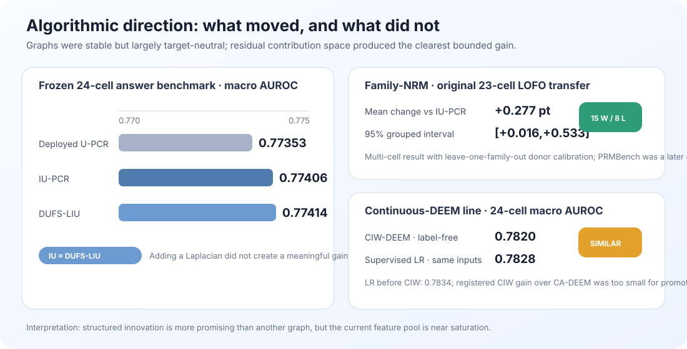
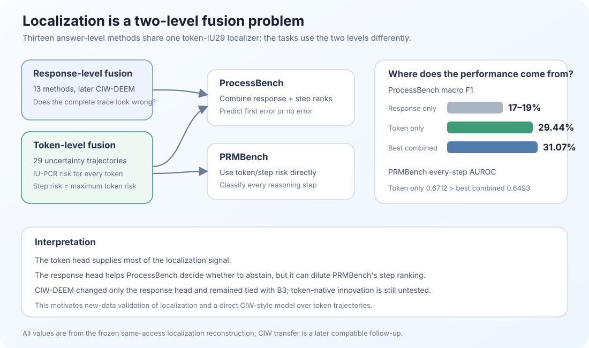
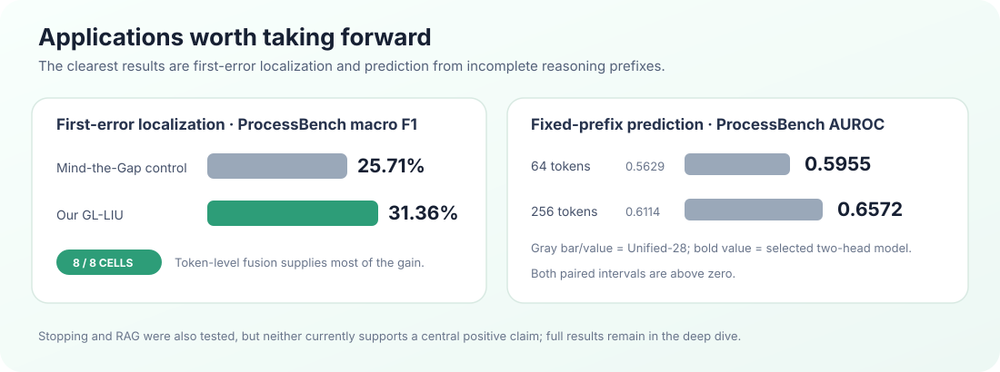

Subject: Update on the last three weeks: algorithmic development and new applications

Hi Ofir, Bracha and Amir,

I wanted to share an update on what I have done in the past three weeks since our last meeting. The work converged around two connected directions:

1. Algorithmic extensions of our unsupervised fusion method, U-PCR.
2. Application-oriented extensions beyond global final-answer hallucination detection.

I also ran a smaller white-box study using internal model representations. I summarize it briefly near the end, because I now see it as a useful side result rather than the center of this update. Separate deep dives preserve the mathematical derivations, complete experimental record, confidence intervals and links to the plots and reports.

### TL;DR

- **Aligned benchmark (main algorithmic result):** 13 label-free fusion methods on the same frozen 24 cells all land within 1.4 AUROC points, with overlapping intervals; a simple six-family average is second. We are approaching saturation on the current feature pool — the full table is below.
- **What does separate:** Family-NRM (+0.28pp on the 23-cell benchmark and +0.46pp on the reserved PRMBench confirmation, both with positive intervals) and CIW-DEEM (the best point estimate, 0.7820, but below the registered promotion threshold).
- **The applications are now the clearest wins:** first-error localization beats the reproduced Mind the Gap in all 8 cells (25.7% → 31.4% macro F1), and the ablation shows most of the ability comes from token-level fusion; fixed-prefix prediction separates cleanly at 64 and 256 tokens (against our own frozen baseline — an internal comparison, noted below).
- **White-box:** tied with the gray-box score on matched answers, broader coverage; a secondary direction until independently validated.
- **What I propose to decide:** stop open-ended exploration, consolidate into a thesis/paper-style document, and choose one final prospective experiment.

## 1. Algorithmic extensions of U-PCR

The algorithmic direction grew directly from our discussion about using DUFS more naturally inside U-PCR. In the previous round, I tried various feature-selection methods, including DUFS, GroupFS and others. Those methods selected the features in advance and then ran L-SML or U-PCR as-is. This time, instead of adding a selector before U-PCR, I replaced U-PCR's own internal decision about which measurements to retain with 111 variants inspired by these feature-selection algorithms. None improved the final AUROC or moved the selected subset closer to the best label-based subset.

I then did another literature review, this time focusing specifically on papers that continued the early U-PCR and unsupervised ensemble-regression work. I found two papers that became important for the rest of this direction:

1. [*Crowdsourcing Regression: A Spectral Approach*](https://proceedings.mlr.press/v151/tenzer22a.html) (AISTATS 2022) studies how to recover an unknown continuous target from several noisy regressors without observing the target labels. IU-PCR estimates the common target direction from the regressors' covariance under an independence assumption. SU-PCR extends it by separating the covariance into a low-rank shared component and a sparse component representing correlated errors between regressors. This was directly relevant to us because our 30 hallucination measurements are also noisy regressors of an unknown correctness score and are not fully independent.
2. [*Unsupervised Ensemble Learning Through Deep Energy-based Models*](https://arxiv.org/abs/2601.20556) (AISTATS 2026) replaces the linear, covariance-based spectral model with a learned energy-based model over the ensemble outputs and the latent class. This allows the model to represent nonlinear dependencies between predictors while still training without correctness labels. The original method expects categorical classifier predictions, whereas our measurements are continuous scores, so applying it required a new continuous adaptation rather than simply running the published algorithm.

I started by implementing IU-PCR and SU-PCR. SU-PCR's sparse-error correction was inconclusive: heterogeneous across cells, and on the aligned benchmark below it ends slightly under IU-PCR. IU-PCR performed well and gave us a cleaner baseline to develop: it retains the full stable measurement set and estimates the final score through a low-dimensional projected covariance solve.

I then integrated the [DUFS](https://proceedings.neurips.cc/paper/2021/hash/0bc10d8a74dbafbf242e30433e83aa56-Abstract.html) mechanism into this PCR fusion stage. In the earlier experiments, DUFS selected features and the fusion algorithm then ran unchanged. In DUFS-LIU-PCR, no feature is simply selected or deleted. The continuous DUFS gates define a similarity graph between answers, and the graph Laplacian enters the final IU-PCR weight problem as a regularizer. I tested many variants of this basic idea. They often found stable geometry, but that geometry mainly followed shared confidence and response length rather than correctness. On the aligned 24-cell answer benchmark, IU-PCR and DUFS-LIU-PCR were essentially tied.

To compare everything under identical conditions, the aligned benchmark evaluates all 13 methods on the same frozen 24 cells (48,607 answers): two independent builds with byte-identical outputs, scores frozen before any label is opened, and a grouped 20,000-draw bootstrap.

| Method | What it does | Macro-24 AUROC | 95% CI |
|---|---|:---:|:---:|
| **CA-DEEM** (ours) | nonlinear family-wise energy correction | **0.7813** | [0.772, 0.790] |
| Equal six-family average | simple baseline | 0.7810 | [0.772, 0.790] |
| **DUFS-LIU-PCR** (ours) | DUFS answer-graph regularizes the IU solve | 0.7766 | [0.767, 0.786] |
| IU-PCR | projected covariance solve (anchor) | 0.7761 | [0.767, 0.785] |
| Family-NRM (within-cell) | residual family-disagreement correction | 0.7746 | [0.766, 0.784] |
| CA-SpecRaGE (atomic) | agreement-weighted multi-view graph regularizing IU | 0.7742 | [0.765, 0.783] |
| Deployed U-PCR | previous method of record | 0.7740 | [0.764, 0.783] |
| Equal 30-feature average | simple baseline | 0.7739 | [0.765, 0.783] |
| PGRD-A | residual-space graph-roughness descent | 0.7735 | [0.764, 0.783] |
| SU-PCR | sparse correlated-error correction | 0.7714 | [0.762, 0.780] |
| Continuous L-SML | earlier spectral lineage | 0.7710 | [0.762, 0.780] |
| DUFS stability + L-SML | stability-selected gates, then L-SML | 0.7703 | [0.761, 0.780] |
| DUFS parameter-free + L-SML | gate-selected features, then L-SML | 0.7674 | [0.758, 0.777] |

The table itself is the central algorithmic finding. Every dependence-aware extension recovers real, stable structure, but the whole roster sits within 1.4 points, a trivial six-family average is second, and no method separates from IU-PCR with statistical confidence. Finding stable dependence is easier than identifying which measurement should be trusted for a particular answer. The two lines that do move beyond this picture — the family-residual line and the energy-model line — are described next.

The most useful change in direction came from [*Hallucination Detection via Reasoning Subspace Projection*](https://arxiv.org/abs/2509.11536) (HARP). I did not reproduce HARP's supervised white-box classifier; I reused its architectural idea of removing the dominant shared component and then examining what remains. In our case, I grouped the 30 measurements into six families according to the raw signal from which they were calculated: entropy level, entropy change, two energy families, top-probability shape and trace structure.

For every answer, I summed the weighted measurements within each family, producing six partial scores that add up exactly to the IU-PCR score. Most of these partial scores rise and fall together with the overall confidence score. I therefore regressed each family contribution on the total IU-PCR score and kept the residual: how much more or less that family contributed than expected for an answer with the same overall score. Family-NRM searches for a residual disagreement pattern that repeats across calibration environments and adds it as a small correction to IU-PCR. Treating every individual feature as its own residual direction was unstable and performed worse; the useful representation was the six provenance families. Across the original 23-cell benchmark, leave-one-family-out calibration improved AUROC over IU-PCR by 0.277 percentage points, with a grouped interval of [+0.016,+0.533]. A later, separate PRMBench response test confirmed the direction: 0.7206 to 0.7252, approximately +0.46 points, again with a positive interval.

I then adapted DEEM to our setting. The published model receives categorical classifier predictions and uses a deeper energy-based architecture to capture nonlinear dependencies; the paper also shows that this flexibility can handle mixture-of-experts settings, where different predictors are useful for different samples. Our measurements are continuous, so the hard and rank-based adapters were unnatural. I therefore built **Continuous Additive DEEM (CA-DEEM)**—called B3 only in the internal experiment registry. CA-DEEM keeps the continuous measurements, processes each provenance family through a small nonlinear component and adds the family contributions into one label-free score.

Because this continuous adapter removed parts of DEEM's original categorical/iRBM architecture, I was concerned that it had also lost some of the model's adaptive expert behavior. I tried several output routers and several residual, graph and Laplacian corrections, but none gave a reliable improvement. The recurring lesson was the same as in DUFS-LIU: finding stable dependence is easier than identifying which measurement should be trusted for a particular answer.

This motivated a different input design. I returned to three token-level signals that produced many of our original measurements: entropy, sampled-token surprisal and partition energy. From each signal I kept the same three summaries we had already used throughout the project—its mean level, its strongest sliding-window variance and its strongest CUSUM change—giving a structured 3-by-3 set of nine inputs. The rows share a raw source and the columns share a mathematical operator, and the dependency audit showed clear relationships in both directions.

For every one of the nine inputs, I used cross-fitting to predict the part already explained by the other inputs that share its source or operator. The residual is its **innovation**: what this measurement contributes beyond the surrounding structure. CIW mixes each original measurement with this innovation, retaining at least half of the original value, and then passes the transformed inputs to the unchanged CA-DEEM model. No correctness labels are used in either stage.

This produced **CIW-DEEM—Cross-fitted Innovation-Weighted DEEM**. On the aligned 24-cell benchmark it reaches **0.7820 cell-macro AUROC**, the highest point estimate in this CA-DEEM input line, but its registered improvement over CA-DEEM is too small to promote it as a replacement. A supervised group-held-out logistic regression on the same transformed inputs reaches 0.7828—essentially the same range—and is slightly worse than logistic regression before the CIW transform (0.7834). CIW therefore does not reveal a large unused linear signal; its small benefit appears specific to how the nonlinear CA-DEEM backend uses the reorganized inputs.

There were many unsuccessful attempts between these steps. They are preserved in the algorithmic deep dive; the sequence above is the main route from the previous feature-selection work to IU/SU-PCR, DUFS-LIU-PCR, Family-NRM, CA-DEEM and finally CIW-DEEM.

## 2. Application-oriented extensions beyond final-answer detection

In this direction, I tested whether the same uncertainty measurements and fusion principles remain useful when the task is no longer a single score for a completed answer. I studied first-error localization, fixed-prefix prediction, actual early stopping and RAG hallucination detection. The first two produced the clearest results, so I focus on them here and leave the complete stopping and RAG analyses in the deep dive.

### A. First-error localization — a consistent improvement over Mind the Gap

[ProcessBench](https://arxiv.org/abs/2412.06559) differs from final-answer detection: the system must identify the first erroneous reasoning step, or return **no error**. Our pipeline splits this into two linked decisions: a global response head that detects whether the trace contains an error at all, and a local token-level head that locates it. We compare it with our reproduction of [*Mind the Gap*](https://openreview.net/pdf?id=gllCfOG1Gt) under the same protocol. The frozen selected pipeline happens to use a DUFS-LIU response head chosen earlier; as shown below, that choice is not what matters.

More generally, I reconstructed all 13 answer-level fusion methods as alternative **response heads** and paired each of them with the same **token head**. The response head summarizes whether the complete trace looks unreliable. The token head fuses 29 uncertainty streams along the generated trajectory using IU-PCR, assigns a risk to every token and reduces each reasoning step to its maximum token risk. Concretely, the 29 streams are causal token-level series from four sources: the token-entropy trajectory and thirteen transforms of it (sliding-window variance, CUSUM change, rolling spectral summaries, permutation entropy, Hurst and tail statistics); the sampled-token surprisal series with its variance, CUSUM and running-minimum transforms; the partition-energy series with the same transforms; six top-K distribution-shape series (top-1 log-probability, top-2 margin, top-K entropy, varentropy, Rényi-2 entropy, tail mass); plus the elapsed prefix length. On ProcessBench, the ranked response and step risks are combined before deciding between the highest-risk step and **no error**. On PRMBench, which labels every step independently, the token score can be used directly.

| ProcessBench result across four datasets and two Qwen3 sizes | Reproduced Mind the Gap | Our selected pipeline | Change |
|---|---:|---:|---:|
| Macro F1: correct first-error decision, including clean traces | 25.71% | **31.36%** | **+5.65 points** |
| Exact first erroneous step, among erroneous traces | 17.84% | **21.79%** | **+3.95 points** |
| Predicted within one step of the first error | 39.35% | **46.76%** | **+7.41 points** |

The selected pipeline wins all eight cells, and almost all our global-local variants beat Mind the Gap in aggregate. Consistent with the answer-level benchmark in section 1, the graph is not what wins here either: graph-headed variants add only 0.33-0.58 F1 points over the plain IU-PCR head, with intervals crossing zero. I therefore treat IU-PCR as the leading response-head configuration going forward. The result supports the global-local design, not graph superiority.

The component ablation also shows where the result comes from:

| Same-access localization reconstruction | Response head only | Token head only | Best response + token |
|---|---:|---:|---:|
| ProcessBench first-error macro F1 | 17.36%-19.20% across the 13 methods | **29.44%** | **31.07%** |
| PRMBench every-step AUROC | at most 0.5739 | **0.6712** | 0.6493 |

Most of the localization ability therefore comes from token-level fusion. The response head adds a smaller but useful ProcessBench improvement because that task also requires deciding when the whole trace is clean. On PRMBench, adding a global response score hurts because the target is the correctness of each individual step.

**Separate PRMBench experiment.** [PRMBench](https://arxiv.org/abs/2501.03124) labels every step, not only the first error. The token-only trajectory-first IU-PCR reaches 0.6712 AUROC; supervised [Qwen2.5-Math-PRM-7B](https://arxiv.org/abs/2501.07301) reaches 0.7983 and remains a higher-access ceiling.

I also transferred CIW-DEEM to these tasks, but only as a replacement for the answer-level head; the token-IU29 localizer stayed fixed. It remained effectively tied with CA-DEEM. This strengthens the case for the more direct next experiment: apply the innovation idea to the token trajectories themselves.

### B. Fixed-prefix prediction — a clear gain at 64 and 256 tokens

We can predict final-answer correctness meaningfully before the answer is complete, and the selected prefix model clearly improves over our earlier shared causal baseline.

That baseline, **Unified-28**, compresses seven token-level uncertainty streams into four causal summaries per stream—the current level, a short moving average, accumulated positive evidence and persistence—giving 28 features in total. One frozen IU-PCR weight vector converts those features into a risk score at every prefix. It is deliberately simple and fully causal: at token 64, for example, it only uses information available up to token 64.

The selected model uses a more task-specific **two-head architecture**. Its global head recomputes the answer-level IU uncertainty score using only the observed prefix. Its local head follows the strongest token-level warning seen so far. After calibration, the two scores are combined with equal weight. This lets the model use both the overall state of the incomplete answer and a sharp local warning that may otherwise be averaged away.

On the aligned ProcessBench prefix benchmark, the two-head model reaches 0.5955 AUROC at 64 observed tokens, compared with 0.5629 for Unified-28, and 0.6572 at 256 tokens, compared with 0.6114. Both paired intervals are above zero; the benchmark also evaluates 16-, 32- and 128-token budgets, where the two models do not separate.

One honest caveat, in contrast with the localization result: the comparison here is internal. Unified-28 is our own frozen baseline, and no published method is evaluated in this lane yet. The natural external reference is [*Deep Think with Confidence* (DeepConf)](https://arxiv.org/abs/2508.15260), but it operates in a different regime: it generates thousands of reasoning traces per problem, uses windowed local-confidence measures to filter the traces and weight their self-consistency votes, and early-stops weak traces during generation. Our question is the complementary single-trace one — how early does one saved trace predict its own outcome — which is why DeepConf serves as motivation rather than as a comparator here. Adding an external comparator, including a code-exact DeepConf-style reconstruction, is a natural part of the prospective run discussed below.

### Other application experiments

I also tested actual online stopping and RAG hallucination detection, but I do not currently see either as a central positive result. LEASH reduced generated tokens by 38.8%, but pass@1 fell by 18.3 percentage points. The RAG experiments showed that evidence-contrast fusion can transfer, but the outcome depends strongly on the benchmark, prediction unit and context condition, so there is no single RAG headline. The complete protocols and results remain in the application deep dive.

## 3. Additional white-box exploration

Separately, inspired mainly by *TriLens*, I tested whether internal layer representations add information beyond our gray-box token statistics. A distributed-depth U-PCR representation reached about 0.785 macro AUROC and covered more answers, but on the exact matched subset it was effectively tied with gray-box DUFS-LIU: 0.7817 versus 0.7830. A post-hoc white+gray average reached 0.7902, suggesting complementarity, but it needs independent validation. I therefore see white-box as a useful secondary direction that we can expand if relevant, not as the main story of this update.

My current conclusion is that we are approaching saturation in algorithmic development on the present feature pool. We now have methods that work well at several levels of complexity—from the relatively simple IU-PCR, through the bounded Family-NRM correction, to nonlinear CA-DEEM and CIW-DEEM—but the additional complexity is producing increasingly small gains. At the same time, the same uncertainty-fusion framework has produced clearer successes in first-error localization and fixed-prefix prediction.

Because of that, I want to stop open-ended exploration at this stage. The space of possible variants has no natural end, and new methods and papers appear every month; I would rather commit to a small number of specific directions and take them to depth. Concretely, I would like to discuss consolidating what we have into a formal thesis or paper-style document that makes the full story easier to evaluate and share, while choosing which of the localization, early-prediction and token-native innovation directions deserves one final prospective experiment.

I prepared a results index and three deep dives. They contain the equations, complete method chronology, negative experiments, confidence intervals, paper references and links to the full interactive benchmark and all existing plots:

- [Visual HTML version of this letter](advisor_update_aug26_2026/index.html)
- [Algorithmic deep dive](advisor_update_aug26_2026/01_algorithmic_deep_dive.md)
- [White-box deep dive](advisor_update_aug26_2026/02_whitebox_deep_dive.md)
- [Applications deep dive](advisor_update_aug26_2026/03_applications_deep_dive.md)
- [Complete plot and document index](advisor_update_aug26_2026/ASSET_INDEX.md)
- [Full paper list and how each paper informed the work](advisor_update_aug26_2026/REFERENCES.md)

Could we meet next week to go over the results and decide on the main thesis and paper story?

Thanks, 
Omri

### Papers mentioned in the letter

- Jaffe, Fetaya, Nadler, Jiang and Kluger, *Unsupervised Ensemble Learning with Dependent Classifiers* (AISTATS 2016).
- Dror, Nadler, Bilal and Kluger, *Unsupervised Ensemble Regression* (2017).
- Tenzer, Dror, Nadler, Bilal and Kluger, [*Crowdsourcing Regression: A Spectral Approach*](https://proceedings.mlr.press/v151/tenzer22a.html) (AISTATS 2022).
- Ofir Lindenbaum, Uri Shaham, Jonathan Svirsky, Erez Peterfreund and Yuval Kluger, [*Differentiable Unsupervised Feature Selection based on a Gated Laplacian*](https://proceedings.neurips.cc/paper/2021/hash/0bc10d8a74dbafbf242e30433e83aa56-Abstract.html) (NeurIPS 2021).
- Hu et al., [*HARP: Hallucination Detection via Reasoning Subspace Projection*](https://arxiv.org/abs/2509.11536) (2025 preprint).
- Maymon, Buznah and Shaham, [*Unsupervised Ensemble Learning Through Deep Energy-based Models*](https://arxiv.org/abs/2601.20556) (AISTATS 2026).
- Yang et al., *TriLens: Per-Layer Logit-Lens Entropy for White-Box Hallucination Detection* (2026 preprint).
- Zheng et al., *ProcessBench: Identifying Process Errors in Mathematical Reasoning*.
- Chen et al., *Mind the Gap: Catching Hallucinations via Evidence Drop on the Reasoning Manifold* (ICML 2026).
- Song et al., *PRMBench: A Fine-grained and Challenging Benchmark for Process-Level Reward Models* (ACL 2025).
- Zhang et al., *The Lessons of Developing Process Reward Models in Mathematical Reasoning*.
- Fu et al., [*Deep Think with Confidence*](https://arxiv.org/abs/2508.15260) (2025 preprint).
- *LEASH: Logit-Entropy Adaptive Stopping Heuristic for Efficient Chain-of-Thought Reasoning*.
- Niu et al., *RAGTruth* (ACL 2024); GASP (2026 preprint); LettuceDetect (2025 preprint); and RefChecker (EMNLP 2024).
