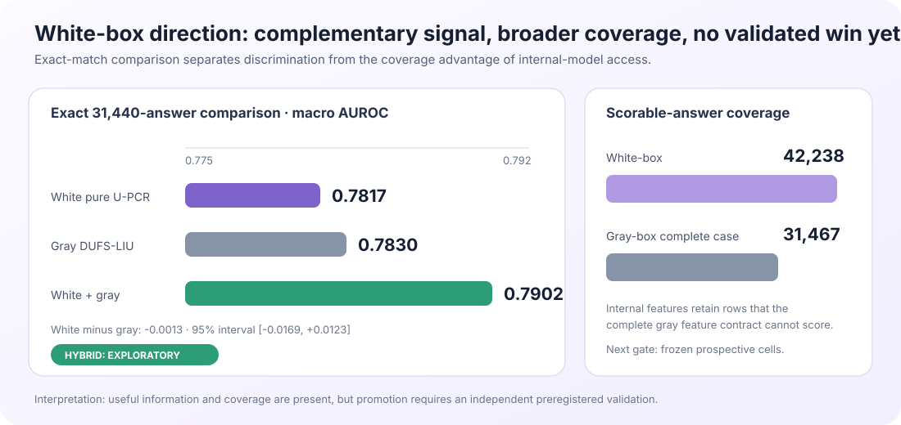

Subject: Update on the last three weeks: fusion, white-box features and new applications

Hi Ofir, Bracha and Amir,

I wanted to share an update on what I have done in the past three weeks since our last meeting. I focused on three complementary directions:

1. Algorithmic extensions of our unsupervised fusion method, U-PCR.
2. White-box hallucination detection using internal model representations.
3. Application-oriented extensions beyond global final-answer hallucination detection.

Below is the main story and what I think we learned. I also prepared a separate deep dive for each direction, with the mathematical derivations, complete experimental record, confidence intervals and links to the plots and reports.

## 1. Algorithmic extensions of U-PCR

The algorithmic direction grew directly from our discussion about using DUFS more naturally inside U-PCR. In the previous round, I tried various feature-selection methods, including DUFS, GroupFS and others. Those methods selected the features in advance and then ran L-SML or U-PCR as-is. This time, instead of adding a selector before U-PCR, I replaced U-PCR's own internal decision about which measurements to retain with 111 variants inspired by these feature-selection algorithms. None improved the final AUROC or moved the selected subset closer to the best label-based subset.

I then did another literature review, this time focusing specifically on papers that continued the early U-PCR and unsupervised ensemble-regression work. I found two papers that became important for the rest of this direction:

1. *Crowdsourcing Regression: A Spectral Approach* (AISTATS 2022) studies how to recover an unknown continuous target from several noisy regressors without observing the target labels. IU-PCR estimates the common target direction from the regressors' covariance under an independence assumption. SU-PCR extends it by separating the covariance into a low-rank shared component and a sparse component representing correlated errors between regressors. This was directly relevant to us because our 30 hallucination measurements are also noisy regressors of an unknown correctness score and are not fully independent.
2. *Unsupervised Ensemble Learning Through Deep Energy-based Models* (AISTATS 2026) replaces the linear, covariance-based spectral model with a learned energy-based model over the ensemble outputs and the latent class. This allows the model to represent nonlinear dependencies between predictors while still training without correctness labels. The original method expects categorical classifier predictions, whereas our measurements are continuous scores, so applying it required a new continuous adaptation rather than simply running the published algorithm.

I started by implementing IU-PCR and SU-PCR. SU-PCR's sparse-error correction was positive but statistically inconclusive. IU-PCR performed well and gave us a cleaner baseline to develop: it retains the full stable measurement set and estimates the final score through a low-dimensional projected covariance solve.

I then integrated the DUFS mechanism into this PCR fusion stage. In the earlier experiments, DUFS selected features and the fusion algorithm then ran unchanged. In DUFS-LIU-PCR, no feature is simply selected or deleted. The continuous DUFS gates define a similarity graph between answers, and the graph Laplacian enters the final IU-PCR weight problem as a regularizer. I tested many variants of this basic idea. They often found stable geometry, but that geometry mainly followed shared confidence and response length rather than correctness. On the aligned 24-cell answer benchmark, IU-PCR and DUFS-LIU-PCR were essentially tied.

The most useful change in direction came from *Hallucination Detection via Reasoning Subspace Projection* (HARP). I did not reproduce HARP's supervised white-box classifier; I reused its architectural idea of removing the dominant shared component and then examining what remains. In our case, I grouped the 30 measurements into six families according to the raw signal from which they were calculated: entropy level, entropy change, two energy families, top-probability shape and trace structure.

For every answer, I summed the weighted measurements within each family, producing six partial scores that add up exactly to the IU-PCR score. Most of these partial scores rise and fall together with the overall confidence score. I therefore regressed each family contribution on the total IU-PCR score and kept the residual: how much more or less that family contributed than expected for an answer with the same overall score. Family-NRM searches for a residual disagreement pattern that repeats across calibration environments and adds it as a small correction to IU-PCR. Treating every individual feature as its own residual direction was unstable and performed worse; the useful representation was the six provenance families. On the separate PRMBench response test, this improved AUROC from 0.7206 to 0.7252, approximately +0.46 percentage points, with a positive interval.

I then implemented the DEEM direction. The original DEEM model receives categorical classifier predictions and learns a nonlinear energy function over the ensemble. Our inputs are continuous measurements, so I first tested hard and rank-based adapters and then developed B3, a graph-free continuous version. B3 preserves the continuous measurements, processes each provenance family through a small nonlinear network, and adds the family contributions to produce the final score.

The first attempts to extend B3 focused on its output. I tried sample-dependent routers that changed the importance of the families, as well as residual and graph-based corrections. Although these mechanisms were active, they did not consistently beat simple static or permuted controls. The problem was similar to what I had seen with DUFS-LIU: an unsupervised objective can identify dependence between measurements, but it does not necessarily know which measurement is more correct for a particular answer.

I therefore moved the intervention from the output of B3 to its input. A dependency audit showed that the historical families were strongly correlated and that B3 mostly preserved this shared variation. I organized a core set of nine measurements as a 3-by-3 structure: three raw sources—entropy, sampled-token surprisal and partition energy—each measured using three operators—mean, sliding variance and CUSUM. For each measurement, CIW predicts its shared component from the four measurements with the same source or the same operator, using five-fold cross-fitting. The prediction residual is the feature's *innovation*: the part not explained by the surrounding structure. The original feature and its standardized innovation are then mixed using a fixed per-feature weight derived from its out-of-fold predictability. Highly predictable measurements receive more innovation correction, poorly predictable measurements remain close to their original value, and at least half of every original measurement is always retained. This entire input transformation is learned without correctness labels, after which the unchanged B3 model is fitted on the transformed measurements.

This produced **CIW-DEEM—Cross-fitted Innovation-Weighted DEEM**. It uses the dependence structure conservatively, to separate shared signal from feature-specific innovation, rather than treating dependence as a direct indication of correctness. On the aligned 24-cell benchmark it achieves 0.7492 equal-dataset-family AUROC and 0.7820 cell-macro AUROC. Its equal-family improvement over frozen B3 is +0.000732, or approximately +0.073 AUROC points. This is the highest point estimate among the directly comparable B3 input variants, but the sign-flip test is inconclusive and the gain is below the preregistered +0.25-point promotion threshold. CIW-DEEM is therefore the leading challenger from this line, not yet a promoted replacement; its small benefit also appears specific to the nonlinear B3 model rather than a generic improvement to IU-PCR, DUFS-LIU or linear prediction.

There were many unsuccessful attempts between these steps, which I am not listing in the letter. They are preserved in the algorithmic deep dive. The sequence above is the main route that led from the previous feature-selection work to IU/SU-PCR, DUFS-LIU-PCR, Family-NRM and finally CIW-DEEM.

## 2. White-box direction — internal layers add coverage and signal, but not yet a validated win

The main reference for this direction was *TriLens: Per-Layer Logit-Lens Entropy for White-Box Hallucination Detection*. TriLens reads the attention output, MLP output and residual stream at every transformer layer, then uses a supervised probe. I collected a related but richer internal representation on 14 dataset-model cells covering nine model families. For each layer and pathway I extracted logit-lens entropy, target-token NLL, top-1 surprisal, target-to-top-1 gap, entropy excess and divergence from the final-layer distribution.

The main question was whether our label-free fusion machinery could combine these depth trajectories without training a supervised classifier. I tested U-PCR, DUFS-LIU, hierarchical depth groups and residual-family fusion. The initial compact representation did not beat the final-layer NLL baseline. A richer distributed-depth representation was much stronger and reached about 0.785 macro AUROC, above our local supervised TriLens-style approximation.

However, on the exact 31,440 answers where the final white-box and gray-box methods can both be evaluated, the aggregate result is a practical tie: 0.7817 for pure white-box U-PCR versus 0.7830 for gray-box DUFS-LIU, with a wide paired interval around the difference. White-box does provide broader coverage—42,238 scorable answers versus 31,467 complete gray-box answers. A simple post-hoc white+gray average reaches 0.7902, which is interesting evidence of complementarity, but it was proposed after seeing these data and is not yet a promoted method.

My conclusion is that internal layers contain useful complementary signal and solve a real coverage problem, but we do not yet have independent evidence that white-box access improves aggregate detection. This direction needs one preregistered validation run on new model-dataset cells before it should become a central result.

## 3. Application-oriented extensions beyond final-answer detection

In this direction, I tested whether the same uncertainty measurements and fusion principles remain useful when the task is no longer a single score for a completed answer. I studied four separate applications—first-error localization, fixed-prefix prediction, actual early stopping and RAG hallucination detection—and evaluated each one against the relevant methods and benchmark for that task.

### A. First-error localization — a consistent improvement over Mind the Gap

The main result is positive: our uncertainty-based localization framework consistently outperforms the reproduced [*Mind the Gap*](https://openreview.net/pdf?id=gllCfOG1Gt) control on ProcessBench. Across the eight evaluated combinations of Qwen3-4B/Qwen3-8B and GSM8K, MATH, OlympiadBench and OmniMath, the selected end-to-end pipeline improves macro F1 from 25.71% to 31.36%, and it is better in every cell. Exact first-step localization improves from 17.84% to 21.79%, and localization within one step improves from 39.35% to 46.76%.

To turn our completed-answer detector into a localizer, I split it into two linked decisions. A **global head** fuses full-trace uncertainty measurements with the U-PCR/IU-PCR machinery and decides whether the reasoning trace contains an error at all. A **local head** applies the same fusion principle to token-by-token uncertainty curves—such as entropy changes, local variance and accumulated risk—to assign an error score to every generated token. If the global head predicts an error, we select the highest-risk token and only then map it to the corresponding ProcessBench reasoning step. DUFS-LIU variants change the regularization inside these heads, but not this global-then-local structure.

The important point is therefore not that one internally named graph variant obtained the highest score. Nearly all of our main configurations outperform Mind the Gap at the aggregate point estimate. Differences between our own IU- and DUFS-based variants are much smaller: in the later matched reconstruction, the leading adapters improve over matched IU by only 0.33-0.58 F1 points, with intervals crossing zero. The contribution is the transfer of our uncertainty-fusion framework from answer ranking to error localization, not a confirmed advantage from one particular graph. On PRMBench the same conclusion appears in another form: the simpler token-only score reaches 0.6712 AUROC, compared with 0.5988 for response-token fusion and 0.7983 for the supervised PRM ceiling.

### B. Fixed-prefix prediction — a clear gain at both tested budgets

We can predict final-answer correctness meaningfully before the answer is complete, and the selected prefix model clearly improves over our earlier shared causal baseline.

That baseline, **Unified-28**, compresses seven token-level uncertainty streams into four causal summaries per stream—the current level, a short moving average, accumulated positive evidence and persistence—giving 28 features in total. One frozen IU-PCR weight vector converts those features into a risk score at every prefix. It is deliberately simple and fully causal: at token 64, for example, it only uses information available up to token 64.

The selected model uses a more task-specific **two-head architecture**. Its global head recomputes the answer-level IU uncertainty score using only the observed prefix. Its local head follows the strongest token-level warning seen so far. After calibration, the two scores are combined with equal weight. This lets the model use both the overall state of the incomplete answer and a sharp local warning that may otherwise be averaged away. *DeepConf* motivated the broader confidence-under-compute question, although our single-trace method is an adaptation rather than a paper-exact reproduction.

On the aligned ProcessBench prefix benchmark, the two-head model reaches 0.5955 AUROC at 64 observed tokens, compared with 0.5629 for Unified-28, and 0.6572 at 256 tokens, compared with 0.6114. Both paired intervals are above zero. This is evidence for useful prediction from fixed saved prefixes; it does not yet show that we can choose the stopping time adaptively during live generation.

### C. Actual stopping — substantial compute savings, but not a deployment win

The stopping result is negative as a matched-accuracy claim. This experiment is different from the fixed-prefix task: instead of asking whether a saved prefix already predicts the final outcome, the policy must decide online when to terminate the model's reasoning.

For this test I implemented the LEASH callback as a separate stopping policy rather than as another U-PCR variant. At every generated token it monitors three signals from the model's output distribution: entropy, the gap between the two most likely tokens, and the maximum token probability. After a minimum reasoning period, it stops when uncertainty has fallen and reached a plateau while the confidence margin is no longer changing substantially. The callback then forces a short greedy closure so that the model still produces a final answer. I compared this actual stopped generation with unrestricted chain-of-thought generation on the same questions.

Across the six eligible model-dataset cells on AQuA and GSM8K, LEASH reduces generated tokens by 38.8% overall, but pass@1 falls by 18.3 percentage points and decreases in every cell. Two additional Mistral cells could not be evaluated because their tokenizer did not provide the chat template required by the protocol. LEASH therefore demonstrates a real accuracy-compute frontier, but not successful stopping at preserved accuracy.

### D. RAG hallucination detection — useful transfer, but strongly task-dependent

The RAG result is mixed rather than one general win. Here the adaptation is not merely a different aggregation of the original uncertainty features. For the same generated answer, I rescore every token under different evidence conditions: with the retrieved context, without the context, and—when available—with one retrieved document removed at a time. The changes in token probability, entropy and distribution shape tell us how strongly each claim depends on its evidence. A fixed label-free IU-PCR head fuses these **evidence-contrast features** into token risk; the token scores are then averaged over a sentence or the whole answer when the benchmark requires sentence- or answer-level predictions.

I evaluated this transfer in seven separate panels because the prediction units and access assumptions are genuinely different. On the RAGTruth test split, our fixed RAG-IU method reaches 0.7274 AUROC at answer level, 0.6892 at sentence level and 0.6587 at token level, with substantial differences between QA and Data-to-Text. On the local GASP sentence benchmark, I also tested a simpler task-specific score that standardizes and combines four evidence-sensitivity measurements: the sentence's loss and distribution change without context, and their largest change when one document is removed. This GASP-style score reaches 0.6708 versus 0.6597 for matched fixed IU, but the interval on the difference crosses zero, so they are effectively tied. LettuceDetect is not another version of our method; it provides a separate supervised example-level ceiling of 0.7929 F1. For RefChecker, I apply the fixed IU evidence score to fixed, pre-extracted claims and keep accurate-, noisy- and zero-context conditions separate; it reaches 0.6645, 0.6402 and 0.7506 AUROC respectively. These results show that the fusion principle can be transferred to RAG evidence, but they do not support pooling these tasks or claiming one universally superior RAG detector.

My current view is that the three directions form a coherent thesis story rather than three unrelated projects. The algorithmic work explains why stable dependence is not necessarily target-aligned; the white-box work tests whether new internal measurements provide missing information; and the applications show where the same uncertainty machinery becomes more useful when the target is localization or early prediction rather than only completed-answer ranking.

For the next stage, I would like to discuss which prospective confirmation should come first: the CIW/innovation direction, independent white-box validation, or new-data localization and prefix prediction. My current preference is to prioritize the application result that already separates—prefix prediction—while keeping CIW-DEEM and the white+gray combination as frozen challengers for confirmation.

I prepared a results index and three deep dives. They contain the equations, complete method chronology, negative experiments, confidence intervals, paper references and links to the full interactive benchmark and all existing plots:

- [Visual HTML version of this letter](advisor_update_aug26_2026/index.html)
- [Algorithmic deep dive](advisor_update_aug26_2026/01_algorithmic_deep_dive.md)
- [White-box deep dive](advisor_update_aug26_2026/02_whitebox_deep_dive.md)
- [Applications deep dive](advisor_update_aug26_2026/03_applications_deep_dive.md)
- [Complete plot and document index](advisor_update_aug26_2026/ASSET_INDEX.md)
- [Full paper list and how each paper informed the work](advisor_update_aug26_2026/REFERENCES.md)

Could we meet next week to go over the results and decide on the main thesis and paper story?

Thanks, 
Omri

### Papers mentioned in the letter

- Jaffe, Fetaya, Nadler, Jiang and Kluger, *Unsupervised Ensemble Learning with Dependent Classifiers* (AISTATS 2016).
- Dror, Nadler, Bilal and Kluger, *Unsupervised Ensemble Regression* (2017).
- Tenzer, Dror, Nadler, Bilal and Kluger, *Crowdsourcing Regression: A Spectral Approach* (AISTATS 2022).
- Ofir Lindenbaum, Uri Shaham, Jonathan Svirsky, Erez Peterfreund and Yuval Kluger, *Differentiable Unsupervised Feature Selection based on a Gated Laplacian* (NeurIPS 2021).
- Hu et al., *HARP: Hallucination Detection via Reasoning Subspace Projection* (2025 preprint).
- Maymon, Buznah and Shaham, *Unsupervised Ensemble Learning Through Deep Energy-based Models* (AISTATS 2026).
- Yang et al., *TriLens: Per-Layer Logit-Lens Entropy for White-Box Hallucination Detection* (2026 preprint).
- Zheng et al., *ProcessBench: Identifying Process Errors in Mathematical Reasoning*.
- *Mind the Gap: Catching Hallucinations via Evidence Drop* (ICML 2026).
- Fu et al., *Deep Think with Confidence*.
- *LEASH: Logit-Entropy Adaptive Stopping Heuristic for Efficient Chain-of-Thought Reasoning*.
- Niu et al., *RAGTruth* (ACL 2024); GASP (2026 preprint); LettuceDetect (2025 preprint); and RefChecker (EMNLP 2024).
