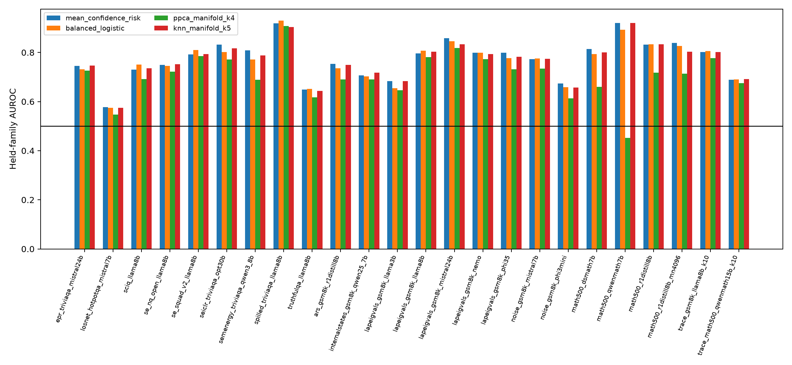
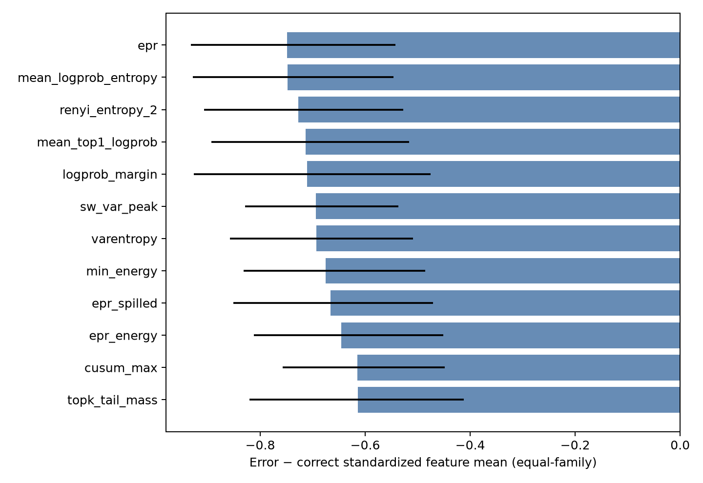
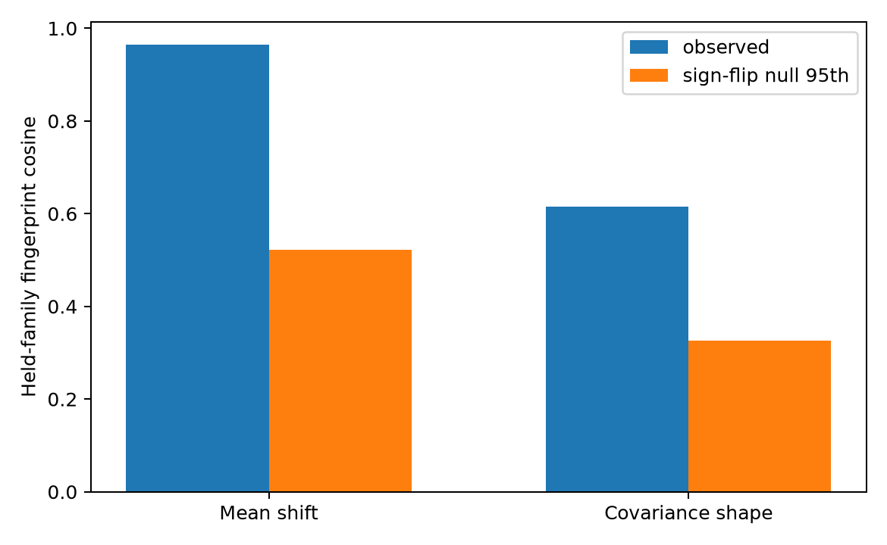

# Cross-dataset hallucination manifold diagnostic v1

**Decision: `SHARED_DIRECTION_NOT_DISTINCT_NONLINEAR_MANIFOLD`**

## Short answer

The features contain a transferable hallucination direction, but the nonlinear manifold models do not add a reliable advantage over a balanced shared linear head. The evidence supports a common direction, not a distinct curved hallucination manifold.

This is a supervised retrospective diagnostic. It does not make DUFS-LIU label-free geometry identifiable and it is not external confirmation.

The inputs use the project's previously frozen confidence-orientation contract. That contract was informed by earlier labelled audits, so the fact that individual feature shifts mostly point in the confidence direction is not a fresh discovery. The held-family predictive comparison and the nonlinear-versus-linear contrast are the useful parts of this diagnostic.

## Primary leave-one-dataset-family-out results

| method | family AUROC [95% CI] | cell AUROC | family error AUPRC |
|---|---:|---:|---:|
| `epr_risk` | 0.7167 [0.6562, 0.7700] | 0.7499 | 0.7650 |
| `mean_confidence_risk` | 0.7386 [0.6798, 0.7894] | 0.7726 | 0.7731 |
| `iu_pcr_risk` | 0.7416 [0.6800, 0.7923] | 0.7741 | 0.7740 |
| `shared_direction` | 0.7364 [0.6767, 0.7875] | 0.7707 | 0.7736 |
| `balanced_logistic` | 0.7379 [0.6791, 0.7873] | 0.7652 | 0.7692 |
| `ppca_manifold_k4` | 0.6882 [0.6339, 0.7378] | 0.7054 | 0.7357 |
| `knn_manifold_k5` | 0.7353 [0.6755, 0.7861] | 0.7667 | 0.7637 |

## Secondary leave-one-cell-out results

| method | family AUROC [95% CI] | cell AUROC |
|---|---:|---:|
| `epr_risk` | 0.7167 [0.6573, 0.7701] | 0.7499 |
| `mean_confidence_risk` | 0.7386 [0.6796, 0.7908] | 0.7726 |
| `iu_pcr_risk` | 0.7416 [0.6811, 0.7924] | 0.7741 |
| `shared_direction` | 0.7364 [0.6755, 0.7875] | 0.7708 |
| `balanced_logistic` | 0.7422 [0.6813, 0.7919] | 0.7750 |
| `ppca_manifold_k4` | 0.6931 [0.6388, 0.7422] | 0.7131 |
| `knn_manifold_k5` | 0.7367 [0.6779, 0.7876] | 0.7700 |

## Does the geometry itself repeat?

| fingerprint | held-family cosine | null 95th | one-sided p |
|---|---:|---:|---:|
| error−correct mean direction | 0.9650 | 0.5215 | 9.999e-05 |
| error−correct covariance shape | 0.6149 | 0.3263 | 9.999e-05 |

The cell-macro covariance participation rank is 3.69 for errors and 4.00 for correct answers, out of 16 available dimensions.

## Strongest repeatable feature shifts

Positive means the confidence-oriented feature is higher on errors; negative means lower on errors. Because the orientation contract defines higher values as more likely correct, the signs are expected; cross-family consistency and effect magnitude are descriptive, not an independent validation of the signs.

| feature | equal-family error−correct | 95% CI | sign across cells |
|---|---:|---:|---:|
| `epr` | -0.749 | [-0.933, -0.543] | 0+ / 24− |
| `mean_logprob_entropy` | -0.748 | [-0.928, -0.546] | 0+ / 24− |
| `renyi_entropy_2` | -0.727 | [-0.907, -0.528] | 0+ / 24− |
| `mean_top1_logprob` | -0.713 | [-0.893, -0.516] | 0+ / 24− |
| `logprob_margin` | -0.711 | [-0.926, -0.476] | 0+ / 24− |
| `sw_var_peak` | -0.694 | [-0.829, -0.537] | 0+ / 24− |
| `varentropy` | -0.693 | [-0.858, -0.509] | 1+ / 23− |
| `min_energy` | -0.675 | [-0.831, -0.486] | 0+ / 24− |
| `epr_spilled` | -0.666 | [-0.851, -0.471] | 0+ / 24− |
| `epr_energy` | -0.646 | [-0.812, -0.451] | 3+ / 21− |

## Interpretation boundary

A shared supervised direction means donor labels identify a repeatable target axis in these already oriented features. It does not mean the unlabeled marginal geometry can tell DUFS which axis is hallucination. A common global sign reflection of feature axes cannot manufacture a nonlinear advantage, so the failure of PPCA/kNN to beat the linear control remains informative. Without that nonlinear win, 'shared direction' is the more accurate description.

## Figures

