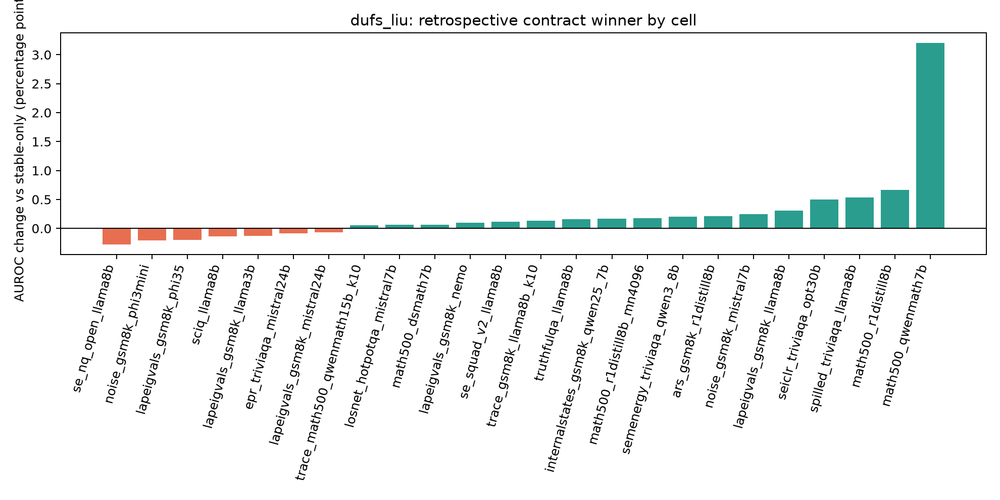
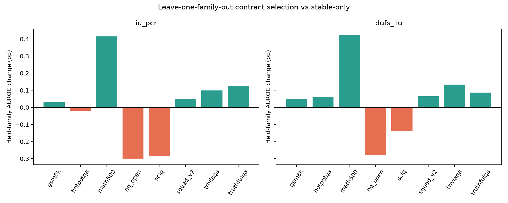

# DUFS-LIU mixed feature-contract search

Version: `dufs-liu-feature-contract-search-v1-2026-08-07`. The fit took 540.8 seconds.

## Question and protocol

The four quarantined views were not assumed to need the same treatment. For each view, the search tested `drop`, confidence-oriented `raw`, `squared` (`-z²`), and label-free KDE `mode` (`-|rank-mode_rank|`). This gives 256 global contracts. A transformation replaces its parent; it is never added beside it.

DUFS-LIU was kept at its current frozen settings: three gate seeds (11, 23, 37), 80 epochs, graph k=7, and lambda=0.1. The fit phase wrote and hashed every score without reading labels. Labels were opened only after the complete score bank was frozen.

The retrospective winner is useful for choosing the next candidate, but its score is optimistic because the same 24 cells chose it. Leave-one-dataset-family-out (LOFO) selection is the main check on whether the choice transfers.

## Fixed controls and retrospective winners

| method | contract | feature decisions | macro AUROC | change vs stable [95% CI] | W/L/T |
|---|---|---|---:|---:|---:|
| `iu_pcr` | `stable_drop_all` | pe_mean=drop, stft_spectral_entropy=drop, cusum_shift_idx=drop, rpdi=drop | 0.774063 | +0.000pp [+0.000, +0.000] | 0/0/24 |
| `iu_pcr` | `raw_all` | pe_mean=raw, stft_spectral_entropy=raw, cusum_shift_idx=raw, rpdi=raw | 0.775403 | +0.134pp [-0.071, +0.397] | 13/11/0 |
| `iu_pcr` | `squared_all` | pe_mean=squared, stft_spectral_entropy=squared, cusum_shift_idx=squared, rpdi=squared | 0.775032 | +0.097pp [-0.086, +0.382] | 11/13/0 |
| `iu_pcr` | `mode_all` | pe_mean=mode, stft_spectral_entropy=mode, cusum_shift_idx=mode, rpdi=mode | 0.775559 | +0.150pp [-0.058, +0.472] | 13/11/0 |
| `iu_pcr` | `retrospective_best` | pe_mean=drop, stft_spectral_entropy=mode, cusum_shift_idx=squared, rpdi=raw | 0.776261 | +0.220pp [+0.012, +0.529] | 17/7/0 |
| `dufs_liu` | `stable_drop_all` | pe_mean=drop, stft_spectral_entropy=drop, cusum_shift_idx=drop, rpdi=drop | 0.774139 | +0.000pp [+0.000, +0.000] | 0/0/24 |
| `dufs_liu` | `raw_all` | pe_mean=raw, stft_spectral_entropy=raw, cusum_shift_idx=raw, rpdi=raw | 0.775633 | +0.149pp [-0.027, +0.387] | 13/11/0 |
| `dufs_liu` | `squared_all` | pe_mean=squared, stft_spectral_entropy=squared, cusum_shift_idx=squared, rpdi=squared | 0.775451 | +0.131pp [-0.031, +0.385] | 13/11/0 |
| `dufs_liu` | `mode_all` | pe_mean=mode, stft_spectral_entropy=mode, cusum_shift_idx=mode, rpdi=mode | 0.775738 | +0.160pp [-0.025, +0.456] | 14/10/0 |
| `dufs_liu` | `retrospective_best` | pe_mean=squared, stft_spectral_entropy=mode, cusum_shift_idx=raw, rpdi=raw | 0.776562 | +0.242pp [+0.043, +0.545] | 17/7/0 |



## Leave-one-family-out selection

Each held-out dataset family is evaluated with the contract chosen only from the other seven families. This is not a new-data confirmation set—the 24 cells have influenced earlier research—but it prevents a cell or family from selecting its own transform.

| method | LOFO macro AUROC | stable macro AUROC | change | W/L/T |
|---|---:|---:|---:|---:|
| `iu_pcr` | 0.775040 | 0.774063 | +0.098pp | 14/10/0 |
| `dufs_liu` | 0.775367 | 0.774139 | +0.123pp | 14/10/0 |



### Selection stability across the eight held-family folds

| method | feature | drop | raw | squared | mode | modal choice | stability |
|---|---|---:|---:|---:|---:|---|---:|
| `iu_pcr` | `pe_mean` | 4 | 0 | 3 | 1 | `drop` | 50% |
| `iu_pcr` | `stft_spectral_entropy` | 0 | 1 | 0 | 7 | `mode` | 88% |
| `iu_pcr` | `cusum_shift_idx` | 4 | 2 | 2 | 0 | `drop` | 50% |
| `iu_pcr` | `rpdi` | 0 | 8 | 0 | 0 | `raw` | 100% |
| `dufs_liu` | `pe_mean` | 1 | 0 | 3 | 4 | `mode` | 50% |
| `dufs_liu` | `stft_spectral_entropy` | 0 | 1 | 0 | 7 | `mode` | 88% |
| `dufs_liu` | `cusum_shift_idx` | 0 | 4 | 4 | 0 | `raw` | 50% |
| `dufs_liu` | `rpdi` | 0 | 8 | 0 | 0 | `raw` | 100% |

## Development decision

The next DUFS-LIU feature-contract candidate selected on all available development cells is:

- `pe_mean`: `squared`
- `stft_spectral_entropy`: `mode`
- `cusum_shift_idx`: `raw`
- `rpdi`: `raw`

Its retrospective cell-macro AUROC is 0.776562, versus 0.774139 for stable-only. The LOFO selection procedure changes the held-out cells by +0.123pp on average. The candidate may be frozen for the next external run only if that transfer result and the per-feature stability table do not reveal a collapse.

No score in this report is prospective evidence for the selected candidate. A new dataset/model family is required for an unbiased confirmation.

## Reproduction

```bash
python scripts/dufs_liu_feature_contract_search.py fit --jobs 4 --resume
python scripts/dufs_liu_feature_contract_search.py report
```
