# Family15 tail20 external transfer: exploratory follow-up

All ten methods retain source-frozen weights, calibration and preprocessing. Existing telemetry was reused; no new inference or GPU training.
External benchmarks had already informed the discussion. These results are an exploratory follow-up, not independent confirmation.
The candidate learns within-group tail weights; its two-group between-group split is fixed by normalization. Equal fusion remains a control.

## Complete-population official scores

| Method | Hard2Verify / Qwen3 Balanced F1 | Socratic / Qwen3 PRMScore | Socratic / QwQ PRMScore |
|---|---:|---:|---:|
| Bank11 L-SML | 43.67 | 63.22 | 64.24 |
| Family15 tail20 L-SML | 41.02 | 59.92 | 62.69 |
| Family15 continuous L-SML | 42.02 | 60.02 | 61.15 |
| Filtered28 L-SML | 41.87 | 60.57 | 61.49 |
| Filtered28 equal | 42.08 | 61.25 | 63.00 |
| Family15 equal | 42.38 | 61.12 | 62.94 |
| Bank11 equal | 40.88 | 60.79 | 61.50 |
| Bank11 partition equal | 39.76 | 61.27 | 62.11 |
| All48 oriented equal | 39.70 | 59.50 | 61.60 |
| CT7 reference | 37.75 | 58.75 | 60.17 |

Scores are percentages. Hard2Verify uses the harmonic mean of correct/error recall; Socratic PRMScore is the mean of correct/error F1. They must not be averaged.

## Registered contrasts

| Cell | Contrast | Difference (points) | Adjusted interval |
|---|---|---:|---|
| Hard2Verify / Qwen3-8B | Family15 tail20 L-SML minus Bank11 L-SML | -2.650 | [-6.806, +1.511] |
| Hard2Verify / Qwen3-8B | Family15 tail20 L-SML minus Family15 equal | -1.360 | [-4.696, +1.920] |
| Hard2Verify / Qwen3-8B | Family15 tail20 L-SML minus Family15 continuous L-SML | -1.001 | [-4.436, +2.359] |
| Hard2Verify / Qwen3-8B | Family15 continuous L-SML minus Filtered28 L-SML | +0.153 | [-3.466, +3.845] |
| Hard2Verify / Qwen3-8B | Family15 equal minus Filtered28 equal | +0.299 | [-2.192, +2.931] |
| Hard2Verify / Qwen3-8B | Filtered28 equal minus All48 oriented equal | +2.384 | [-0.369, +5.427] |
| Socratic / Qwen3-8B | Family15 tail20 L-SML minus Bank11 L-SML | -3.301 | [-4.085, -2.532] |
| Socratic / Qwen3-8B | Family15 tail20 L-SML minus Family15 equal | -1.203 | [-1.738, -0.682] |
| Socratic / Qwen3-8B | Family15 tail20 L-SML minus Family15 continuous L-SML | -0.102 | [-0.691, +0.482] |
| Socratic / Qwen3-8B | Family15 continuous L-SML minus Filtered28 L-SML | -0.542 | [-1.155, +0.064] |
| Socratic / Qwen3-8B | Family15 equal minus Filtered28 equal | -0.127 | [-0.595, +0.345] |
| Socratic / Qwen3-8B | Filtered28 equal minus All48 oriented equal | +1.747 | [+1.217, +2.273] |
| Socratic / QwQ-32B | Family15 tail20 L-SML minus Bank11 L-SML | -1.549 | [-2.309, -0.792] |
| Socratic / QwQ-32B | Family15 tail20 L-SML minus Family15 equal | -0.247 | [-0.785, +0.278] |
| Socratic / QwQ-32B | Family15 tail20 L-SML minus Family15 continuous L-SML | +1.536 | [+0.933, +2.146] |
| Socratic / QwQ-32B | Family15 continuous L-SML minus Filtered28 L-SML | -0.333 | [-0.955, +0.297] |
| Socratic / QwQ-32B | Family15 equal minus Filtered28 equal | -0.066 | [-0.522, +0.395] |
| Socratic / QwQ-32B | Filtered28 equal minus All48 oriented equal | +1.402 | [+0.896, +1.916] |

100,000 paired source-question bootstrap draws; seed 20260924; Bonferroni across all 18 contrasts. Source-overlap-excluded results are a secondary sensitivity panel in DISJOINT_CONTRASTS.json.

## Plots

### All alternatives and official primary scores. Metrics differ by benchmark; never averaged.
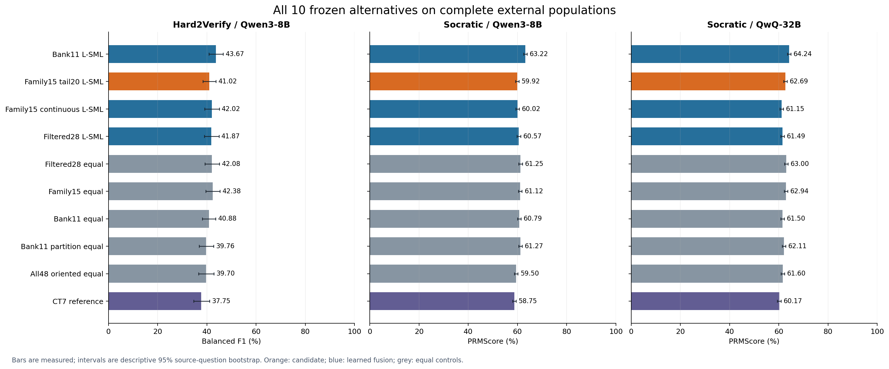
[Vector PDF](plots/01_all_methods.pdf)

### The two class F1 scores that form official PRMScore.
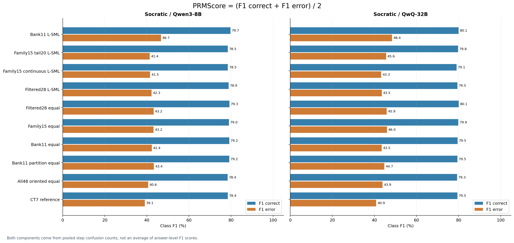
[Vector PDF](plots/02_prmscore_components.pdf)

### Precision and recall for both correct and erroneous steps.
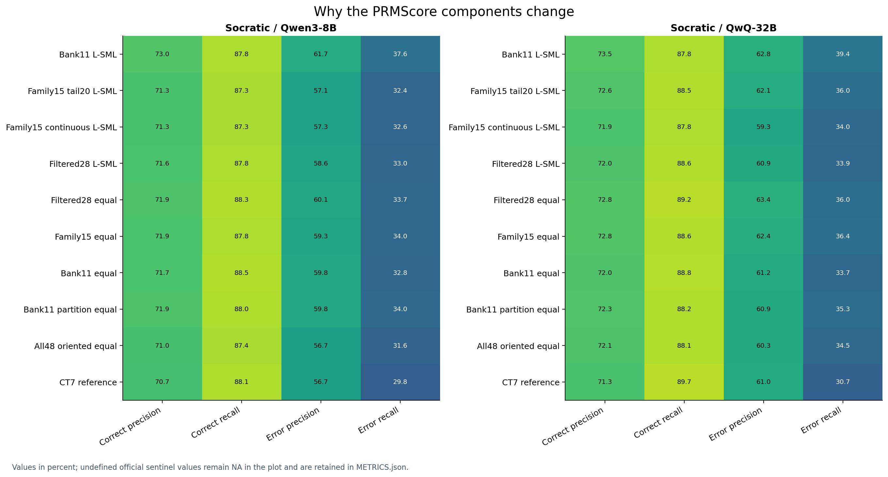
[Vector PDF](plots/03_precision_recall.pdf)

### Hard2Verify class recalls and false alarms on completely correct answers.
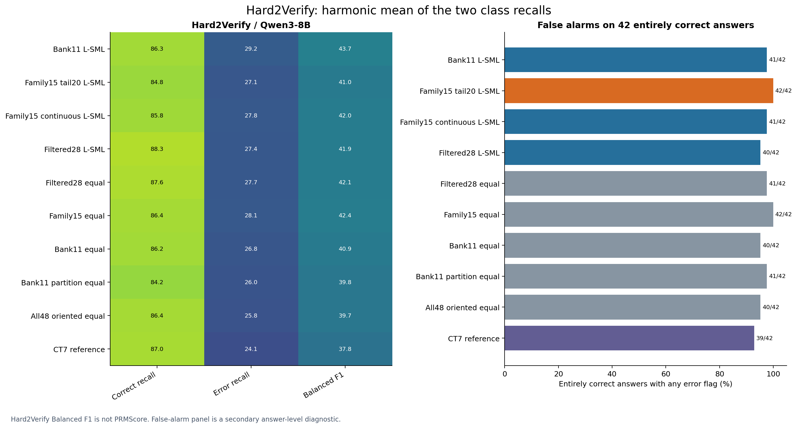
[Vector PDF](plots/04_hard2_components.pdf)

### All 18 registered comparisons with multiplicity-adjusted intervals.
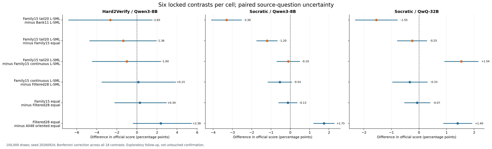
[Vector PDF](plots/05_paired_contrasts.pdf)

### Official category panels; exact per-class components are retained in METRICS.json.
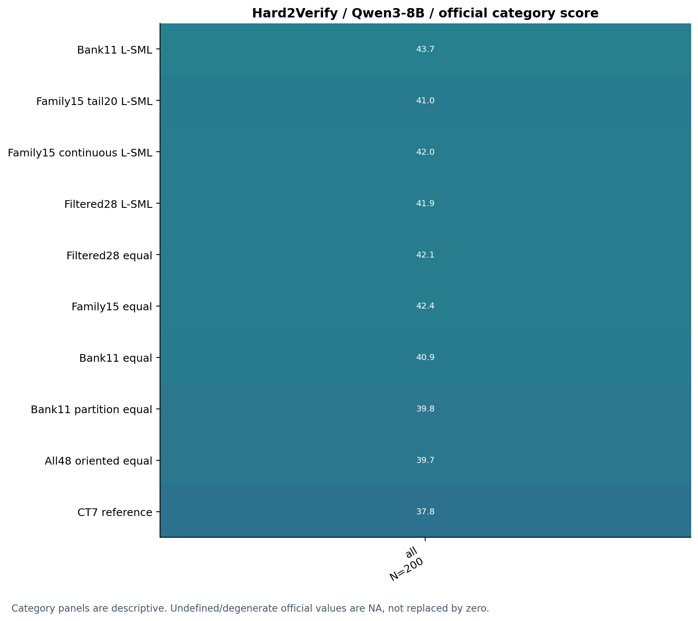
[Vector PDF](plots/06_categories_hard2verify_qwen3_8b.pdf)

### Official category panels; exact per-class components are retained in METRICS.json.
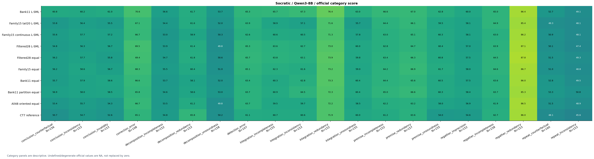
[Vector PDF](plots/06_categories_socratic_qwen3_8b.pdf)

### Official category panels; exact per-class components are retained in METRICS.json.
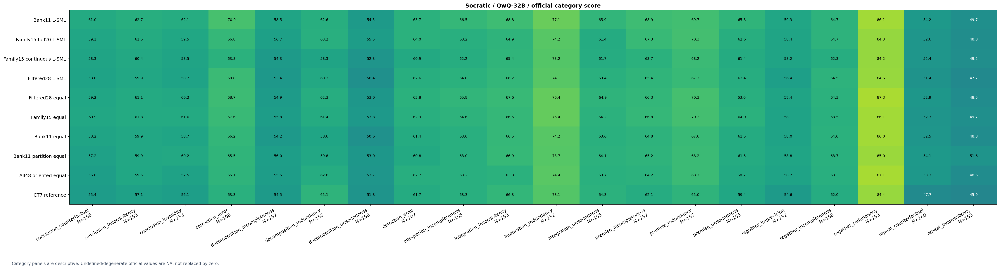
[Vector PDF](plots/06_categories_socratic_qwq32b.pdf)

### Number of original steps diagnostics across every method.
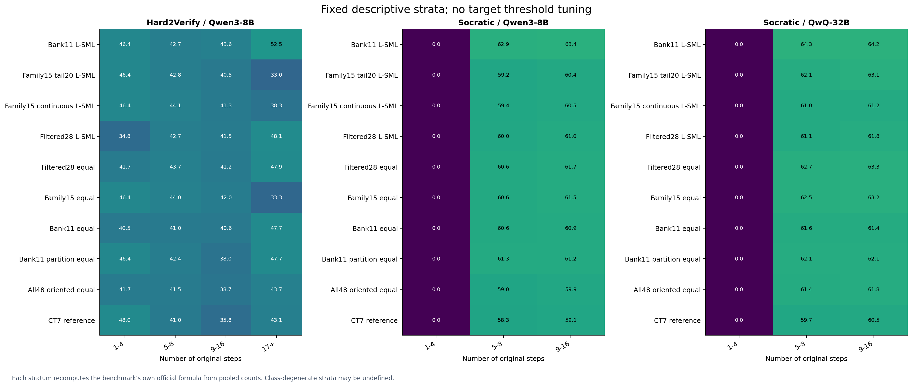
[Vector PDF](plots/07_length.pdf)

### Relative step position quartile diagnostics across every method.
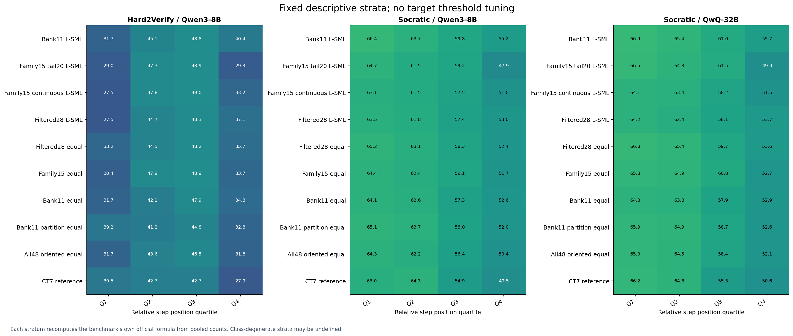
[Vector PDF](plots/08_position.pdf)

### Published context is visually separated from this run; unavailable components are never inferred.
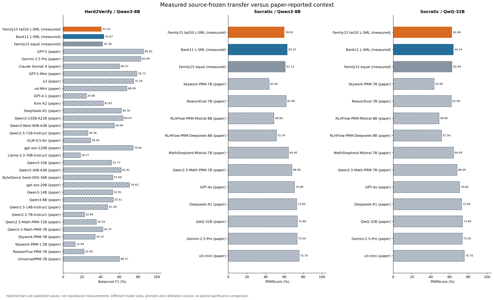
[Vector PDF](plots/09_literature.pdf)

### Measured and available published class components, with missing literature values explicit.
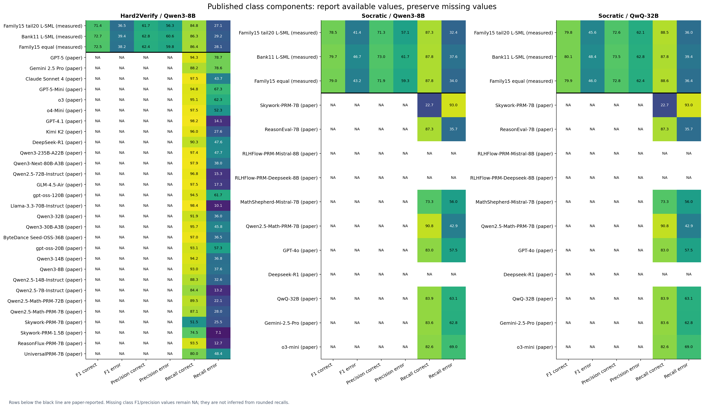
[Vector PDF](plots/10_literature_components.pdf)

### Full versus observed-disjoint official scores for all ten alternatives.
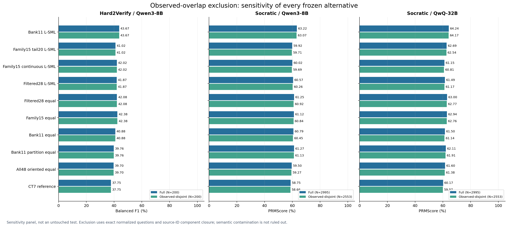
[Vector PDF](plots/11_disjoint_sensitivity.pdf)

### CUSUM versus other-family signed and absolute score contributions by relative position.
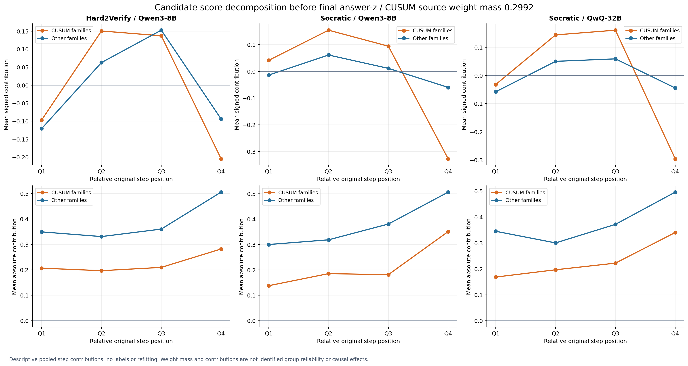
[Vector PDF](plots/12_position_contributions.pdf)

### Frequency of constant within-answer channels across complete populations; family counts are also in JSON.
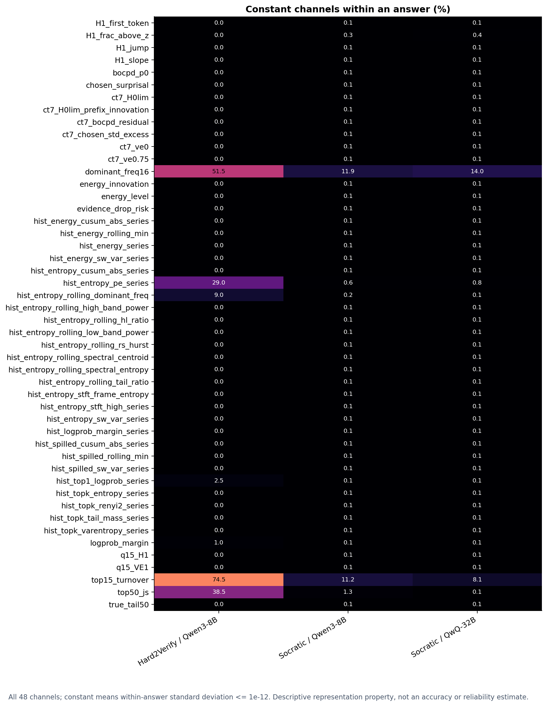
[Vector PDF](plots/13_constant_channels.pdf)

## Coverage and safeguards

- Hard2Verify / Qwen3-8B: 200 answers, 1860 included steps, 79 source-question groups; observed-disjoint panel 200 answers. 0 empty steps retain the locked missing-step decisions.
- Socratic / Qwen3-8B: 2995 answers, 26055 included steps, 1765 source-question groups; observed-disjoint panel 2553 answers. 3 empty steps retain the locked missing-step decisions.
- Socratic / QwQ-32B: 2995 answers, 26055 included steps, 1765 source-question groups; observed-disjoint panel 2553 answers. 3 empty steps retain the locked missing-step decisions.

All predictions were sealed before annotation access in this follow-up. Every official total/category component is replayed through pinned author code. Descriptive PRMScore strata preserve official undefined sentinels; plots show NA for such components.
Question overlap detection uses exact normalized text and source-ID component closure, not a semantic or pretraining contamination audit.
No result licenses target tuning or selecting a subset of reported arms. Fresh unexposed evaluation is required after any further method changes.

## Published context

Published values are not reproduced runs and have different calibration, prompting, model-size and compute conditions. Missing class F1/precision/recall values remain missing.

- **hard2verify / GPT-5**: 85.83 (percent). Generative critics use prompted verification; reasoning maximum effort, Qwen3 thinking on, instruction models greedy, max output 32K. PRM thresholds tuned on 100 target responses, grid 0.1..0.9 by 0.05, maximizing harmonic mean of three task BF1 scores. [Source](https://arxiv.org/html/2510.13744v1).
- **hard2verify / Gemini 2.5 Pro**: 83.09 (percent). Generative critics use prompted verification; reasoning maximum effort, Qwen3 thinking on, instruction models greedy, max output 32K. PRM thresholds tuned on 100 target responses, grid 0.1..0.9 by 0.05, maximizing harmonic mean of three task BF1 scores. [Source](https://arxiv.org/html/2510.13744v1).
- **hard2verify / Claude Sonnet 4**: 60.37 (percent). Generative critics use prompted verification; reasoning maximum effort, Qwen3 thinking on, instruction models greedy, max output 32K. PRM thresholds tuned on 100 target responses, grid 0.1..0.9 by 0.05, maximizing harmonic mean of three task BF1 scores. [Source](https://arxiv.org/html/2510.13744v1).
- **hard2verify / GPT-5-Mini**: 78.73 (percent). Generative critics use prompted verification; reasoning maximum effort, Qwen3 thinking on, instruction models greedy, max output 32K. PRM thresholds tuned on 100 target responses, grid 0.1..0.9 by 0.05, maximizing harmonic mean of three task BF1 scores. [Source](https://arxiv.org/html/2510.13744v1).
- **hard2verify / o3**: 75.29 (percent). Generative critics use prompted verification; reasoning maximum effort, Qwen3 thinking on, instruction models greedy, max output 32K. PRM thresholds tuned on 100 target responses, grid 0.1..0.9 by 0.05, maximizing harmonic mean of three task BF1 scores. [Source](https://arxiv.org/html/2510.13744v1).
- **hard2verify / o4-Mini**: 68.09 (percent). Generative critics use prompted verification; reasoning maximum effort, Qwen3 thinking on, instruction models greedy, max output 32K. PRM thresholds tuned on 100 target responses, grid 0.1..0.9 by 0.05, maximizing harmonic mean of three task BF1 scores. [Source](https://arxiv.org/html/2510.13744v1).
- **hard2verify / GPT-4.1**: 24.66 (percent). Generative critics use prompted verification; reasoning maximum effort, Qwen3 thinking on, instruction models greedy, max output 32K. PRM thresholds tuned on 100 target responses, grid 0.1..0.9 by 0.05, maximizing harmonic mean of three task BF1 scores. [Source](https://arxiv.org/html/2510.13744v1).
- **hard2verify / Kimi K2**: 42.83 (percent). Generative critics use prompted verification; reasoning maximum effort, Qwen3 thinking on, instruction models greedy, max output 32K. PRM thresholds tuned on 100 target responses, grid 0.1..0.9 by 0.05, maximizing harmonic mean of three task BF1 scores. [Source](https://arxiv.org/html/2510.13744v1).
- **hard2verify / DeepSeek-R1**: 62.3 (percent). Generative critics use prompted verification; reasoning maximum effort, Qwen3 thinking on, instruction models greedy, max output 32K. PRM thresholds tuned on 100 target responses, grid 0.1..0.9 by 0.05, maximizing harmonic mean of three task BF1 scores. [Source](https://arxiv.org/html/2510.13744v1).
- **hard2verify / Qwen3-235B-A22B**: 64.03 (percent). Generative critics use prompted verification; reasoning maximum effort, Qwen3 thinking on, instruction models greedy, max output 32K. PRM thresholds tuned on 100 target responses, grid 0.1..0.9 by 0.05, maximizing harmonic mean of three task BF1 scores. [Source](https://arxiv.org/html/2510.13744v1).
- **hard2verify / Qwen3-Next-80B-A3B**: 54.69 (percent). Generative critics use prompted verification; reasoning maximum effort, Qwen3 thinking on, instruction models greedy, max output 32K. PRM thresholds tuned on 100 target responses, grid 0.1..0.9 by 0.05, maximizing harmonic mean of three task BF1 scores. [Source](https://arxiv.org/html/2510.13744v1).
- **hard2verify / Qwen2.5-72B-Instruct**: 26.36 (percent). Generative critics use prompted verification; reasoning maximum effort, Qwen3 thinking on, instruction models greedy, max output 32K. PRM thresholds tuned on 100 target responses, grid 0.1..0.9 by 0.05, maximizing harmonic mean of three task BF1 scores. [Source](https://arxiv.org/html/2510.13744v1).
- **hard2verify / GLM-4.5-Air**: 29.4 (percent). Generative critics use prompted verification; reasoning maximum effort, Qwen3 thinking on, instruction models greedy, max output 32K. PRM thresholds tuned on 100 target responses, grid 0.1..0.9 by 0.05, maximizing harmonic mean of three task BF1 scores. [Source](https://arxiv.org/html/2510.13744v1).
- **hard2verify / gpt-oss-120B**: 74.64 (percent). Generative critics use prompted verification; reasoning maximum effort, Qwen3 thinking on, instruction models greedy, max output 32K. PRM thresholds tuned on 100 target responses, grid 0.1..0.9 by 0.05, maximizing harmonic mean of three task BF1 scores. [Source](https://arxiv.org/html/2510.13744v1).
- **hard2verify / Llama-3.3-70B-Instruct**: 18.37 (percent). Generative critics use prompted verification; reasoning maximum effort, Qwen3 thinking on, instruction models greedy, max output 32K. PRM thresholds tuned on 100 target responses, grid 0.1..0.9 by 0.05, maximizing harmonic mean of three task BF1 scores. [Source](https://arxiv.org/html/2510.13744v1).
- **hard2verify / Qwen3-32B**: 51.77 (percent). Generative critics use prompted verification; reasoning maximum effort, Qwen3 thinking on, instruction models greedy, max output 32K. PRM thresholds tuned on 100 target responses, grid 0.1..0.9 by 0.05, maximizing harmonic mean of three task BF1 scores. [Source](https://arxiv.org/html/2510.13744v1).
- **hard2verify / Qwen3-30B-A3B**: 61.91 (percent). Generative critics use prompted verification; reasoning maximum effort, Qwen3 thinking on, instruction models greedy, max output 32K. PRM thresholds tuned on 100 target responses, grid 0.1..0.9 by 0.05, maximizing harmonic mean of three task BF1 scores. [Source](https://arxiv.org/html/2510.13744v1).
- **hard2verify / ByteDance Seed-OSS-36B**: 53.09 (percent). Generative critics use prompted verification; reasoning maximum effort, Qwen3 thinking on, instruction models greedy, max output 32K. PRM thresholds tuned on 100 target responses, grid 0.1..0.9 by 0.05, maximizing harmonic mean of three task BF1 scores. [Source](https://arxiv.org/html/2510.13744v1).
- **hard2verify / gpt-oss-20B**: 70.93 (percent). Generative critics use prompted verification; reasoning maximum effort, Qwen3 thinking on, instruction models greedy, max output 32K. PRM thresholds tuned on 100 target responses, grid 0.1..0.9 by 0.05, maximizing harmonic mean of three task BF1 scores. [Source](https://arxiv.org/html/2510.13744v1).
- **hard2verify / Qwen3-14B**: 52.91 (percent). Generative critics use prompted verification; reasoning maximum effort, Qwen3 thinking on, instruction models greedy, max output 32K. PRM thresholds tuned on 100 target responses, grid 0.1..0.9 by 0.05, maximizing harmonic mean of three task BF1 scores. [Source](https://arxiv.org/html/2510.13744v1).
- **hard2verify / Qwen3-8B**: 53.51 (percent). Generative critics use prompted verification; reasoning maximum effort, Qwen3 thinking on, instruction models greedy, max output 32K. PRM thresholds tuned on 100 target responses, grid 0.1..0.9 by 0.05, maximizing harmonic mean of three task BF1 scores. [Source](https://arxiv.org/html/2510.13744v1).
- **hard2verify / Qwen2.5-14B-Instruct**: 47.59 (percent). Generative critics use prompted verification; reasoning maximum effort, Qwen3 thinking on, instruction models greedy, max output 32K. PRM thresholds tuned on 100 target responses, grid 0.1..0.9 by 0.05, maximizing harmonic mean of three task BF1 scores. [Source](https://arxiv.org/html/2510.13744v1).
- **hard2verify / Qwen2.5-7B-Instruct**: 22.84 (percent). Generative critics use prompted verification; reasoning maximum effort, Qwen3 thinking on, instruction models greedy, max output 32K. PRM thresholds tuned on 100 target responses, grid 0.1..0.9 by 0.05, maximizing harmonic mean of three task BF1 scores. [Source](https://arxiv.org/html/2510.13744v1).
- **hard2verify / Qwen2.5-Math-PRM-72B**: 35.5 (percent). Generative critics use prompted verification; reasoning maximum effort, Qwen3 thinking on, instruction models greedy, max output 32K. PRM thresholds tuned on 100 target responses, grid 0.1..0.9 by 0.05, maximizing harmonic mean of three task BF1 scores. [Source](https://arxiv.org/html/2510.13744v1).
- **hard2verify / Qwen2.5-Math-PRM-7B**: 42.37 (percent). Generative critics use prompted verification; reasoning maximum effort, Qwen3 thinking on, instruction models greedy, max output 32K. PRM thresholds tuned on 100 target responses, grid 0.1..0.9 by 0.05, maximizing harmonic mean of three task BF1 scores. [Source](https://arxiv.org/html/2510.13744v1).
- **hard2verify / Skywork-PRM-7B**: 34.12 (percent). Generative critics use prompted verification; reasoning maximum effort, Qwen3 thinking on, instruction models greedy, max output 32K. PRM thresholds tuned on 100 target responses, grid 0.1..0.9 by 0.05, maximizing harmonic mean of three task BF1 scores. [Source](https://arxiv.org/html/2510.13744v1).
- **hard2verify / Skywork-PRM-1.5B**: 12.94 (percent). Generative critics use prompted verification; reasoning maximum effort, Qwen3 thinking on, instruction models greedy, max output 32K. PRM thresholds tuned on 100 target responses, grid 0.1..0.9 by 0.05, maximizing harmonic mean of three task BF1 scores. [Source](https://arxiv.org/html/2510.13744v1).
- **hard2verify / ReasonFlux-PRM-7B**: 22.4 (percent). Generative critics use prompted verification; reasoning maximum effort, Qwen3 thinking on, instruction models greedy, max output 32K. PRM thresholds tuned on 100 target responses, grid 0.1..0.9 by 0.05, maximizing harmonic mean of three task BF1 scores. [Source](https://arxiv.org/html/2510.13744v1).
- **hard2verify / UniversalPRM-7B**: 60.27 (percent). Generative critics use prompted verification; reasoning maximum effort, Qwen3 thinking on, instruction models greedy, max output 32K. PRM thresholds tuned on 100 target responses, grid 0.1..0.9 by 0.05, maximizing harmonic mean of three task BF1 scores. [Source](https://arxiv.org/html/2510.13744v1).
- **socratic / Skywork-PRM-7B**: 43.6 (percent). Paper Appendix A uses PRMBench evaluation toolkit for PRMs and Table 6 critic prompt with temperature 1.0. Exact model-specific score thresholds and checkpoint revisions are not fully specified in paper text. [Source](https://arxiv.org/html/2505.23474v1).
- **socratic / ReasonEval-7B**: 61.9 (percent). Paper Appendix A uses PRMBench evaluation toolkit for PRMs and Table 6 critic prompt with temperature 1.0. Exact model-specific score thresholds and checkpoint revisions are not fully specified in paper text. [Source](https://arxiv.org/html/2505.23474v1).
- **socratic / RLHFlow-PRM-Mistral-8B**: 48.8 (percent). Paper Appendix A uses PRMBench evaluation toolkit for PRMs and Table 6 critic prompt with temperature 1.0. Exact model-specific score thresholds and checkpoint revisions are not fully specified in paper text. [Source](https://arxiv.org/html/2505.23474v1).
- **socratic / RLHFlow-PRM-Deepseek-8B**: 51.5 (percent). Paper Appendix A uses PRMBench evaluation toolkit for PRMs and Table 6 critic prompt with temperature 1.0. Exact model-specific score thresholds and checkpoint revisions are not fully specified in paper text. [Source](https://arxiv.org/html/2505.23474v1).
- **socratic / MathShepherd-Mistral-7B**: 64.4 (percent). Paper Appendix A uses PRMBench evaluation toolkit for PRMs and Table 6 critic prompt with temperature 1.0. Exact model-specific score thresholds and checkpoint revisions are not fully specified in paper text. [Source](https://arxiv.org/html/2505.23474v1).
- **socratic / Qwen2.5-Math-PRM-7B**: 68 (percent). Paper Appendix A uses PRMBench evaluation toolkit for PRMs and Table 6 critic prompt with temperature 1.0. Exact model-specific score thresholds and checkpoint revisions are not fully specified in paper text. [Source](https://arxiv.org/html/2505.23474v1).
- **socratic / GPT-4o**: 70.8 (percent). Paper Appendix A uses PRMBench evaluation toolkit for PRMs and Table 6 critic prompt with temperature 1.0. Exact model-specific score thresholds and checkpoint revisions are not fully specified in paper text. [Source](https://arxiv.org/html/2505.23474v1).
- **socratic / Deepseek-R1**: 73 (percent). Paper Appendix A uses PRMBench evaluation toolkit for PRMs and Table 6 critic prompt with temperature 1.0. Exact model-specific score thresholds and checkpoint revisions are not fully specified in paper text. [Source](https://arxiv.org/html/2505.23474v1).
- **socratic / QwQ-32B**: 73.8 (percent). Paper Appendix A uses PRMBench evaluation toolkit for PRMs and Table 6 critic prompt with temperature 1.0. Exact model-specific score thresholds and checkpoint revisions are not fully specified in paper text. [Source](https://arxiv.org/html/2505.23474v1).
- **socratic / Gemini-2.5-Pro**: 73.5 (percent). Paper Appendix A uses PRMBench evaluation toolkit for PRMs and Table 6 critic prompt with temperature 1.0. Exact model-specific score thresholds and checkpoint revisions are not fully specified in paper text. [Source](https://arxiv.org/html/2505.23474v1).
- **socratic / o3-mini**: 75.7 (percent). Paper Appendix A uses PRMBench evaluation toolkit for PRMs and Table 6 critic prompt with temperature 1.0. Exact model-specific score thresholds and checkpoint revisions are not fully specified in paper text. [Source](https://arxiv.org/html/2505.23474v1).

## Audit and machine-readable evidence

[Review status](AUDIT_DEFERRED.md), [metrics and all components](METRICS.json), [paired contrasts](CONTRASTS.json), [official replay](OFFICIAL_METRIC_REPLAY.json), [provenance](EVALUATION_PROVENANCE.json).

## פירוש התוצאות בעברית

ההשוואה הושלמה על כל 6,190 רשומות תשובה־מודל: 200 ב־Hard2Verify ו־2,995 תשובות ב־Socratic לכל אחד משני מודלי הטלמטריה. כל עשר החלופות הופעלו על נתונים שנאספו קודם, ללא אימון או הרצת GPU נוספת. הציונים הם באחוזים ובאותו סף שנקבע בנתוני המקור, ללא כיול על שתי קבוצות הבדיקה החדשות.

השיטה החדשה Family15 tail20 השיגה Balanced F1 של 41.020 ב־Hard2Verify ו־PRMScore של 59.921 ב־Socratic/Qwen3 ו־62.690 ב־Socratic/QwQ. שיטת Bank11 L-SML הקפואה השיגה בהתאמה 43.670, 63.221 ו־64.238. ההפרש לרעת Family15 הוא 2.650, 3.301 ו־1.549 נקודות. רווחי הסמך המותאמים ל־18 ההשוואות כוללים אפס ב־Hard2Verify, אך ב־Socratic שניהם מתחת לאפס. Family15 tail20 אינה מחליפה אפוא את Bank11 כמועמדת המובילה להעברה.

מול מיצוע משפחתי פשוט של אותם פיצ׳רים, Family15 tail20 נמוכה ב־1.360, 1.203 ו־0.247 נקודות. מיצוע מוצג כאן כבקרה בלבד, ולא כשיטה מוצעת. ב־Socratic/QwQ יש לשיטה החדשה יתרון של 1.536 נקודות על גרסת Family15 הרציפה עם אותם פיצ׳רים; זוהי תובנה על אופן הפיוז׳ן, אך אינה מפצה על הפער מ־Bank11.

פירוק PRMScore מסביר חלק מהפער: ב־Socratic/Qwen3 ה־F1 של צעדים שגויים הוא 41.380 לעומת 46.726 ל־Bank11; ב־QwQ הוא 45.585 לעומת 48.417. גם F1 הצעדים הנכונים נמוך מעט. הגרפים מציגים בנפרד F1, precision ו־recall לכל מחלקה, והמדדים הרשמיים אינם מחוברים למדד משותף בין הבנצ׳מרקים.

ערכי הספרות מוצגים כרקע בלבד: אלה אינם שחזורים זהים של תנאי ההרצה, הכיול, הפרומפט או גודל המודל. בפרט, חלק מהספים בספרות כוילו על תשובות מבנצ׳מרק היעד, בשונה מן הסף הקפוא שלנו. אין כאן טענת שיא ביצועים.

הבנצ׳מרקים החיצוניים כבר היו מוכרים בדיון שקדם להקפאת ההשוואה הזו, לכן זוהי בדיקת העברה חקרנית, לא אישוש בלתי תלוי. המשתמש ביקש לוותר על סבב נוסף של בדיקות עצמאיות ולהעביר אותו לסוכן אחר; מצב הבדיקה מפורט ב־AUDIT_DEFERRED.md. יש להתייחס לפרשנות הזאת כזמנית עד לסיום הסקירה ההיא.
