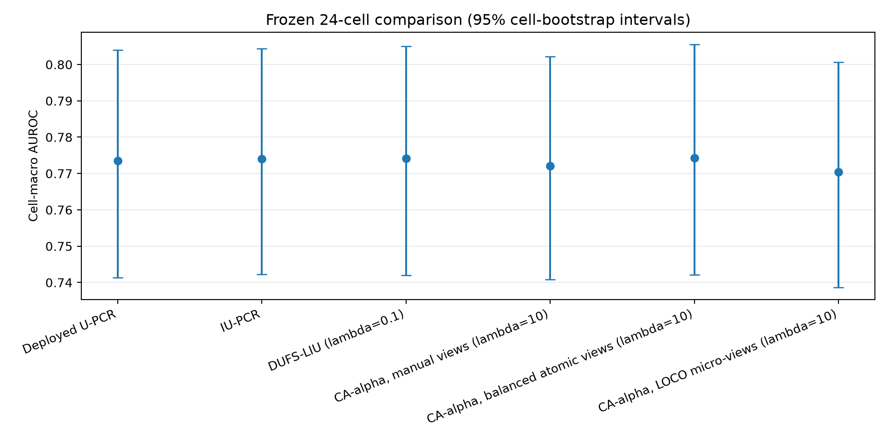
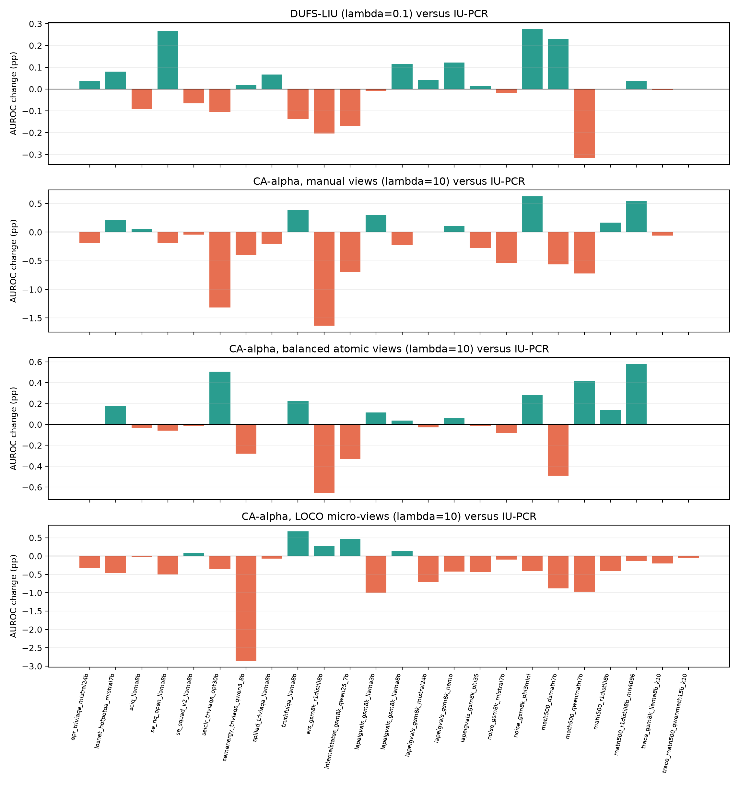
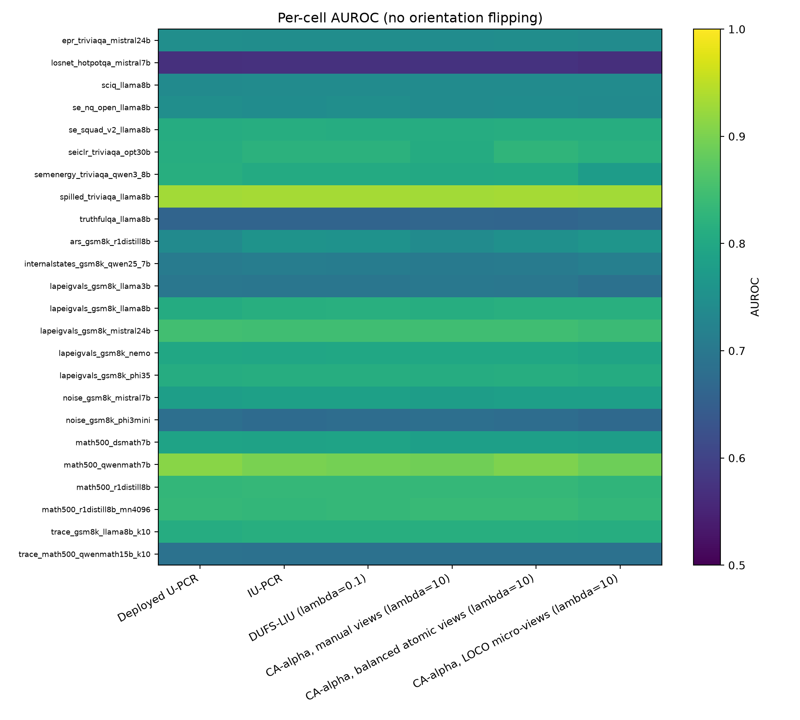
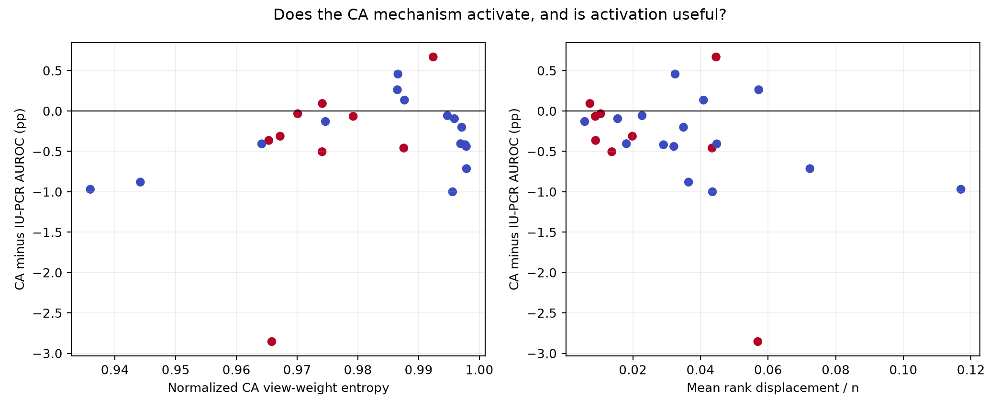
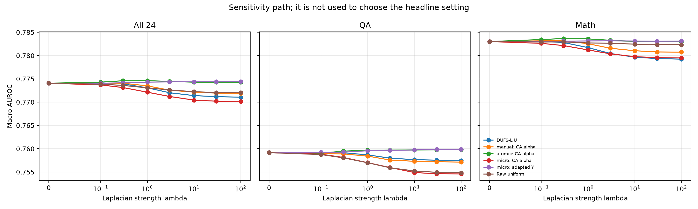
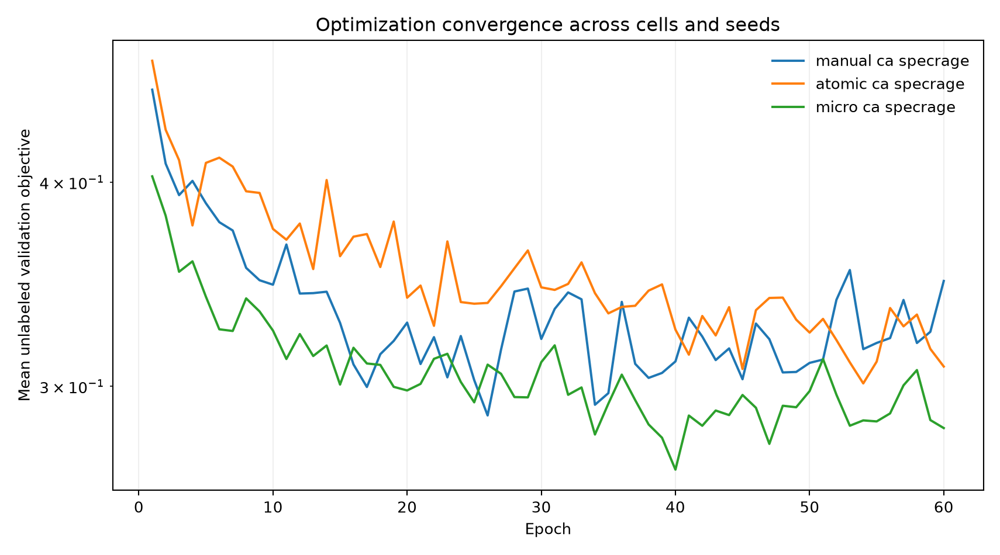
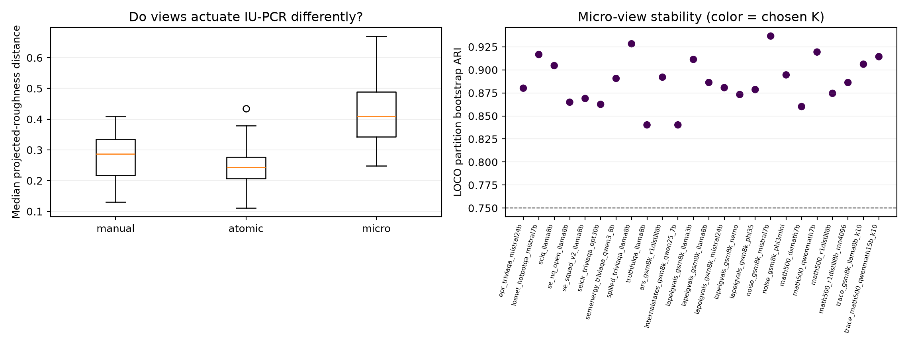
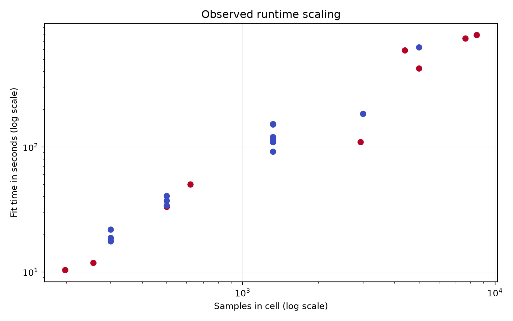

# Frozen 24-cell unsupervised fusion benchmark

Version: `frozen-24cell-unsupervised-fusion-v1-2026-08-07`.

## Read this first: terms and metrics

A **cell** is one dataset/model pair. This benchmark contains 24 cells: 9 question-answering cells and 15 mathematics cells. A **feature** is one continuous hallucination signal. U-PCR treats each feature as an expert that tries to rank correct answers above incorrect answers.

A **graph** connects samples that look similar. Its **Laplacian** is a matrix that measures how quickly a score changes between connected samples. LIU adds a penalty when the fused score is rough on the graph.

**AUROC** is the probability that a random correct answer receives a higher score than a random incorrect answer. 0.5 is random ranking and 1.0 is perfect. **AUPRC** summarizes precision and recall; its random reference is the positive rate, so it is especially useful for imbalanced cells. No method is allowed to flip a score after seeing AUROC.

A **cell-macro average** gives every one of the 24 cells equal weight. A **family-macro average** first averages repeated cells from the same dataset family, then gives each family equal weight. A **95% bootstrap interval** shows the uncertainty obtained by resampling cells or families.

## Experimental status

All model settings, seeds, feature directions, feature exclusions, view-building rules, and headline lambda values were fixed before this report opened labels. Score files were hashed first. The fit program never read labels.

This is still **retrospective development evidence**, not a clean confirmation set. The same 24 cells influenced earlier feature-contract work, and ten cells were inspected during the SpecRaGE execution pilot. A second reviewer can reduce interpretation bias, but cannot make previously seen data statistically unseen.

## Headline results

| method | cell-macro AUROC [95% CI] | QA | math | family macro | cell-macro AUPRC |
|---|---:|---:|---:|---:|---:|
| Deployed U-PCR | 0.7735 [0.7414, 0.8040] | 0.7587 | 0.7824 | 0.7414 | 0.7089 |
| IU-PCR | 0.7741 [0.7422, 0.8044] | 0.7592 | 0.7830 | 0.7416 | 0.7096 |
| DUFS-LIU (lambda=0.1) | 0.7741 [0.7420, 0.8050] | 0.7592 | 0.7831 | 0.7417 | 0.7096 |
| CA-alpha, manual views (lambda=10) | 0.7721 [0.7409, 0.8021] | 0.7573 | 0.7810 | 0.7410 | 0.7073 |
| CA-alpha, balanced atomic views (lambda=10) | 0.7743 [0.7421, 0.8055] | 0.7597 | 0.7830 | 0.7421 | 0.7095 |
| CA-alpha, LOCO micro-views (lambda=10) | 0.7704 [0.7386, 0.8007] | 0.7549 | 0.7798 | 0.7393 | 0.7038 |

The SpecRaGE headline uses `lambda=10`, selected on the earlier synthetic mechanism study. The full lambda path is a sensitivity analysis only; this report does not replace the headline with the best observed real-data value.

## Paired changes

A positive change means the candidate ranks answers better than the reference. The cell estimate gives all 24 cells equal weight and its interval resamples cells. The family estimate first averages within the eight dataset families and its interval resamples families. Both intervals are paired: candidate and reference stay together. `Holm p` corrects the paired Wilcoxon tests for multiple comparisons.

| candidate | reference | cell mean (pp) [cell 95% CI] | family mean (pp) [family 95% CI] | W/T/L | worst (pp) | Holm p |
|---|---|---:|---:|---:|---:|---:|
| CA-alpha, manual views (lambda=10) | Deployed U-PCR | -0.139 [-0.364, +0.056] | -0.040 [-0.298, +0.216] | 12/1/11 | -1.826 | 1 |
| CA-alpha, manual views (lambda=10) | IU-PCR | -0.193 [-0.409, +0.006] | -0.056 [-0.239, +0.125] | 9/0/15 | -1.634 | 0.9487 |
| CA-alpha, manual views (lambda=10) | DUFS-LIU (lambda=0.1) | -0.200 [-0.399, -0.019] | -0.064 [-0.280, +0.164] | 8/0/16 | -1.430 | 0.6714 |
| CA-alpha, manual views (lambda=10) | CA-alpha, balanced atomic views (lambda=10) | -0.215 [-0.420, -0.052] | -0.108 [-0.273, +0.029] | 8/0/16 | -1.823 | 0.3665 |
| CA-alpha, balanced atomic views (lambda=10) | Deployed U-PCR | +0.076 [-0.138, +0.304] | +0.068 [-0.109, +0.223] | 14/0/10 | -1.016 | 1 |
| CA-alpha, balanced atomic views (lambda=10) | IU-PCR | +0.023 [-0.091, +0.130] | +0.052 [-0.018, +0.126] | 11/1/12 | -0.659 | 1 |
| CA-alpha, balanced atomic views (lambda=10) | DUFS-LIU (lambda=0.1) | +0.015 [-0.109, +0.143] | +0.045 [-0.084, +0.164] | 11/1/12 | -0.722 | 1 |
| CA-alpha, balanced atomic views (lambda=10) | CA-alpha, manual views (lambda=10) | +0.215 [+0.052, +0.421] | +0.108 [-0.030, +0.269] | 16/0/8 | -0.343 | 0.3665 |
| CA-alpha, LOCO micro-views (lambda=10) | Deployed U-PCR | -0.309 [-0.756, +0.105] | -0.218 [-0.591, +0.166] | 10/0/14 | -3.593 | 1 |
| CA-alpha, LOCO micro-views (lambda=10) | IU-PCR | -0.363 [-0.654, -0.129] | -0.234 [-0.523, +0.092] | 5/0/19 | -2.855 | 0.0693 |
| CA-alpha, LOCO micro-views (lambda=10) | DUFS-LIU (lambda=0.1) | -0.370 [-0.674, -0.114] | -0.241 [-0.586, +0.135] | 6/0/18 | -2.874 | 0.09505 |
| CA-alpha, LOCO micro-views (lambda=10) | CA-alpha, manual views (lambda=10) | -0.170 [-0.516, +0.158] | -0.178 [-0.384, +0.023] | 8/0/16 | -2.463 | 1 |
| CA-alpha, LOCO micro-views (lambda=10) | CA-alpha, balanced atomic views (lambda=10) | -0.385 [-0.679, -0.115] | -0.286 [-0.577, +0.017] | 5/1/18 | -2.577 | 0.1365 |

## Interface and control results

These methods test whether any change comes from sample-specific alpha, the learned embedding Y, or a simpler graph. They use the same frozen lambda 10.

| method | AUROC | QA | math | AUPRC | change vs IU-PCR (pp) |
|---|---:|---:|---:|---:|---:|
| manual: adapted plain-loss Y (lambda=10) | 0.7733 | 0.7594 | 0.7816 | 0.7057 | -0.074 |
| manual: CA-trained Y (lambda=10) | 0.7731 | 0.7544 | 0.7843 | 0.7075 | -0.094 |
| manual: prior-only uniform Y (lambda=10) | 0.7725 | 0.7603 | 0.7798 | 0.7062 | -0.161 |
| manual: CA prior-alpha graph control (lambda=10) | 0.7729 | 0.7547 | 0.7838 | 0.7080 | -0.118 |
| manual: global alpha control (lambda=10) | 0.7728 | 0.7592 | 0.7810 | 0.7076 | -0.123 |
| manual: permuted alpha control (lambda=10) | 0.7728 | 0.7592 | 0.7809 | 0.7074 | -0.129 |
| atomic: adapted plain-loss Y (lambda=10) | 0.7713 | 0.7579 | 0.7794 | 0.7065 | -0.271 |
| atomic: CA-trained Y (lambda=10) | 0.7712 | 0.7566 | 0.7799 | 0.6996 | -0.290 |
| atomic: prior-only uniform Y (lambda=10) | 0.7715 | 0.7573 | 0.7800 | 0.7065 | -0.259 |
| atomic: CA prior-alpha graph control (lambda=10) | 0.7733 | 0.7573 | 0.7830 | 0.7080 | -0.072 |
| atomic: global alpha control (lambda=10) | 0.7746 | 0.7597 | 0.7835 | 0.7098 | +0.053 |
| atomic: permuted alpha control (lambda=10) | 0.7745 | 0.7596 | 0.7834 | 0.7097 | +0.041 |
| micro: adapted plain-loss Y (lambda=10) | 0.7744 | 0.7597 | 0.7831 | 0.7082 | +0.029 |
| micro: CA-trained Y (lambda=10) | 0.7723 | 0.7563 | 0.7819 | 0.7053 | -0.174 |
| micro: prior-only uniform Y (lambda=10) | 0.7740 | 0.7585 | 0.7833 | 0.7099 | -0.003 |
| micro: CA prior-alpha graph control (lambda=10) | 0.7705 | 0.7531 | 0.7810 | 0.7059 | -0.353 |
| micro: global alpha control (lambda=10) | 0.7710 | 0.7558 | 0.7801 | 0.7059 | -0.304 |
| micro: permuted alpha control (lambda=10) | 0.7710 | 0.7558 | 0.7801 | 0.7059 | -0.307 |
| Raw-uniform graph control (lambda=10) | 0.7722 | 0.7552 | 0.7824 | 0.7081 | -0.182 |

## Predeclared CA-SpecRaGE promotion gates

These gates prevent a small mean gain from hiding unstable failures. Passing every gate would justify a new unseen-data confirmation run; it would not by itself prove generalization.

| gate | observed | pass |
|---|---:|---:|
| Mean improvement over deployed U-PCR is at least 0.5 pp | -0.309 | no |
| Mean improvement over IU-PCR is at least 0.5 pp | -0.363 | no |
| Mean improvement over DUFS-LIU is at least 0.5 pp | -0.370 | no |
| Family-bootstrap lower bound versus IU-PCR is above 0 pp | -0.523 | no |
| At least 14 of 24 cells improve versus IU-PCR | 5.000 | no |
| Worst loss versus IU-PCR is no worse than -2 pp | -2.855 | no |
| LOCO micro-views improve over manual views | -0.170 | no |
| LOCO micro-views do not lose to balanced atomic views | -0.385 | no |

Overall gate result: **0/8 passed**. Do not promote CA-SpecRaGE from this benchmark.

## Mechanism checks

The plots below separate two questions: did the learner actually change its view reliance and sample ranking, and were those changes useful? High weight entropy means near-uniform view weights. Rank displacement near zero means the Laplacian hardly changed IU-PCR.

Unavailable numerical diagnostics: **135 values across 8 cells**. These are written as JSON `null`, and their full paths are listed in `diagnostics.csv`; they are not replaced by zero.

## View construction experiment

This run compares three definitions. `manual` uses the old provenance groups. `atomic` uses one feature per view, but divides equal micro-cluster mass among near-duplicate features. `micro` clusters features that have a similar and bootstrap-stable effect on the two-dimensional IU-PCR subspace.

For each held cell, the micro partition is learned from the other 23 cells only. Raw projected matrices are not compared across cells: pairwise Frobenius distances inside each cell are used so eigenvector sign or basis changes do not alter the distance. Cluster count is selected by a fixed label-free combination of distance silhouette, bootstrap adjusted Rand stability, singleton fraction, and size imbalance. Every partition and candidate score is stored for review.

## Reproducibility files

- `RUN_DEFINITION.json`: all fixed settings and source hashes.
- `FIT_COMPLETE.json`: per-cell score and diagnostic hashes.
- `SCORE_FREEZE_MANIFEST.json`: verification performed before labels were read.
- `per_cell_metrics.csv`: every cell and method result.
- `headline_summary.csv`, `paired_comparisons.csv`, `lambda_paths.csv`.
- `diagnostics.csv` and `training_history.csv`.
- `REVIEWER_GUIDE.md`: instructions for an independent model or researcher.

The raw score files contain sample indices, feature names, and scores, but no labels. The labels remain in the input bundle used only by this report step.
