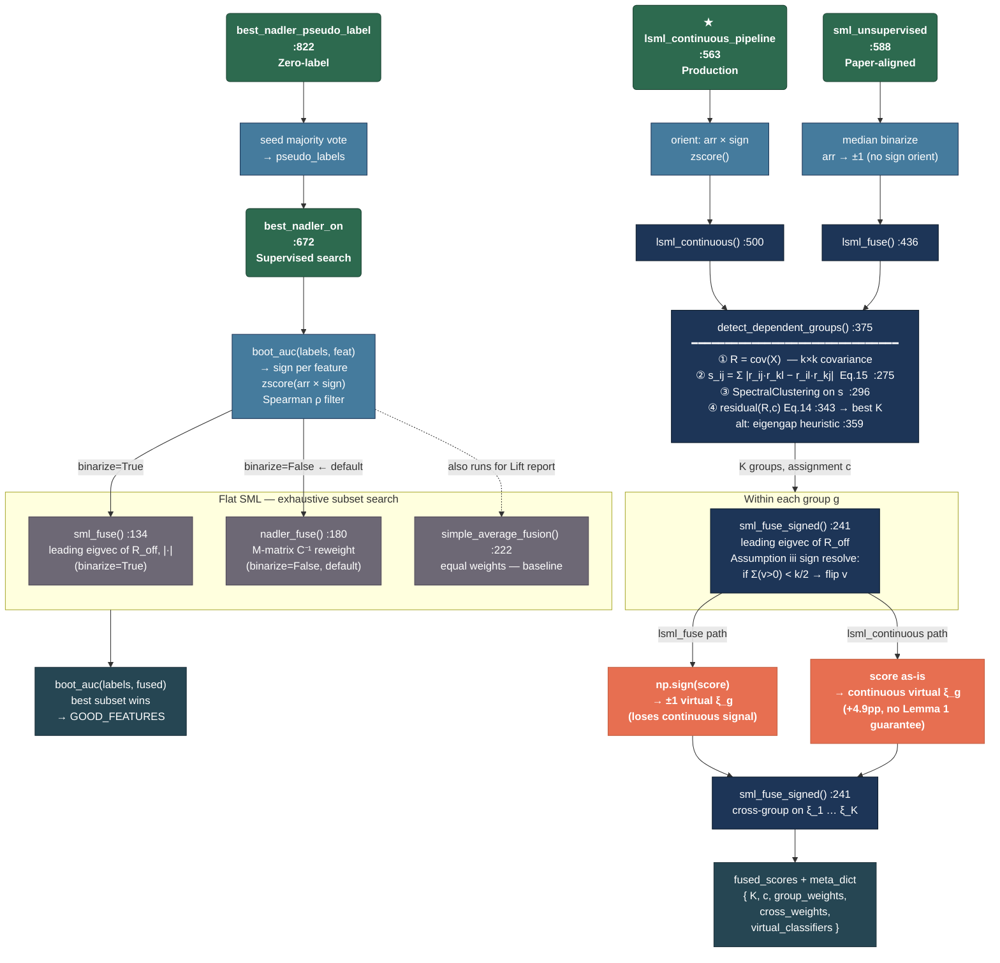

# Fusion Pipeline — Entry Points & Flowchart

## Entry Points Summary

| Entry point | Line | Labels needed? | Binarizes? | Groups? | Purpose |
|-------------|------|---------------|-----------|---------|---------|
| `lsml_continuous_pipeline` | 563 | No — uses `FEATURE_SIGNS` | No | Yes | **Current production** |
| `sml_unsupervised` | 588 | No | Yes (median) | Yes | Paper-faithful, zero supervision |
| `best_nadler_on` | 672 | Yes — for sign + search | Optional | No (flat SML) | Historical supervised search that produced `GOOD_FEATURES` |
| `best_nadler_pseudo_label` | 822 | No (wraps `best_nadler_on`) | Optional | No | Zero-label variant of the above |

---

## Flowchart



---

## The One Divergence Point That Matters

The entire binary vs. continuous difference collapses to a single line:

```python
# lsml_fuse  (binary, paper-faithful)  — fusion_utils.py:475
xi_g = np.sign(score)   # throws away magnitude

# lsml_continuous  (project invention, +4.9pp)  — fusion_utils.py:539
xi_g = score            # keeps magnitude
```

Everything above and below that line — group detection, `sml_fuse_signed`, the cross-group step, the output `meta_dict` — is shared code.

---

## Three Paths in Plain English

**Path A — Production** (`lsml_continuous_pipeline`):
```
feats_dict + FEATURE_SIGNS
  → orient + zscore  (pre-oriented, no labels)
  → lsml_continuous → detect_dependent_groups → within sml_fuse_signed
  → keep score continuous (no np.sign)
  → cross-group sml_fuse_signed
  → fused_scores
```

**Path B — Paper-aligned** (`sml_unsupervised`):
```
feats_dict
  → median binarize to ±1  (no sign orient — Assumption iii handles it)
  → lsml_fuse → detect_dependent_groups → within sml_fuse_signed
  → np.sign(score) → ±1 virtual classifier
  → cross-group sml_fuse_signed
  → fused_scores
```

**Path C — Historical supervised** (`best_nadler_on`):
```
feats_dict + labels
  → boot_auc → sign per feature
  → zscore + Spearman ρ filter
  → exhaustive subset search (size 2..4)
     each subset: sml_fuse OR nadler_fuse → boot_auc(labels, fused)
  → best (subset, auc)   ← this is how GOOD_FEATURES was found
```
