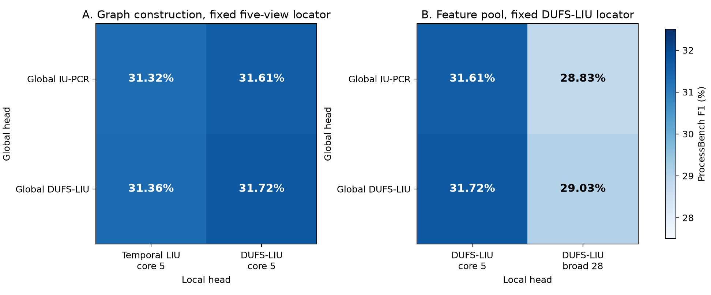
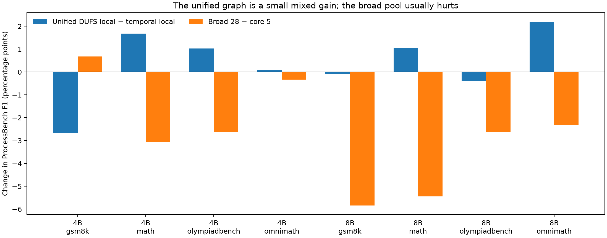
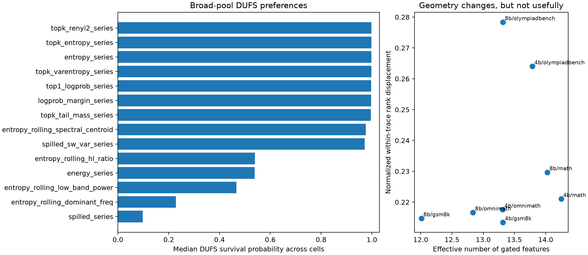

# GL-LIU factorial experiment: unified graph and broad token views

Date: 2026-08-08

Status: completed diagnostic. No candidate was selected or hidden after labels were opened.

## Short conclusion

Using DUFS-LIU in both heads is the cleanest current system, but the gain over
GL-LIU v1 is small. Its eight-cell ProcessBench F1 is **31.72%**, versus
**31.36%** for the frozen temporal-locator version and **25.71%**
for the reproduced Mind the Gap control. The unified system wins in
5 of 8 cells. On the six cells outside
component selection, its F1 is **31.41%**, versus
**30.76%** for GL-LIU v1.

Expanding the local head from five native curves to 28 token-resolved curves
does **not** help. It lowers F1 to **29.03%**, a change of
**-2.70 percentage points**, and loses in
7 of 8 cells. This is a useful negative
result: more token telemetry is not automatically more localization information.

## Metrics used in this report

- **Global AUROC** measures whether the complete-trace score ranks erroneous
  traces above clean traces. It does not require a decision threshold.
- **Exact localization** is the fraction of erroneous traces whose highest-risk
  token maps to the annotated first erroneous step. The global detector is not
  involved in this component metric.
- **Within-one-step localization** also counts predictions one reasoning step
  before or after the annotation.
- **ProcessBench F1** is the harmonic mean of exact erroneous-step accuracy and
  clean-trace abstention accuracy. A system must both locate errors and avoid
  flagging clean traces.

All numbers use the same 100 repeated calibration/evaluation splits. The split
spread measures calibration sensitivity; it is not a confidence interval over
new datasets.

## What was crossed

The experiment used two separate 2x2 matrices so two scientific questions were
not mixed together.

### Matrix A: graph construction

The local feature pool was fixed to the same five native curves. The global
head was IU-PCR or DUFS-LIU, and the local graph was temporal or DUFS-gated.
This tests whether a single DUFS-LIU construction can be used in both heads.

| global head | temporal LIU, core 5 | DUFS-LIU, core 5 |
|---|---:|---:|
| IU-PCR | 31.32% | 31.61% |
| DUFS-LIU | 31.36% | **31.72%** |

### Matrix B: local feature pool

The local graph was fixed to DUFS-LIU. The local feature pool was the frozen
five-view core or the broad 28-view token contract.

| global head | DUFS-LIU, core 5 | DUFS-LIU, broad 28 |
|---|---:|---:|
| IU-PCR | 31.61% | 28.83% |
| DUFS-LIU | **31.72%** | 29.03% |

## Component results

The global result reproduces the previous finding. DUFS-LIU reaches
**79.36% AUROC**, versus
**79.14%** for IU-PCR. DUFS-LIU is
better in every cell, but the average difference remains only about 0.22
percentage points.

For localization before the detector threshold:

| local head | exact, all 8 | within one step, all 8 | exact, six non-selection cells |
|---|---:|---:|---:|
| temporal LIU, core 5 | 26.41% | 57.18% | 25.14% |
| DUFS-LIU, core 5 | **26.70%** | 57.10% | **25.78%** |
| DUFS-LIU, broad 28 | 24.09% | 52.54% | 22.75% |

The core DUFS locator is slightly better in exact localization overall and on
the six non-selection cells. It is not uniformly better: the end-to-end gain is
positive in five cells and negative in three. The result supports simplicity
and slightly better transfer, not a large new localization effect.

## What the 28 local curves mean

The global schema has 30 registered feature names. Twenty-nine survived in the
frozen mixed global pool for these caches. They cannot all be copied directly
to tokens:

1. `trace_length` is constant inside one trace and cannot move a token argmax;
2. `cusum_max` and `cusum_shift_idx` are two reductions of the same absolute
   CUSUM curve, so the local curve is included once;
3. `min_spilled` was saturated globally, but its rolling-minimum curve varies
   locally and was retained.

This gives 28 unique curves: raw entropy, spilled energy, log-partition energy,
top-k distribution statistics, and rolling spectral, variance, CUSUM,
permutation-entropy, tail-ratio, Hurst-proxy, and minimum curves. The rolling
spectral window was fixed at 32 tokens and the local window at 16. These are
token-resolved proxies for global reductions, not mathematically identical
copies of the full-trace statistics.

## Why the broad pool failed

The failure is not a numerical collapse:

- all 28 curves survived in every cell;
- the broad feature effective rank is about 9, so the matrix is not constant;
- the DUFS effective feature count is about 12--14;
- the broad pool changes the within-trace score ranking substantially, with a
  normalized displacement of about 0.21--0.28.

DUFS is optimizing neighbourhood preservation, not first-error localization.
It gives high survival probability to entropy and several top-k distribution
curves. Those curves form a coherent token-state geometry, but the evaluation
shows that this geometry is less aligned with the first erroneous step than the
five native dynamics. This is the central diagnosis: **DUFS can preserve a
real, stable geometry that is irrelevant to our target.**

## Reproduction checks

For all eight cells, the hashes of both global scores, the temporal-core token
curve, and the DUFS-core token curve exactly match the frozen GL-LIU v1
artifacts. Therefore the 31.36% versus 31.72% comparison changes
only the declared local graph. The broad pool is the only new score constructor.

## Scientific conclusion

1. Keep global mixed DUFS-LIU. It remains the reliable component.
2. Use five-view local DUFS-LIU as the **simplest leading candidate** for the
   next external test. It gives one graph construction in both heads and a
   small transfer advantage.
3. Do not claim that local DUFS-LIU is confirmed. The gain over temporal LIU is
   only +0.37 points and is mixed by cell.
4. Reject the naive broad-28 local pool. Do not tune subsets or windows on these
   same labels to rescue it.
5. The next useful evidence is external: a new dataset family and preferably a
   new model/output family, with both temporal-core and DUFS-core frozen.

## Claim boundary

This remains calibrated unsupervised scoring. Correctness labels are not used
to fit scores, DUFS gates, graphs, or weights. Labels are used for the repeated
calibration-half threshold and final evaluation. The 4B and 8B cells reuse the
same benchmark examples, so there are four dataset families, not eight
independent datasets.
