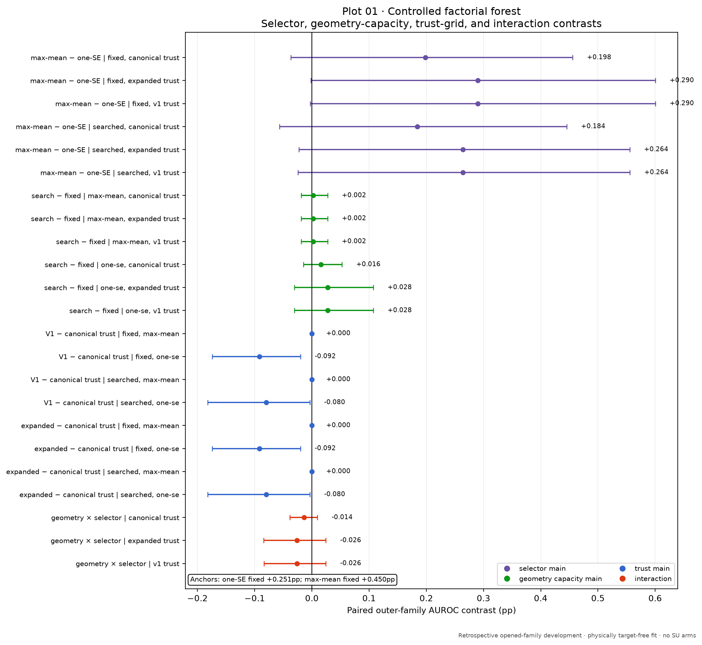
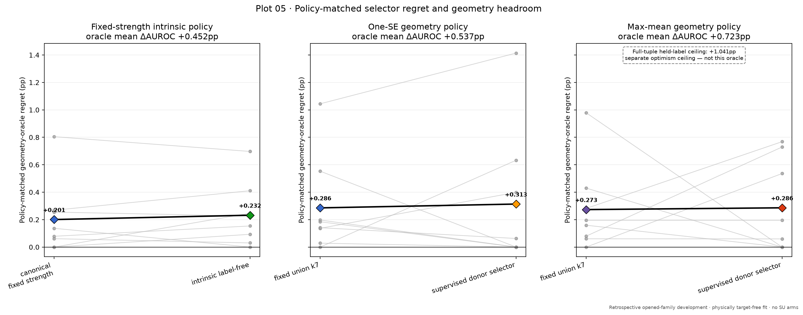
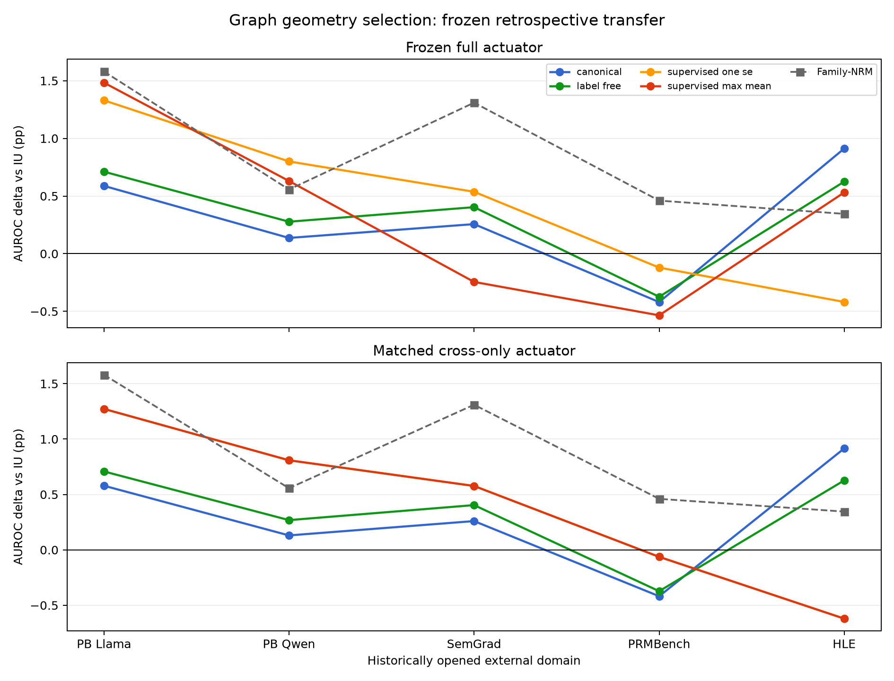

# Graph Geometry Selection Research V1 — final synthesis

**Final decision: `GEOMETRY_SEARCH_SELECTION_OPTIMISM`.**

The study found geometry headroom, but neither the label-free selector nor the donor-label selector identified it reliably on held families. The apparent gain from the historical +0.251pp to roughly +0.450pp is almost entirely a selector/correction-strength effect, not a graph-search effect. The enlarged Phase-B bank improves inner selection more than outer performance, so the bounded conclusion is selection optimism rather than a promoted geometry.

## Controlled factorial and anchors

| estimand | mean paired delta (pp) | interpretation |
|---|---:|---|
| fixed union-k7, one-SE/canonical | +0.251 | exact +0.251pp anchor |
| fixed union-k7, max-mean/canonical | +0.450 | exact +0.450pp anchor |
| max-mean minus one-SE, fixed/canonical | +0.198 | selector/correction-strength effect |
| graph search minus fixed, one-SE/canonical | +0.016 | small, interval crosses zero |
| graph search minus fixed, max-mean/canonical | +0.002 | negligible |
| V1 trust minus canonical, fixed/one-SE | -0.092 | expanded trust hurts guarded selection |
| V1 trust minus canonical, fixed/max-mean | +0.000 | no observed effect |

The exact legacy five-lambda searched/V1 result is +0.451606pp and equals the common-eight-lambda matched arm. Expanded and V1 trust grids select the same observed maxima for max-mean; they add no gain there.

## Selector result and geometry headroom

| policy | method | mean delta (pp) | matched held-geometry oracle (pp) | regret (pp) |
|---|---|---:|---:|---:|
| fixed strength | canonical union-k7 | +0.251 | +0.452 | +0.201 |
| fixed strength | label-free adaptive-k7 | +0.220 | +0.452 | +0.232 |
| one-SE | supervised donor selector | +0.224 | +0.537 | +0.313 |
| max-mean | fixed union-k7 | +0.450 | +0.723 | +0.273 |
| max-mean | supervised donor selector | +0.437 | +0.723 | +0.286 |

The separately scoped held-label full-tuple ceiling is +1.041pp; it is not a deployable method and is not used as a geometry-regret reference. The matched Phase-B max-mean optimism difference-in-differences is +0.164pp (5/8 families; one-sided exact sign-flip p=0.265625). Under one-SE it is +0.251355pp (6/8; p=0.042969).

## Actuator and controls

For canonical union-k7, cross-only is +0.245pp and conservative one-SE full minus cross is only +0.006pp. For label-free adaptive-k7, full minus cross is +0.000pp. At lambda=0.03, cos(full, -cbar) is 0.999911 (canonical) and 0.999903 (adaptive). Cross-only has no lambda because score normalization fixes the requested correction SD; only direction is identified.

The cbar signal is stable to leaving out a source family (minimum cosine 0.973 canonical; 0.965 adaptive) and separated from the 20 node-permutation cbar null by ratios 22.62 and 16.83. Outcome controls at fixed lambda=.03/trust=.5 give adaptive real-minus-permutation-mean +0.240pp (randomization p=0.047619). Aggressive max-mean activates more curvature (full-minus-cross +0.130pp canonical and +0.061pp adaptive), but both paired intervals cross zero. The complete attribution gate also fails because the canonical arm is not separated from the DUFS graph control. For the conservative promoted-policy question, the accurate mechanism label is pooled graph cross-gradient, not quadratic graph solve.

## Frozen retrospective transfer

| opened domain | canonical | label-free | supervised one-SE | supervised max-mean | Family-NRM |
|---|---:|---:|---:|---:|---:|
| processbench llama | +0.588 | +0.711 | +1.330 | +1.483 | +1.580 |
| processbench qwen | +0.137 | +0.277 | +0.800 | +0.630 | +0.557 |
| semgrad | +0.257 | +0.404 | +0.537 | -0.245 | +1.310 |
| prmbench | -0.420 | -0.374 | -0.120 | -0.535 | +0.460 |
| hle | +0.912 | +0.625 | -0.419 | +0.531 | +0.345 |

The frozen label-free arm is better than canonical on four of five opened domains, but it remains negative versus IU on PRMBench and trails canonical on HLE. Supervised arms are heterogeneous. Because all five domains were historically opened and the development comparison did not beat fixed union-k7, this stress test does not promote the selector.

## Provenance and claim boundary

The present development fit consumed an exact-whitelist, physically target-free archive. All 75,348 candidate/full/cross/node-control scores were frozen and independently reconstructed before outcomes were loaded. The external fit similarly consumed only isolated telemetry plus row identifiers, reproduced every canonical external score exactly in 16/16 cells, and froze all method scores before its report opened outcomes. No SU-rho or SU covariance-cleaning arm was included.

The historical canonical fit never indexed, decoded, or passed any label array into graph construction, calibration, or scoring, and its emitted state/score artifacts are label-free and hash-consistent. Its input archive nevertheless physically contained 24 label members and its provenance hash read the archive bytes. Historical separation was therefore logical member whitelisting, not physical input isolation; the present study repairs that boundary.

Outer LOFO is strict only for the new graph/selector stage conditional on the frozen mixed-v2 and confidence-orientation contract, which was itself developed using these eight families. Development and transfer findings are retrospective, not end-to-end unseen-family confirmation.

Final independent audits: audits/MECHANISM_FINAL.md and audits/PROVENANCE_FINAL.md. Corrected policy-matched oracle semantics: postreport_audit/REPORT.md. Artifact closure: REPORT_COMPLETE.json.
