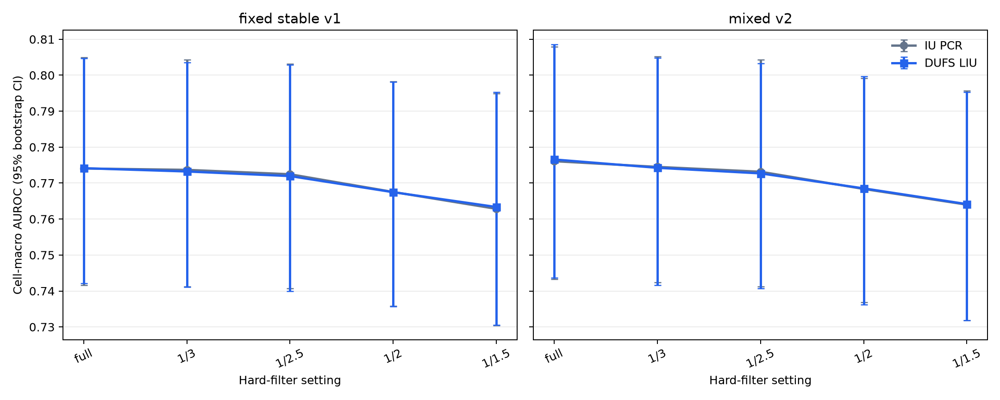
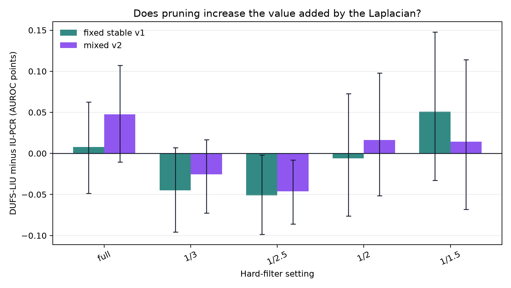
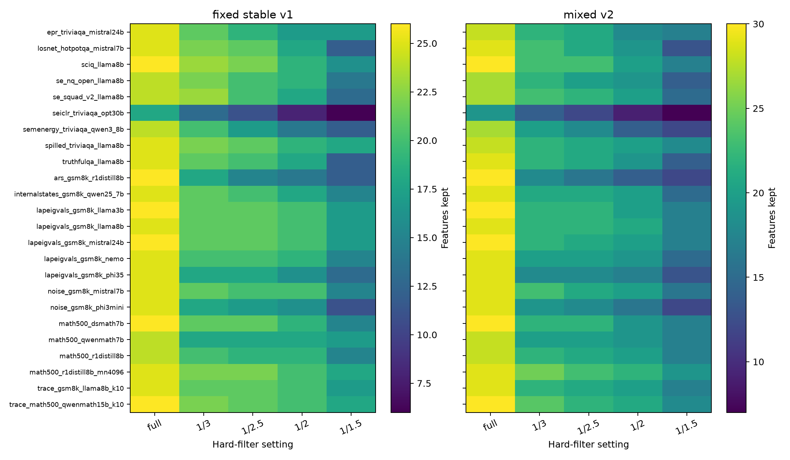
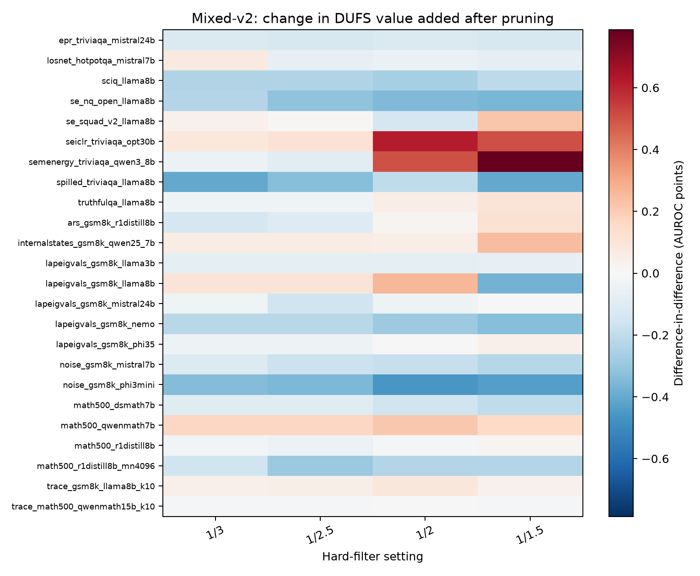

# Hard-filtered IU-PCR and DUFS-LIU on 24 cells

**Status:** Retrospective sensitivity experiment on development data.  No setting
selected here is confirmed on external data.

## Question

Deployed U-PCR estimates each feature's covariance with the unknown correctness
target and removes weak features. Ordinary IU-PCR and DUFS-LIU normally keep the
full input pool. This experiment asks whether applying the deployed hard filter
first makes the DUFS graph more useful.

The key quantity is **DUFS-LIU minus IU-PCR on the same selected features**. It
isolates the Laplacian contribution. We also report a difference-in-difference:

`(filtered DUFS-LIU - filtered IU-PCR) - (full DUFS-LIU - full IU-PCR)`.

A positive value means pruning increased the value added by DUFS. It does not
necessarily mean that the final filtered method is better in absolute AUROC.

## Leakage boundary

The fit stage did not read labels. It estimated every hard-filter mask, trained
DUFS, created the graphs, and froze hashes for all score files first. Labels were
opened only by the report stage to compute AUROC and AUPRC.

The strictness grid changed only `exclude_frac`; `min_frac=0.05`, DUFS seeds,
80 epochs, `k=7`, and Laplacian `lambda=0.1` stayed fixed. Lower denominators are
stricter. The implementation always keeps at least three features.

## Metrics

**AUROC** is the probability that a random correct answer receives a higher score
than a random incorrect answer. **AUROC points** are percentage-point changes in
AUROC; for example, 0.002 AUROC equals 0.2 points. Confidence intervals bootstrap
the 24 cells and therefore describe uncertainty across the current cell roster.

## Results

### fixed_stable_v1

| filter | mean features | IU-PCR AUROC / AUPRC | DUFS-LIU AUROC / AUPRC | DUFS-LIU - IU-PCR | change in DUFS value added vs full |
|---|---:|---:|---:|---:|---:|
| full | 24.8 | 0.774063 / 0.709630 | 0.774139 / 0.709584 | +0.008 pp | +0.000 pp [+0.000, +0.000] |
| rho_max_over_3 | 20.4 | 0.773678 / 0.709437 | 0.773227 / 0.708179 | -0.045 pp | -0.053 pp [-0.106, -0.003] |
| rho_max_over_2p5 | 19.4 | 0.772459 / 0.706520 | 0.771949 / 0.705322 | -0.051 pp | -0.059 pp [-0.113, -0.004] |
| rho_max_over_2 | 17.9 | 0.767528 / 0.695948 | 0.767470 / 0.695272 | -0.006 pp | -0.013 pp [-0.101, +0.077] |
| rho_max_over_1p5 | 14.7 | 0.762844 / 0.691609 | 0.763353 / 0.691680 | +0.051 pp | +0.043 pp [-0.068, +0.161] |
### mixed_v2

| filter | mean features | IU-PCR AUROC / AUPRC | DUFS-LIU AUROC / AUPRC | DUFS-LIU - IU-PCR | change in DUFS value added vs full |
|---|---:|---:|---:|---:|---:|
| full | 28.4 | 0.776087 / 0.710216 | 0.776562 / 0.712663 | +0.048 pp | +0.000 pp [+0.000, +0.000] |
| rho_max_over_3 | 21.3 | 0.774503 / 0.710149 | 0.774249 / 0.709326 | -0.025 pp | -0.073 pp [-0.128, -0.019] |
| rho_max_over_2p5 | 20.3 | 0.773158 / 0.707760 | 0.772695 / 0.707301 | -0.046 pp | -0.094 pp [-0.150, -0.038] |
| rho_max_over_2 | 18.6 | 0.768369 / 0.699974 | 0.768532 / 0.700442 | +0.016 pp | -0.031 pp [-0.124, +0.071] |
| rho_max_over_1p5 | 15.2 | 0.764011 / 0.692358 | 0.764153 / 0.692036 | +0.014 pp | -0.033 pp [-0.142, +0.086] |

### Deployed-style U-PCR reference

The exact deployed reference uses `fixed_stable_v1` and `rho_max_over_3`. Its
cell-macro AUROC is 0.773528 and its AUPRC is
0.708908. The other filter thresholds are
sensitivity arms, not deployed methods.

## Conclusion

The current 24 cells do not establish that hard filtering increases the incremental value added by DUFS-LIU.

For the current mixed-v2 contract, unfiltered DUFS-LIU adds
+0.048 AUROC points over IU-PCR. The largest
retrospective increase in that incremental contribution occurs at
`full`: +0.000
points with a 95% cell-bootstrap interval of
[+0.000, +0.000].

The best absolute mixed-v2 DUFS-LIU row is `full` at
0.776562 cell-macro AUROC. This is a descriptive result,
not a valid new hyperparameter choice, because all thresholds were compared on
the same 24 development cells.

## Interpretation rule

- If filtered DUFS-LIU improves but filtered IU-PCR improves by the same amount,
  pruning helped the base solver; it did not rescue the DUFS mechanism.
- If the difference-in-difference is positive with a stable lower bound, pruning
  made the graph penalty more useful.
- If aggressive settings collapse to three features, apparent gains must be
  treated as small-subset behavior rather than evidence for DUFS.
- Any candidate threshold must be frozen and tested on new dataset/model cells
  before it can replace the current method.
