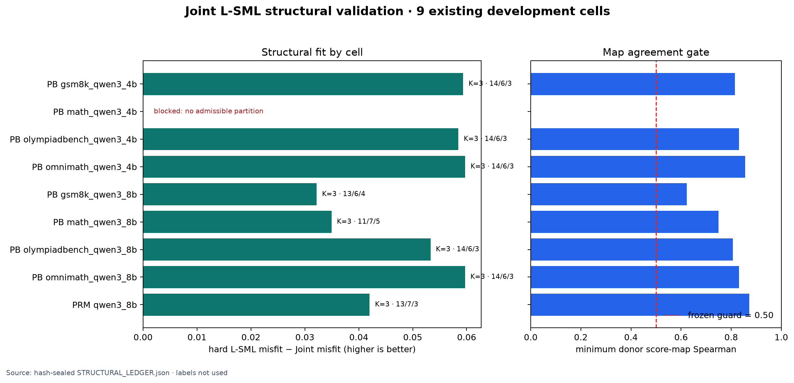
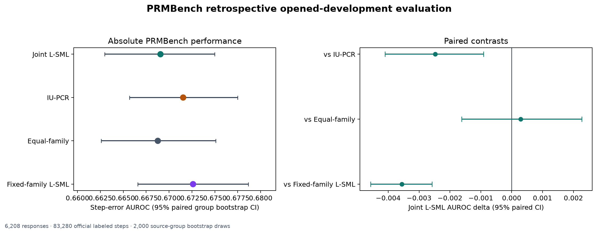
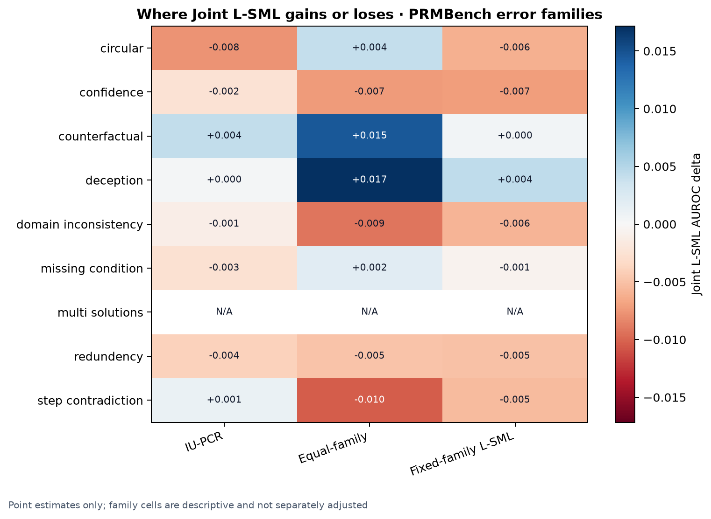
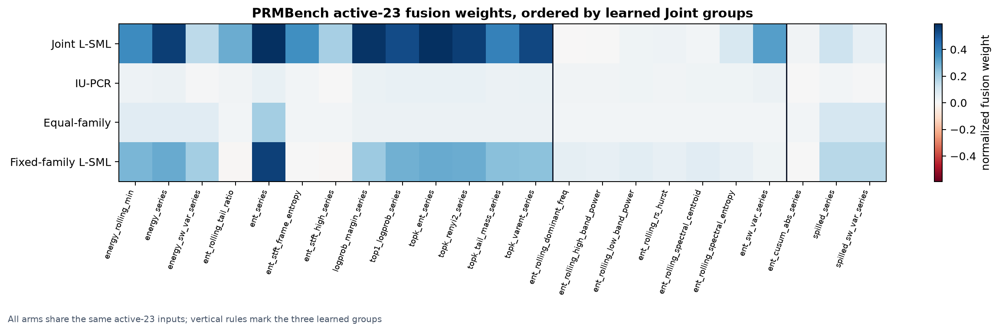

# Joint L-SML localization on existing Qwen data

Status: `HARM` on PRMBench; `STRUCTURAL_NO_SCORE` on ProcessBench.

This is a retrospective opened-development result. It can guide method development,
but it is not a generalization result, a promotion, or a new-leader claim.

## Result

- Joint L-SML PRMBench step AUROC: **0.669063** (paired 95% CI **[0.662967, 0.674967]**).
- Versus matched IU-PCR: **-0.002476** (95% CI **[-0.004103, -0.000908]**).
- Versus equal-family: **+0.000289** (95% CI **[-0.001620, +0.002271]**).
- Versus fixed-family continuous L-SML: **-0.003556** (95% CI **[-0.004572, -0.002578]**).
- Cohort: 6,208 error responses, 83,280 official labeled steps, 2,000 paired source-group bootstrap draws.

## Structural gate

Seven of eight ProcessBench cells fit successfully, but `processbench_math_qwen3_4b`
had no admissible partition: every candidate K left at least one group below three
features. The frozen all-eight-cell rule therefore closed the entire ProcessBench
panel before labels, with no efficacy score. PRMBench selected K=3
with group sizes [13, 7, 3]; Joint misfit was
0.203177 versus
0.245183 for hard L-SML.

## Figures

### Structural validation

Observation: 7/8 ProcessBench cells and the PRMBench cell passed; every fitted cell reduced off-diagonal misfit relative to hard L-SML.

Inference: the overlapping/global factor fit is numerically useful where the learned partition satisfies the minimum-size contract.

Limitation: the blocked PB cell prevents any ProcessBench efficacy conclusion and exposes a cardinality failure, not an accuracy failure.

### PRMBench performance

Observation: Joint scores below IU-PCR and fixed-family L-SML; both paired intervals are wholly negative, while the equal-family interval crosses zero.

Inference: the registered development state is HARM; the added structural flexibility improved covariance fit but did not improve localization ranking.

Limitation: these outcomes were opened in prior work, so even a positive interval is only development evidence.

### Error-family heterogeneity

Observation: Joint gains most against equal-family on counterfactual/deception, but loses in several other families; `multi_solutions` has no positive steps and is N/A.

Inference: the aggregate result should not be interpreted as a uniform mechanism across error types.

Limitation: family values are descriptive point estimates; no family-specific multiplicity correction was registered.

### Learned and baseline weight maps

Observation: Joint, IU-PCR, equal-family, and fixed-family heads place different mass on the same 23 retained streams; Joint is visibly more concentrated.

Inference: any efficacy difference comes from fusion structure, because preprocessing, orientation, roster, and reducer are matched.

Limitation: this experiment does not estimate the value of feature pruning itself because every arm uses active-23.

## Reducers and protocol notes

ProcessBench was frozen to detector=max token risk and locator=argmax of the fixed
top-`min(10, step_length)` mean. It is not top-5 and not top-10-percent. PRMBench
uses maximum token risk inside each official step span.

The first registered evaluator failed before metrics because it required 6,966
score IDs to equal the official 6,208 error-response IDs. R1 records and audits
the canonical opaque-ID subset join. R1 then completed the bootstrap but could
not serialize the undefined single-class `multi_solutions` family metrics. R2
uses an independently verified, numerically equivalent tie-block computation
and writes those undefined family metrics as `null`. No score or method changed.
