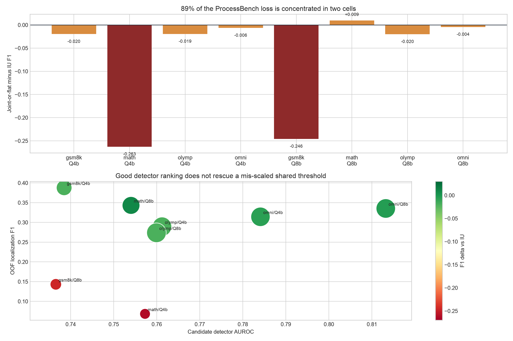
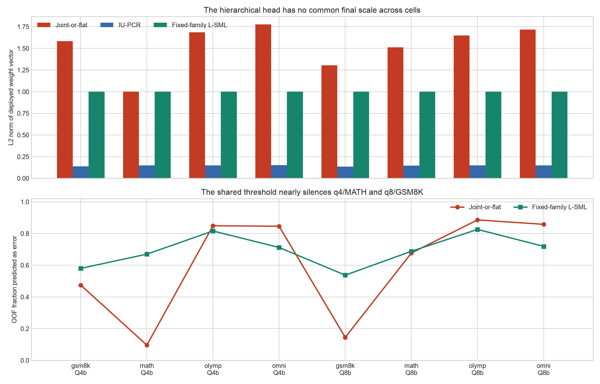
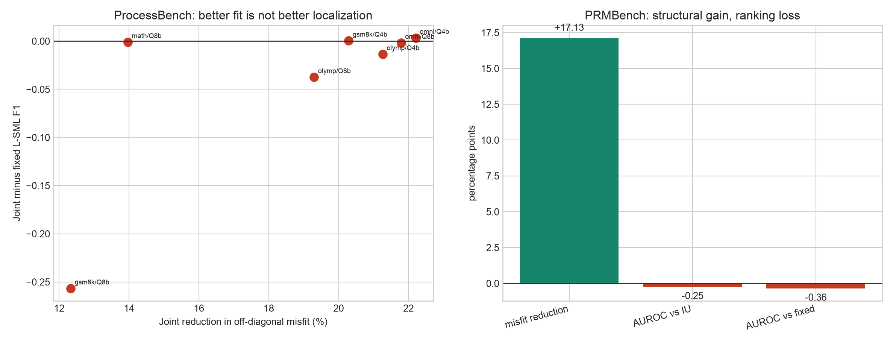

# Joint L-SML localization failure diagnostic

Status: `POSTHOC_RETROSPECTIVE_FAILURE_DIAGNOSTIC`. No new fusion candidate was fit or scored.

## Bottom line

The current Joint L-SML failure is best explained by two linked problems, not by bad signs or broken preprocessing:

1. **ProcessBench scale transfer:** `hierarchical_joint_weights` multiplies global loadings by cross-group SML weights but never normalizes the final head. Seven Joint cells therefore have materially different score scales, and the amendment also splices a unit-norm flat-SML fallback into the same absolute-threshold panel. The shared threshold nearly silences two cells.
2. **Objective/head mismatch:** the structured covariance fit estimates global `v` and group-specific `u`, but the deployed hierarchical head uses only `v` and a second SML over virtual groups. Better covariance reconstruction therefore need not improve the final ranking. PRMBench isolates this second problem because AUROC has no threshold scale failure.

This is the strongest supported diagnosis, not a causal proof. The original run did not score the full grouping x weight-map factorial, so INTERNAL grouping and the hierarchical map cannot be completely separated post hoc.

## ProcessBench: where the loss lives

Observation: q4/MATH and q8/GSM8K account for **89.4%** of the summed per-cell Joint-versus-IU loss. Their candidate F1 deltas are **-0.263** and **-0.246**.

Inference: the fallback is a major failure, but it is not the whole failure; q8/GSM8K uses pure Joint and collapses too.

Limitation: per-cell deltas are post-hoc descriptive quantities under the already-open all-eight cross-fitted threshold policy.

## ProcessBench: rankings survive, calibration does not

Observation: in q4/MATH and q8/GSM8K, candidate-versus-fixed detector Spearman is **0.989** and **0.980**, and locator agreement is **0.918** and **0.887**. Yet candidate activation is only **9.6%** and **14.5%**, versus fixed L-SML **67.0%** and **53.8%**. The median out-of-fold candidate threshold lies **1.30** and **1.13** within-cell score standard deviations above the respective cell means.

Inference: the detector ordering and step locator remain largely intact. The main PB collapse happens when one pooled model-level threshold is applied to cell scores whose scales are not comparable.

Limitation: score normalization may repair this particular PB failure, but it cannot by itself establish a better feature ranking or fix the PRMBench loss.

## Structural fit is not an efficacy surrogate

Observation: Joint reduces off-diagonal misfit in every fitted PB cell and by **17.1%** on PRMBench. Nevertheless PRMBench Joint loses **0.248 AUROC percentage points** to IU and **0.356 percentage points** to fixed-family L-SML. Its full frozen step-score Spearman remains high: **0.948** versus IU and **0.980** versus fixed L-SML.

Inference: the structural model is fitting covariance variation that is not reliably useful for first-error localization. The deployed weight map—not the optimizer convergence—must be redesigned or regularized.

Limitation: the opened data can diagnose and develop; it cannot support a new-leader or generalization claim.

## What is ruled out, and what is not

- **Not supported as the root cause:** sign instability, the removed weak streams, preprocessing drift, reducer drift, optimizer non-convergence, generic weight sparsity, or a coding error in the cross-fitted threshold adapter.
- **Supported:** missing final score-scale convention in the hierarchical head; fallback/Joint scale mixing; low agreement among plausible weight maps in the worst pure-Joint PB cell; and an objective-to-deployed-head mismatch.
- **Still unresolved:** whether INTERNAL K=3 groups are intrinsically wrong, or whether the same groups would work with ordinary unit-normalized continuous L-SML. That arm was structural-only in the frozen run.

## Consequence for the next method

Make donor-frozen score normalization an invariant, not a label-tuned hyperparameter. Then separate grouping from mapping with a small preregistered factorial: INTERNAL versus provenance/fixed groups, crossed with ordinary continuous L-SML versus the hierarchical Joint map. Only after that should feature-first be compared with trajectory-first under equal nested-CV budgets. The companion plan is `docs/experiments/JOINT_LSML_OPTIMIZATION_PLAN_V1.md`.

DUFS must not be used as a K selector: it produces per-feature gates, not a partition count. A bounded PF-DUFS support or soft-affinity study is possible later, but prior project evidence makes it secondary and it must be registered as a new candidate family.
