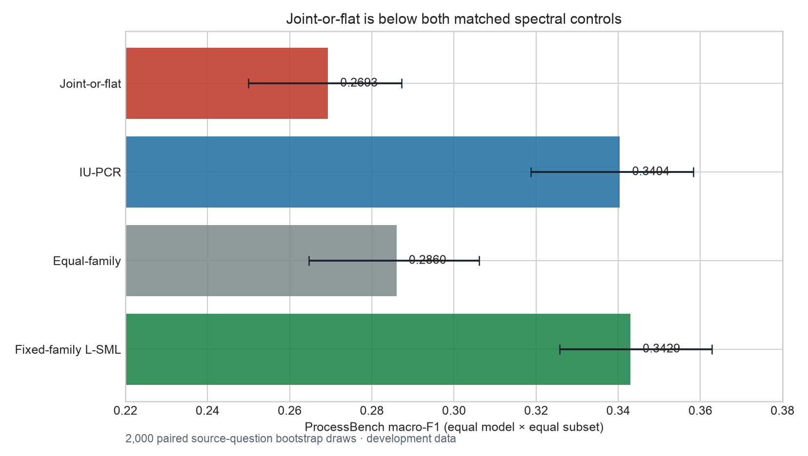
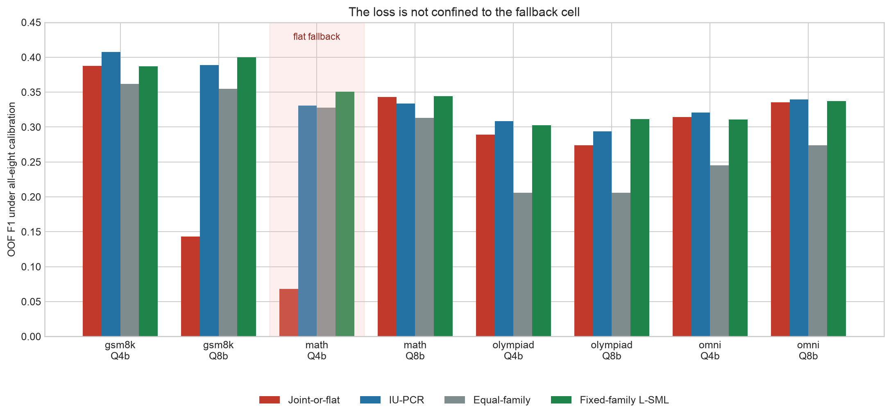
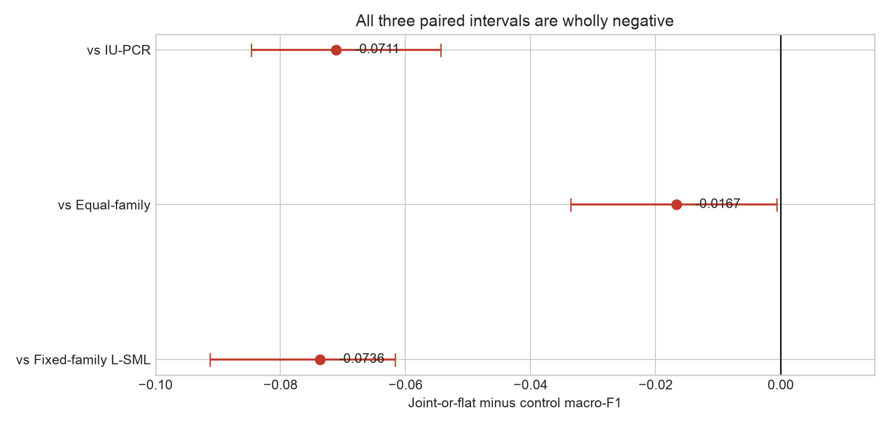

# Joint L-SML ProcessBench amendment result

Status: `HARM`. Scope: retrospective opened development after the PRMBench result was already open.

The all-eight candidate is a disclosed coverage policy, not pure Joint L-SML: seven cells use the frozen Joint head and `processbench_math_qwen3_4b` uses the exact flat-SML alias up to global sign gauge.

## Primary result

- Joint-or-flat macro-F1: **0.269290**.
- IU-PCR: **0.340378**; candidate delta **-0.071087** (descriptive paired 95% interval **[-0.084721, -0.054335]**).
- Fixed-family continuous L-SML: **0.342940**; candidate delta **-0.073650** (95% interval **[-0.091279, -0.061706]**).
- Equal-family: **0.285986**; candidate delta **-0.016696** (95% interval **[-0.033615, -0.000629]**).
- Population: 3,400 source questions, 6,800 paired model rows, 2,000 paired source-question bootstrap draws with threshold refit.

Observation: the candidate is below every matched control and every paired contrast is wholly negative.

Inference: the registered decision is `HARM`; the current Joint head should not replace IU-PCR or fixed-family L-SML.

Limitation: this is opened development evidence, and the candidate includes a one-cell structural fallback.

## Where the failure occurs

Observation: the fallback Qwen3-4B/MATH cell is very poor at **0.0683** F1, but a pure-Joint cell, Qwen3-8B/GSM8K, is also poor at **0.1431**. Across only the seven parent-admissible cells, the selection-conditioned mean is **0.2980** for Joint, versus **0.3417** IU-PCR and **0.3418** fixed-family L-SML.

Inference: the negative result is not explained solely by the flat-SML fallback. The hierarchical cross-group weighting itself is unstable for localization on at least one fitted cell.

Limitation: the seven-cell diagnostic reuses thresholds calibrated by the all-eight procedure, has no interval, and is not fallback-independent or a complete-panel estimand.

## Paired contrasts

Observation: Joint loses by 7.11 F1 points to IU-PCR and 7.36 points to fixed-family L-SML; even equal-family is ahead by 1.67 points.

Inference: lower covariance misfit is not a sufficient selection criterion for a localization fusion head. The next method iteration should gate or regularize the weight map itself, not add more covariance-fit flexibility on these opened labels.

Limitation: no new variant may be selected from this population and then described as confirmation; a new algorithm needs a newly frozen protocol and fresh data for generalization.

## Reducer and historical boundary

ProcessBench uses detector=max token risk and locator=argmax of the fixed top-`min(10, step_length)` mean. It is not top-5 and not top-10-percent. The historical `0.3662` value belongs to a different H2/H3 configuration and remains an audit anchor, not the matched comparator for this active-23 experiment.

PRMBench is not reevaluated here. Its parent result remains `HARM`: pure Joint AUROC 0.669063 versus IU-PCR 0.671539 and fixed-family L-SML 0.672619.

No promotion or generalization claim is allowed.
