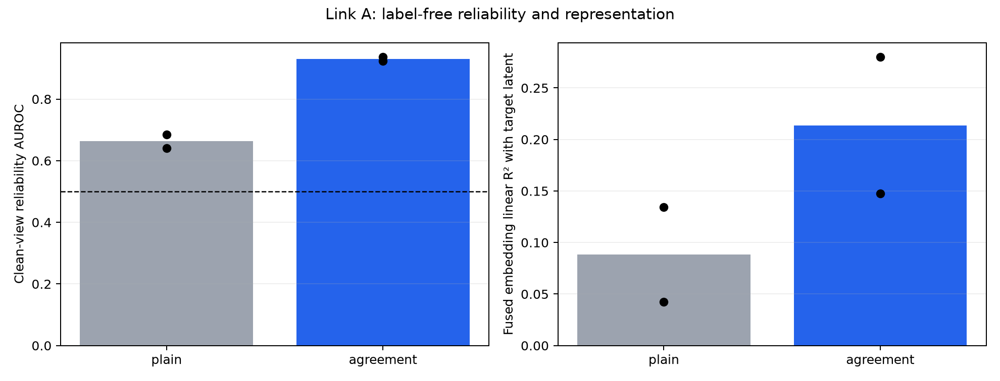
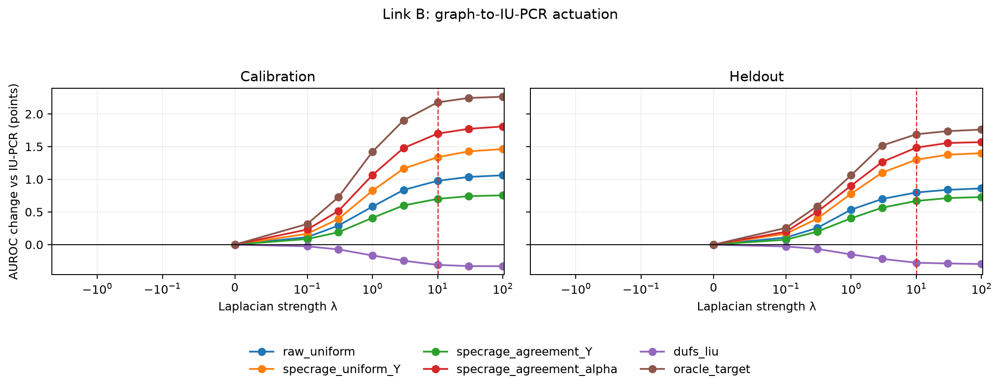
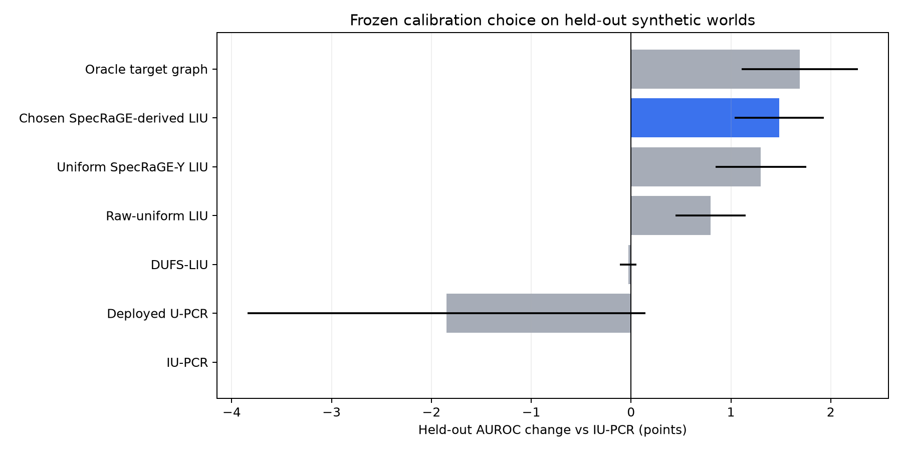
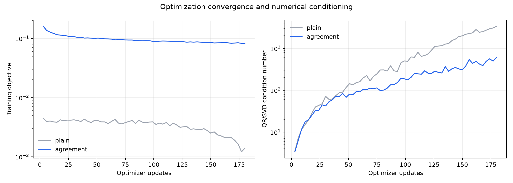

# Corrected SpecRaGE–IU-PCR mechanism study

Version: `specrage-liu-mechanism-v2-2026-08-06`. Runtime: 35.6s.

This study separates reliability learning (Link A) from downstream IU-PCR actuation (Link B). Calibration labels chose one interface and one value of lambda; held-out synthetic seeds were opened only afterward.

## Link A — reliability



| arm | clean-view AUROC | agreement-target AUROC | embedding R² | alpha entropy |
|---|---:|---:|---:|---:|
| plain | 0.663 | 0.802 | 0.088 | 1.000 |
| agreement | 0.930 | 0.802 | 0.214 | 0.985 |

## Link B — coupling

Calibration selected `specrage_agreement_alpha` with `lambda=10.0` (mean calibration change +1.699 points; worst calibration replicate +1.269).
The grid was extended through `lambda=100`; the one-standard-error threshold was +1.575 points, so the smaller saturating value was retained instead of the boundary optimum.





| held-out method | lambda | AUROC | change vs IU (pp) | wins |
|---|---:|---:|---:|---:|
| IU-PCR | 0.0 | 0.7262 | +0.000 | 0/4 |
| Deployed U-PCR | 0.0 | 0.7078 | -1.849 | 1/4 |
| DUFS-LIU | 0.1 | 0.7260 | -0.029 | 3/4 |
| Raw-uniform LIU | 10.0 | 0.7342 | +0.798 | 4/4 |
| Uniform SpecRaGE-Y LIU | 10.0 | 0.7392 | +1.300 | 4/4 |
| Chosen SpecRaGE-derived LIU | 10.0 | 0.7411 | +1.484 | 4/4 |
| Oracle target graph | 10.0 | 0.7431 | +1.689 | 4/4 |

## Oracle-headroom gate

At the frozen lambda, the oracle graph changes held-out AUROC by +1.689 points and changes projected roughness orientation by 0.125 on average. This is the gate missing from v1: the learner is tested only where useful geometry can affect score ranks.

## Numerical boundary

The small-sample spectral networks still produce ill-conditioned raw outputs. Registered SVD singular-value flooring was therefore active and is reported in `reliability_gate.csv` and `training_history.csv`. This is a stabilization, not evidence that the released QR optimization is healthy.



## Reproduction

```bash
python scripts/specrage_upcr_mechanism_v2.py
```

The original v1 negative smoke artifacts remain unchanged.
