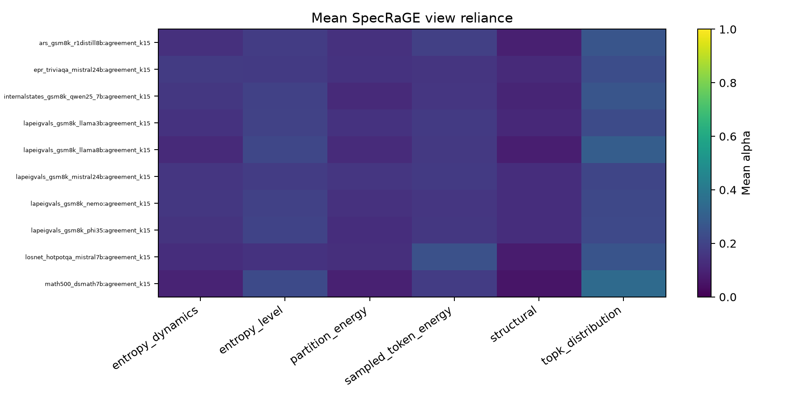
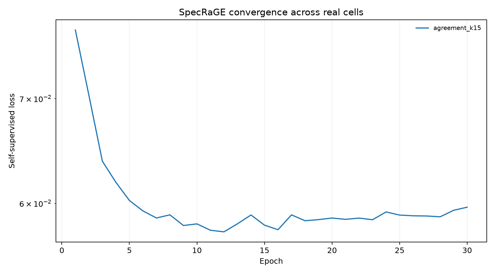

# SpecRaGE-LIU real-artifact smoke run

Version: `specrage-liu-real-calibration-v2-2026-08-06`.

This is a fixed-configuration execution diagnostic on a small cell subset. It is not cross-fitted calibration and is not scientific performance evidence.

| cell | SpecRaGE vs deployed (pp) | SpecRaGE vs frozen DUFS-LIU (pp) |
|---|---:|---:|
| `ars_gsm8k_r1distill8b` | +0.422 | -1.349 |
| `epr_triviaqa_mistral24b` | -0.372 | -0.196 |
| `internalstates_gsm8k_qwen25_7b` | -0.252 | -0.522 |
| `lapeigvals_gsm8k_llama3b` | -0.002 | +0.287 |
| `lapeigvals_gsm8k_llama8b` | +0.430 | -0.296 |
| `lapeigvals_gsm8k_mistral24b` | -0.130 | +0.000 |
| `lapeigvals_gsm8k_nemo` | +0.040 | +0.044 |
| `lapeigvals_gsm8k_phi35` | +0.064 | -0.268 |
| `losnet_hotpotqa_mistral7b` | +0.390 | +0.175 |
| `math500_dsmath7b` | -0.924 | -0.708 |

Passing smoke authorizes only the registered development run.
