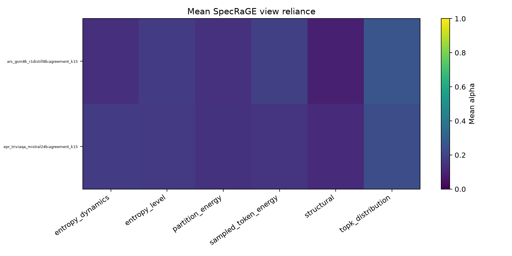
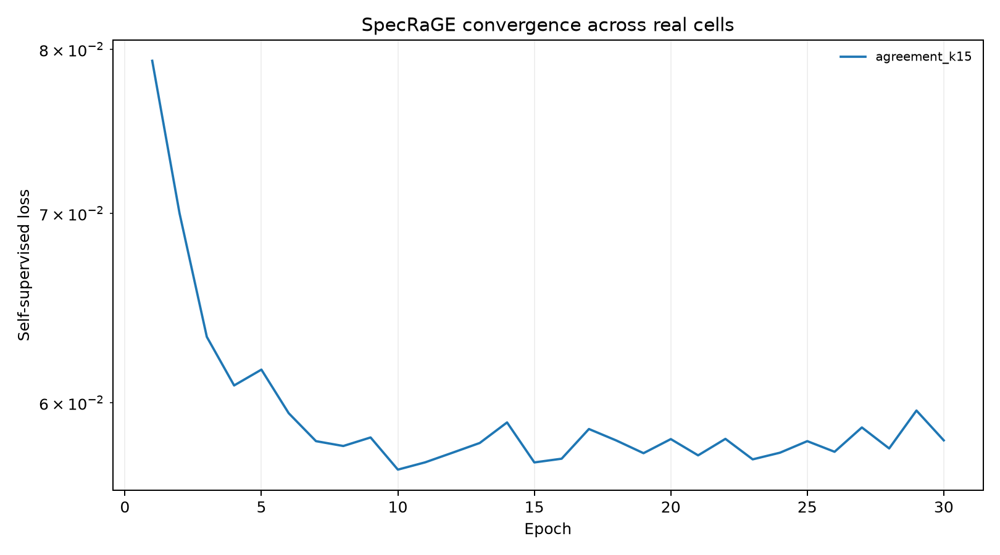

# SpecRaGE-LIU real-artifact smoke run

Version: `specrage-liu-real-calibration-v2-2026-08-06`.

This is a fixed-configuration execution diagnostic on a small cell subset. It is not cross-fitted calibration and is not scientific performance evidence.

| cell | SpecRaGE vs deployed (pp) | SpecRaGE vs frozen DUFS-LIU (pp) |
|---|---:|---:|
| `ars_gsm8k_r1distill8b` | +0.422 | -1.349 |
| `epr_triviaqa_mistral24b` | -0.372 | -0.196 |

Passing smoke authorizes only the registered development run.
