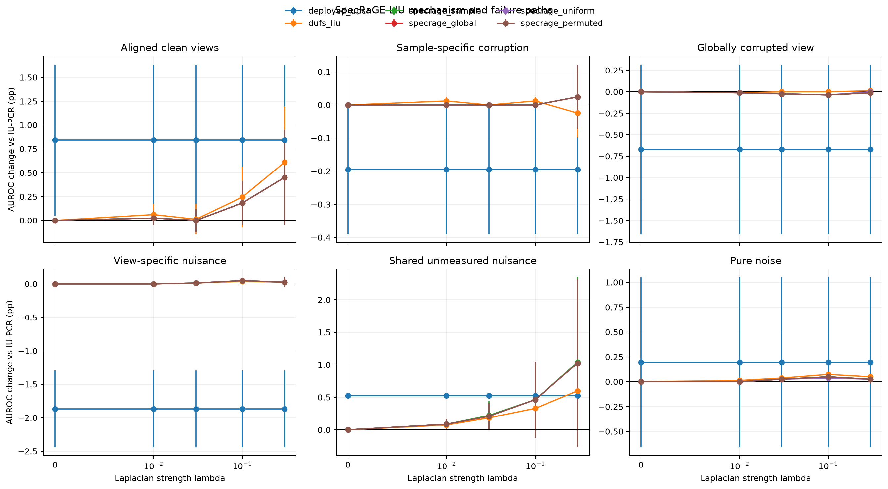
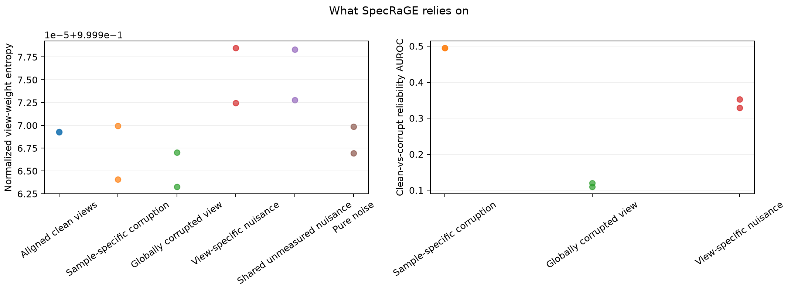
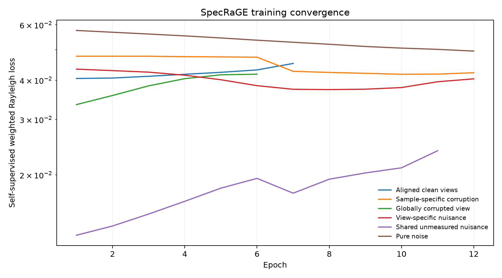

# SpecRaGE-LIU synthetic mechanism study

Version: `specrage-liu-synthetic-v1-2026-08-06`. Stage: `smoke`.

The SpecRaGE learner receives only provenance views. Labels and planted latents are joined after every score is frozen. Values below are paired AUROC-point changes versus ordinary IU-PCR at `lambda=0.1`.



## Primary configuration

| world | deployed U-PCR | DUFS-LIU | SpecRaGE sample | global | uniform | permuted |
|---|---:|---:|---:|---:|---:|---:|
| Aligned clean views | +0.842 | +0.244 | +0.183 | +0.183 | +0.183 | +0.183 |
| Sample-specific corruption | -0.195 | +0.012 | +0.000 | +0.000 | +0.000 | +0.000 |
| Globally corrupted view | -0.671 | +0.000 | -0.037 | -0.037 | -0.037 | -0.037 |
| View-specific nuisance | -1.868 | +0.037 | +0.049 | +0.049 | +0.049 | +0.049 |
| Shared unmeasured nuisance | +0.525 | +0.330 | +0.464 | +0.464 | +0.464 | +0.464 |
| Pure noise | +0.195 | +0.073 | +0.049 | +0.049 | +0.037 | +0.049 |

## Mechanism diagnostics





| world | alpha entropy | seed MAD | clean/corrupt reliability AUROC |
|---|---:|---:|---:|
| Aligned clean views | 1.000 | 0.0000 | n/a |
| Sample-specific corruption | 1.000 | 0.0000 | 0.495 |
| Globally corrupted view | 1.000 | 0.0000 | 0.114 |
| View-specific nuisance | 1.000 | 0.0000 | 0.341 |
| Shared unmeasured nuisance | 1.000 | 0.0000 | n/a |
| Pure noise | 1.000 | 0.0000 | n/a |

## Interpretation boundary

A gain is attributed to conditional reliability only if the sample-specific arm separates from global, uniform, and permuted controls and if learned weights identify the planted clean view. Shared-nuisance failure remains an explicit boundary.

This report is generated mechanically. The registered Gate-E independent result review is stored separately and controls the final conclusion.

## Reproduction

```bash
python scripts/specrage_upcr_synthetic.py --stage smoke
```

Runtime: 4.6s.
